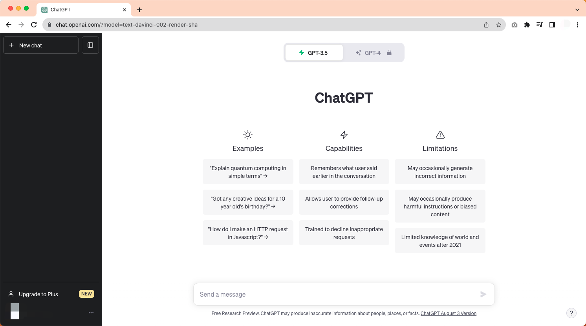
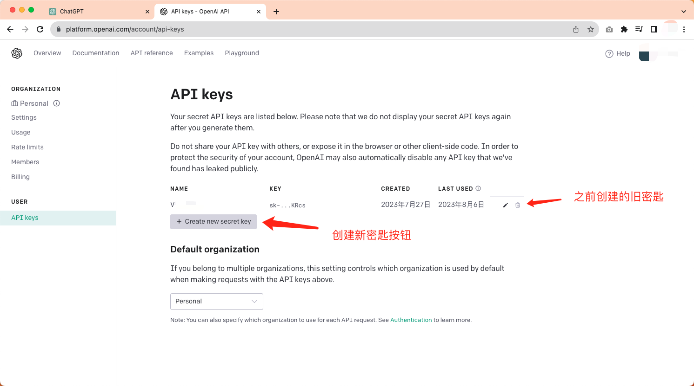
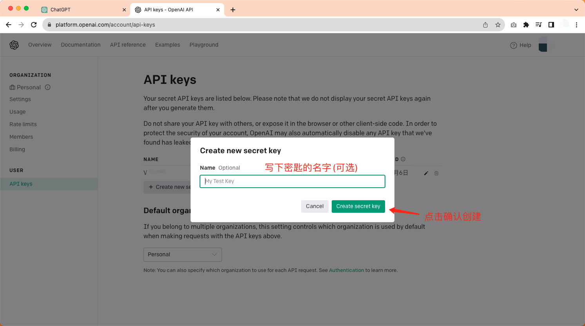
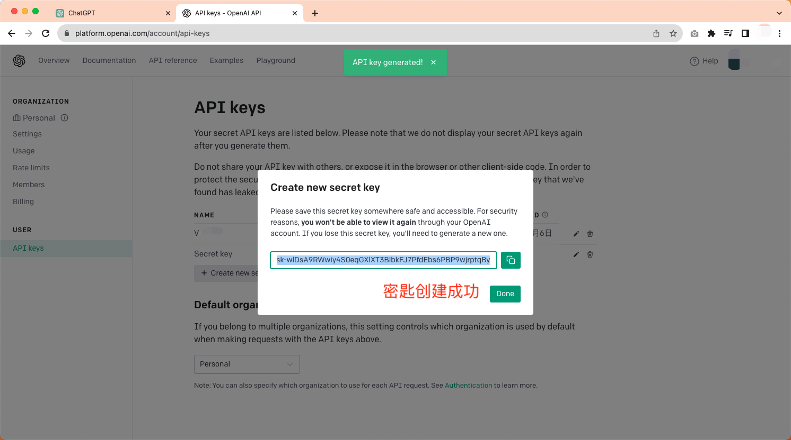

# 如何注册 OpenAI 账户并获得 OpenAI API key 密匙？

如果您选择使用我们提供的`StartAI 入门工具版套餐`的话([了解套餐，请点击这里](/business/prices-table))，需要先拥有一个 OpenAI 的账户，并且通过 OpenAI 的后台得到一个 `API key` 密匙。

为了得到这个密匙，我们需要有:

- 一个国外的手机号码 (虚拟手机号码工具 [点击这里](https://sms-activate.org/))
- 一个国外的付款方式
- 一个国外地址

<!-- truncate -->

我们需要做以下几个步骤:

- 申请一个国外的 Google、Microsoft、Apple 账户
- 到 OpenAI 网站注册一个新账户
- 访问 OpenAI 后台获得 `API key` 密匙
- 下载 GPT AI Flow 软件，安装
- 打开 GPT AI Flow 软件，打开设置界面，填入刚刚申请的 `API key` 密匙

## 申请一个国外的 Google、Microsoft、Apple 账户

以 Google 为例，我们在申请过程中，需要使用国外手机号码收取验证码。

## 到 OpenAI 网站注册一个新账户

点击 Continue with Google 通过国外 Google 账户快速注册，如果有其他平台的账号通过其他平台注册即可。

:::tip
我们不建议使用过国内号码注册的国外账户，如果账户与国内手机相关的话，被官方封号的概率比较大。
:::

## 访问 OpenAI 后台获得 `API key` 密匙

确保 OpenAI 账户注册成功，并且成功登陆 OpenAI 对话网页([点击这里](https://chat.openai.com/))后。

OpenAI 官方后台: [点击这里](https://platform.openai.com/)

点击创建新的密匙按钮，写好新密匙的名字后，点击创建。

密匙创建成功后，请保存好，不要分享给任何人。
