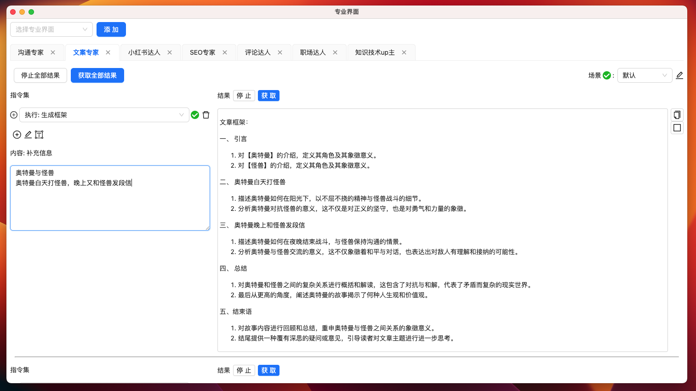
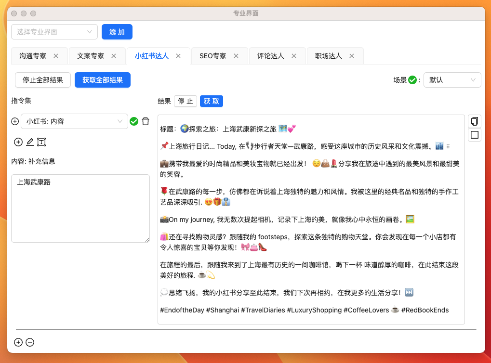
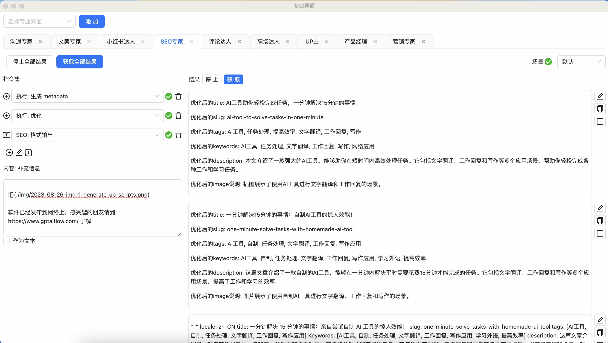

import Image from "@theme/IdealImage";

# 让自媒体博主梦想成真的神奇工具!

<iframe src="//player.bilibili.com/player.html?aid=490716983&bvid=BV1sN411i7Uh&cid=1259490531&p=1" scrolling="no" border="0" frameBorder="no" framespacing="0" allowFullScreen="true"> </iframe>

## 引入

在内容泛滥的时代，如何让你的声音被更多人听到，又不失个性？GPT AI Flow 是答案！这款人工智能工具专为一人自媒体博主和自媒体新手，甚至想做内容创作的企业家量身打造。它能帮助您快速生成和优化文案，为您的自媒体与宣传事业提供强大支持。

<!-- truncate -->

## 产品特色

我们产品的特色主要分为两个部分，

- 一个是桌面端的便捷交互使用体验，
- 另一个是提供专业的我们团队本身创作日常工作中使用下来好的 ai 专业模块。

<!-- truncate -->

### 桌面端便捷交互体验

这是我们软件运行在桌面的样子，作为桌面端的软件悬浮在所有窗口之上，我们可以快速的进行交互。通过预先设置好的快捷键去主动显示和隐藏软件窗口；通过鼠标选择文本+快捷键的方式，让我们方便地调用人工智能解决我们日常遇到的问题。比如翻译场景，搜索场景等等。

### ai 专业界面模块

如果你是新手自媒体人以及创业者，那么我们的专业界面功能便是你们的不二选择。

在我们的专业界面中，你可以发现沟通专家、文案专家、小红书达人、SEO 专家、评论达人、职场达人、up 主、产品经理和营销专家等众多模块，每个模块下也会有不同的场景细分，并且我们还在不断努力拓展，未来它们将变得越来越丰富。

#### 沟通专家

#### 文案专家

#### 小红书达人

#### SEO 专家

#### 评论达人

#### 职场达人

#### up 主

#### 产品经理

#### 营销专家

### 与竞对差异

与目前市场上其他家竞品相比，我们为用户提供了一个准确、参数可调、具有友好直观操作体验的创新性专业界面。

我们拥有多种丰富的模块，满足用户的独特需求，并支持广泛的个性化指令和自定义指令管理。(提供[网页版应用](https://www.app.gptaiflow.com/))

另外我们已经为实际用户提供了小红书的运营服务，并且取得显著成果，充分证实了工具本身的实际效能。

<Image img={require("./img/2023-08-23-img-9-follow-paris-xiaohognshu-followparis-30-days-data.png")} style={{ width: 350}} />

## 最后

所以，无论你是自媒体初学者，还是经验丰富的企业家，亦或是渴望提升自我内容创作的创作者，GPT AI Flow 都能为你带来帮助和启发。与我一道，走进科技创新的前沿，尝试使用这款具有创造性的人工智能工具。现在就点击屏幕下方的链接，开启你的 GPT AI Flow 之旅吧！记住，每一个无论是改变世界还是改变人生的巨大突破，都始于那一次勇敢的尝试。
