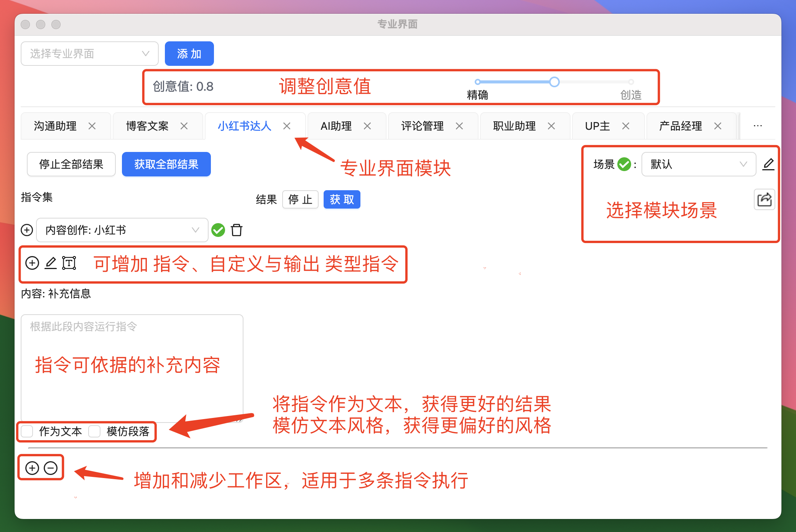
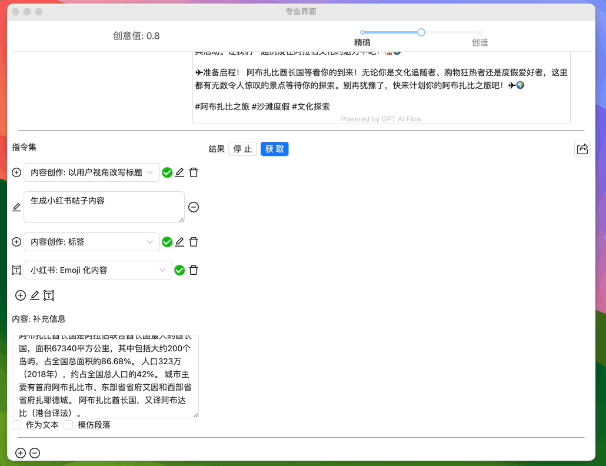
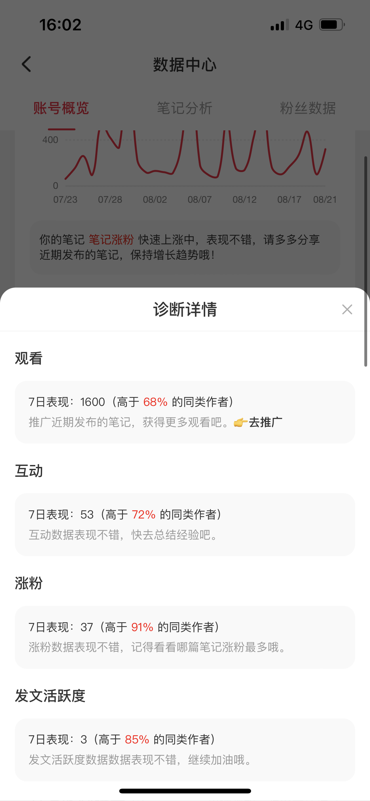

# 不止于文字：🔗 多指令链条，GPT AI Flow 专业模式的秘密武器，改变创作游戏规则

在 [平台] 的各位内容创作者，你们是否曾为内容创作的繁琐与时间消耗而苦恼？如何在保持创作原汁原味的同时，提高效率和质量？我在这里要介绍一个工具——GPT AI Flow。

## GPT AI Flow：不只是另一个 AI 工具

GPT AI Flow 不是简单的套壳 AI，它是一款专为内容创作者设计的工具，可以帮助个人博主和小型自媒体团队实现快速、高质的内容生成。它不只是简化了传统的写作过程，更是一种全新的创作体验。

<!-- truncate -->

## 专业模式：为专业创作者量身打造

进入到专业模式，你会发现一系列高级功能，专为满足资深创作者的需求而设计。在这里，你可以进行详细的二次微调，精确编辑每一段内容，确保每一个字、每一句话都能达到你的预期标准。

### 专业界面模块

让我们深入了解一下专业模式的核心——专业界面模块。在这里，我们拥有：

- **沟通助理**：提高你的互动质量。
- **博客文案**：精炼你的博文语言。
- **小红书达人**：提升你在平台的影响力。
- **AI 助理**：快速辅助画图能力。
- **评论管理**：一键生成有趣且贴合内容的评论。
- **职业助理**：为你的职业发展提供有力的文字支持。
- **UP 主**：为你的视频内容提供脚本和剪辑建议。
- **产品经理**：辅助产品规划与市场定位。
- **营销助理**：创作吸引用户的市场营销文案。
- **SEO 助理**：优化你的内容，提高搜索引擎的可见度。

每个模块下还细分了多个场景，针对不同的内容需求提供定制服务，而且我们正不断努力进行拓展，未来会提供更加丰富和深入的服务。

### 多指令链条：无限创作可能

但今天的主角是专业模式中的多指令链条功能。想象一下，通过组合不同的指令，就像搭积木一样，你可以构建出复杂而精细的内容结构，每个指令就像是一个创意的种子，最终汇聚成为独一无二的创作花园。

- 组合指令，一系列输出结果顺理成章地展现。
- 优化指令链，在创作过程中实时调整，实现精益求精。
- 个性化定制，根据不同的创作需求，迅速调整指令，追求完美的内容输出。

## 实战经验：我们也在用它！

我们自豪地分享来自 GPT AI Flow 用户的真实案例。就拿 “巴黎去哪玩” 来说，他们利用我们的工具，在小红书上的关注度在短短一个月内飙升了 40%。这不仅仅是数字上的提升，而是内容质量和观众互动性的双重跃升。GPT AI Flow 成为他们创意的加速器，助力他们在信息爆炸的自媒体世界中脱颖而出。

与市面上许多 AI 工具不同，GPT AI Flow 真正做到了赋能创作者，提供了更加自由、灵活的创作方式，而不仅仅是简单的内容生成。

## 加入创作革命

我们不仅仅在寻找一个工具，我们在寻找一种全新的创作方式。在这里，我邀请你们一起体验 GPT AI Flow，开启属于你的内容创作革命。

现在，就在 [平台] 上与我交流你对创作的看法，或者直接体验 GPT AI Flow 的专业模式吧。让我们一起探索那无限的创作可能性！
