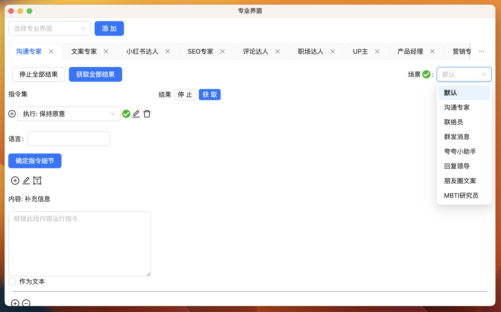

import Image from "@theme/IdealImage";

# 工作效率革命: GPT AI Flow 专业模式将 AI 真正地融入内容创作

## 引入

在当下的信息化时代，我们被海量的数据所包围。手动处理这些数据既耗时又不准确，而 AI SaaS 产品恰恰能智能、迅速地为我们筛选和分析，助我们做出更明智的决策。

- **提高效率**: AI 可以自动完成许多日常任务，如数据分析，几乎不耗时，从而节省大量时间和劳动力。
- **明确决策**: AI 通过分析历史数据，为我们预测未来趋势，使决策更加具有前瞻性。
- **经济高效**: SaaS 模式让用户避免了购买昂贵硬件或软件的成本。只需按需支付，大大节省了投资。

虽然市场上的 AI SaaS 产品众多，但它们常常**缺乏针对具体场景的解决方案**。许多**内容创作者**在付费使用后发现，由于**不懂 AI 技术，很难达到所期望的效果**。而他们又常常忙于创作，无暇深入学习 AI。为了解决这个**不懂技术的痛点**，我们推出了 GPT AI Flow 的专业模式。

这款模式不只是一个 AI 工具，它是**专为内容创作者量身设计**的。我们**提供直观的界面和针对特定创作场景的微调模型**，使创作者可以轻松上手，不必**深挖 AI 技术的细节**。GPT AI Flow 的专业模式将 AI **真正地融入内容创作**，帮助创作者提高工作效率，同时保证输出内容的质量和创新性。

## 专业模式的核心优势

1. **创新的友好界面设计**: 我们的界面不仅具有创新性，而且注重用户体验，简洁的操作流程和可调参数为用户提供了流畅和高效的使用体验。
2. **广泛的应用场景**: 从沟通、文案、小红书、到 SEO，还扩展至评论和职场白领模块，我们为各种职业场景提供了覆盖。
3. **操作简洁，效果出色**: 利用预设的指令集和一键生成功能，我们确保内容迅速产出，同时保留了个性化调整的空间，以适应用户的独特风格。

我们有信心，你**只需体验片刻**，就会发现它能**显著地提升你的工作效率和内容质量**。这款工具将不仅仅是你工作中的辅助工具，它会迅速地成为你**日常工作的得力伙伴**。

## 竞品对比与优势

### 用户交互界面的创新性

- **我们**: 借助**创新性的专业界面**，我们为用户提供一键生成的便利，参数可随时调整，确保使用者得到一个友好、直观的操作体验。
- **竞品**: 多数只提供一个**单调、不易于调整参数的对话框**，显然缺乏深度的用户体验设计。

### 丰富与个性化的功能特点

- **我们**: 我们拥有多种丰富的模块，并配备了经过专家调试的指令集。为了满足用户的独特需求，我们还**支持广泛的个性化指令**设置。
- **竞品**: 或许只提供基础的功能，**且缺乏针对性和深度的个性化配置**选项。

### 实际应用中的成效

- **我们**: 我们的工具不仅仅是理论上的应用，我们已经实际为客户提供了小红书的运营服务，并**已经取得了显著的成果**，充分证实了我们工具的实际效能。
- **竞品**: 很多只**停留在工具的提供阶段**，而缺乏实际应用场景的验证和反馈。

## 专业模式

### 页面使用

深入了解如何轻松掌控创作工具的全方位功能，解锁您的创作潜力: [点击这里](#)

### 应用场景

探索这里，发现 GPT AI Flow 如何在各行各业的丰富场景中发挥强大的作用，激发您的创作灵感: [点击这里](/docs/application-scenarios/introduction)

## 结论

在今天的数字化世界中，AI SaaS 产品的需求呈指数级增长，其中带来的效率和决策优势无疑对任何行业都有不小的吸引力。但问题在于: **如何选择一个真正适合自己，且具有高度应用价值的工具？**

从您刚看过的内容中，我们相信 GPT AI Flow 的专业模式已经为您提供了**明确的答案**。

这不仅仅是一个帮助您高效工作的工具，更是一个真正理解内容创作者需求，为您量身打造的助手。**无需您深入了解复杂的 AI 技术，我们为您简化了所有的步骤，从界面设计到功能调优，每一处都为了确保您能够简单、高效、创新地完成工作。**

比较市场上的竞品，您会发现 GPT AI Flow 在实际应用中的效益、用户体验以及功能特点上均表现出色。**实际的应用案例和真实客户反馈都印证了这一点。**

**为何要选择我们？**因为您值得拥有这样一款工具，它能够真正助您一臂之力，无论是简化工作流程，提高工作效率，还是保障内容质量，GPT AI Flow 都能够做到。

最后，我们真诚地**邀请您尝试我们的产品**。您可以通过 [官方购买页面](/business/prices-table) 了解价格详情，或是**先尝试 7 天免费试用期，感受它为您带来的变化**。相信您会发现，与 GPT AI Flow 一同工作，每一天都将变得更加轻松、高效。

期待您的加入，成为未来的引领者，与您共同开创职业新纪元！

## 联系我们

- 立即体验**7 天免费试用期**:
  - [立即体验网页版](https://www.app.gptaiflow.com/login)
  - [下载软件体验全部功能](/download)
- 联系我们
  - 联系邮箱: hello@gptaiflow.com
  - 加入交流群: [点击这里](/communication-group)
  - 产品反馈: [点击这里](https://wj.qq.com/s2/13154598/1770/)
- 💬 有问题? 查看 FAQ 快速解决: [点击这里](/docs/proudct/gpt-ai-flow-guide-and-faq)

感谢您选择 GPT AI Flow, 共同打造未来超级个体的必备工具 ！
