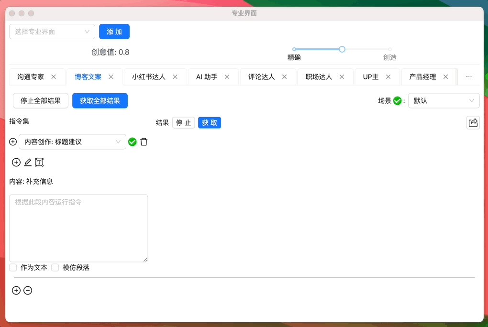

# 博客文案内容创作

博客文案创作的全套流程：对目标读者进行深度分析，进行主题挖掘和研究，制定关键词策略并进行 SEO 优化预设，明确内容策划和布局，进入真实的内容创作阶段，添加相应的视觉元素加强文章影响力，紧接着对文案进行反复的编辑修订，最后进行 SEO 优化提升搜索引擎排名。一切步骤之间环环相扣，共同构建博客文案的内容生态。

- **`受众分析`**：为您描绘出精准的受众画像，帮助您了解并理解他们的需求和兴趣。
- **`主题研究`**：通过行业洞察和市场趋势分析，探索并提供具有吸引力的主题想法。
- **`关键词与 SEO`**：提供关键词建议并进行 SEO 分析，以优化搜寻引擎排名和提高可见度。
- **`内容规划`**：根据主题和受众需求，设计详细的内容框架和创作计划。
- **`内容创作`**：基于规划的框架和策略，创作出引人入胜且具有价值的内容。
- **`视觉元素`**：建议适合您内容的视觉元素，增加文章的吸引力和阅读体验。
- **`编辑校对`**：提供专业的编辑和校对服务，确保内容的通顺和正确。
- **`SEO 优化`**：对已经创作出的内容进行 SEO 优化，提高其在搜索引擎的排名和可见度。

