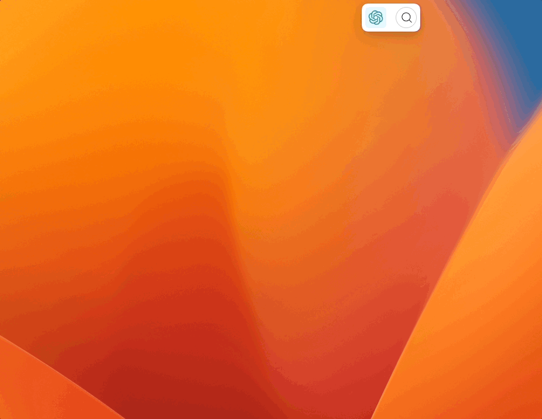
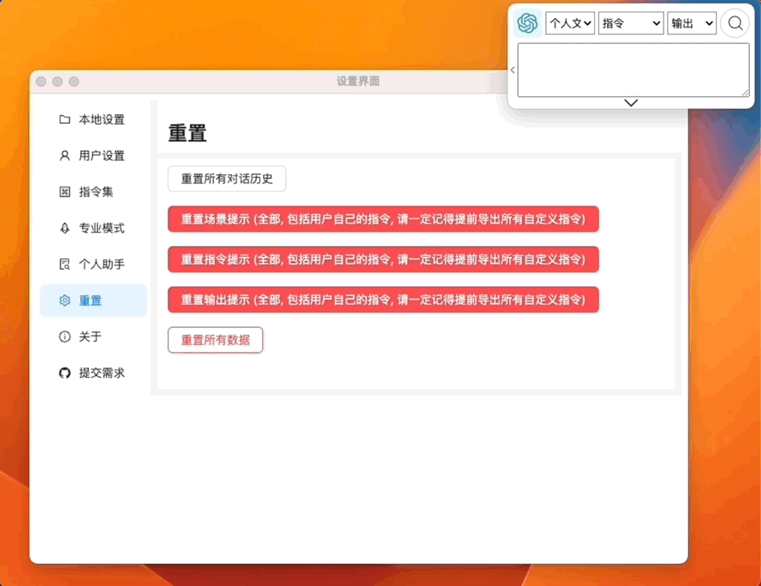
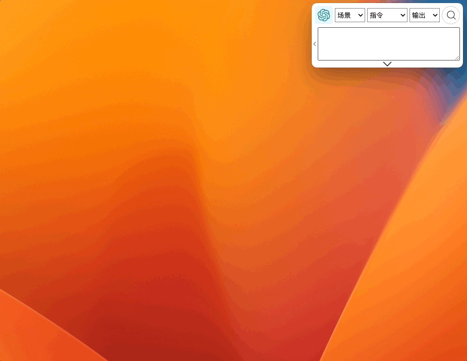

import ContactUs from "../9-contact-us.md"

# v0.1.30 个人文档助手

如果您是从 [v0.1.30 版本](../8-product-release/index.md#2023-10-16-v0130-promode-专业模式升级--个性化本地个人文档助手)之前就开始使用的用户从遵循以下操作:

## 重置窗口场景指令:

如有需要可以导出自定义指令再重置。

## 构建个人本地搜索数据库

:::tip 文档格式支持
目前仅支持 .text 与 .md 文档的识别与读取。
:::

## 选择 `个人文档助手`，提出你的问题

## 联系我们

<ContactUs/>
