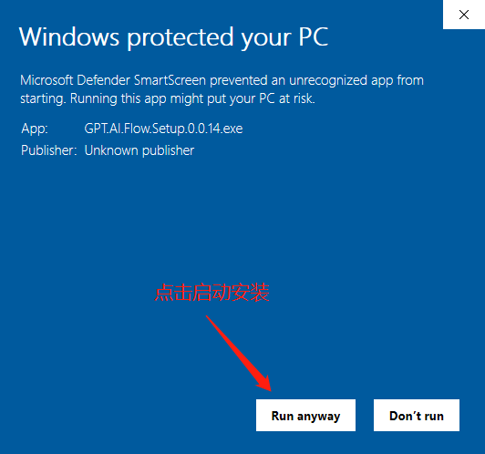
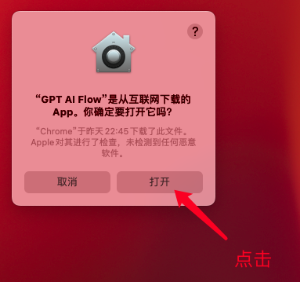
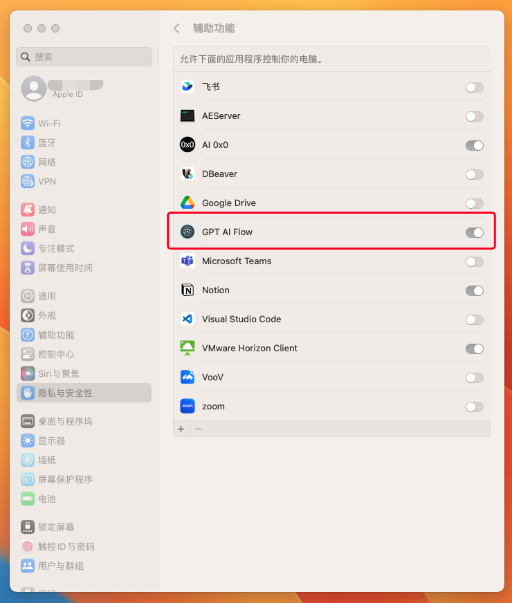
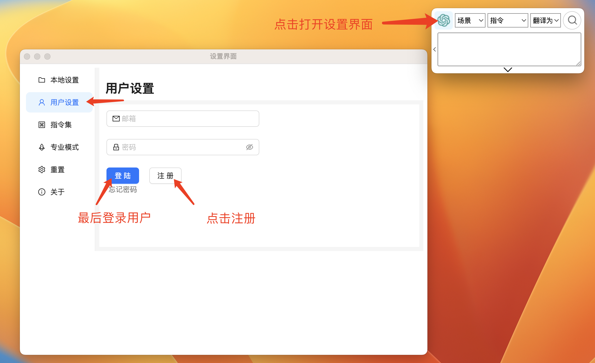
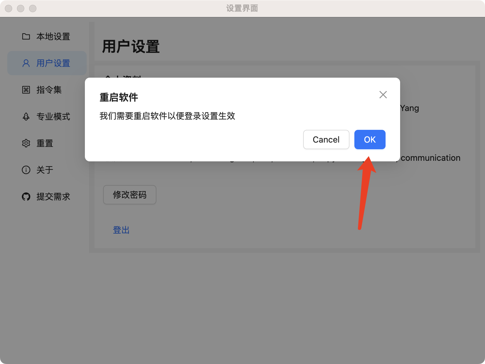
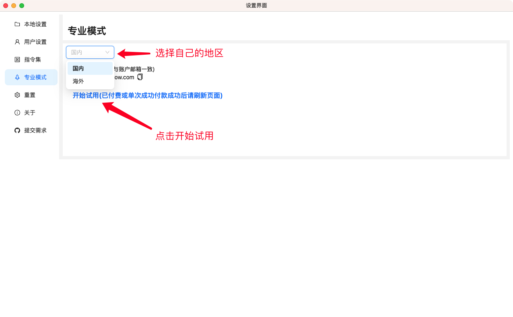
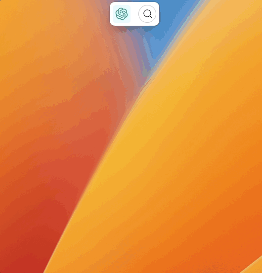

# GPT AI Flow 软件：详细的下载、安装与注册指南

## 下载 GPT AI Flow 软件，安装

打开下载链接，根据自己的系统版本下载对应链接。

下载链接: [点击这里](/download)

下载完成后，双击程序安装即可。

### Windows 系统环境

Windows 下载 `*.exe` 文件后，即可直接安装。

在桌面看到应用后，双击打开。  
某些特殊的功能需要在首次运行时，点击鼠标右键，选择以 `管理员` 的身份运行应用。

### MacOS 系统环境

根据 MacOs 电脑配置下载对应的 `*.dmg` 文件, 下载完成后打开 `*.dmg` 文件将 GPT AI Flow 工具拖进 `Application` 文件夹中。

打开 GPT AI Flow 软件。

请确保应用获得需要的权限，以保证应用正常运行。  
请确保该应用在 MacOS 系统中获得 `设置 > 隐私与安全 > 辅助功能` 的权限。

## 注册登录用户

成功登录账户后，软件会提示重启软件的提示框，点击 `确认`。

## 套餐选择

查看套餐区别: [点击这里](/business/prices-table)

- 免费版和工具版需自备 OpenAI key
- 模型版开启试用后可正常使用

如果你是对内容创作有高度需求的用户，可以开启[免费试用](/docs/proudct/start-free-trial)。

<!-- ### 免费模式

免费模式中，我们可以自由使用软件，不过需要用户提供自己的 `OpenAI API key`。

- 对话框功能
- 自定义指令管理
- 仅支持沟通助理模块
- 支持创建 `49` 个词条构建个人文档助手

:::tip
点击这里: [如何注册 OpenAI 账户并获得 OpenAI API key 密匙？](/blog/how-to-register-for-OpenAI-account-and-get-OpenAI-api-key)
:::

### 专业模式

专业模式是针对对内容创作高度需要的用户，里面提供了全面的内容创作模式可供用 AI 去运营自媒体(沟通助理、博客文案、小红书达人、AI 助手、评论管理、职业助理、up 主、产品经理、营销助理、SEO 助理 等等)，帮助你加快自己的内容创作工作流，短时间内产出大量高质量的内容。

#### 打开专业模式设置

再次来到设置界面，点击左侧的 `专业模式` 栏目。

:::info
套餐信息: [请点击这里](/business/prices-table)
:::

点击 `开始试用` 后，会打开一个新的网页，跟着网页的提示，[完成购买流程即可](/docs/proudct/start-free-trial)。

#### 选择 `StartAI 入门模型版 (官方大模型支持)`

- 免费模式所有功能
- 可使用全部 [专业模式模块](../3-application-scenarios/1-introduction.md)
- 无需 `OpenAI API key` 以及其他额外设置，无限次大模型请求支持
- 支持创建 `999` 个词条构建个人文档助手

:::tip
我们提供的 `StartAI 入门模型版套餐` 自带官方模型支持，所以无需 `OpenAI API key`。
:::

#### 选择 `StartAI 入门工具版`

- 免费模式所有功能
- 可使用全部 [专业模式模块](../3-application-scenarios/1-introduction.md)
- 需要设置 `OpenAI API key`
- 支持创建 `999` 个词条构建个人文档助手

点击打开设置界面，填入刚刚从 `OpenAI` 后台获得的 `API key`，点击保存。

 -->

## 开始使用

## 联系我们

- 立即体验**7 天免费试用期**:
  - [立即体验网页版](https://www.app.gptaiflow.com/login)
  - [下载软件体验全部功能](/download)
- 联系我们
  - 联系邮箱: hello@gptaiflow.com
  - 加入交流群: [点击这里](/communication-group)
  - 产品反馈: [点击这里](https://wj.qq.com/s2/13154598/1770/)
- 💬 有问题? 查看 FAQ 快速解决: [点击这里](/docs/proudct/gpt-ai-flow-guide-and-faq)

感谢您选择 GPT AI Flow, 共同打造未来超级个体的必备工具 ！
