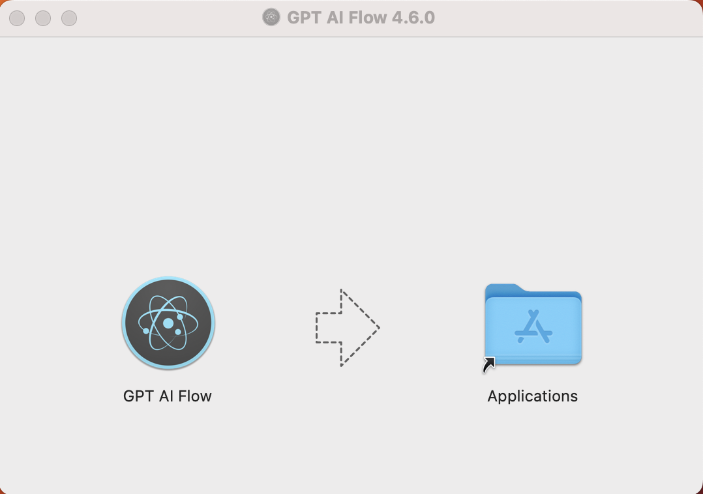

import ContactUs from "../9-contact-us.md"

# 详细的下载、安装与注册的完整步骤

## 下载 GPT AI Flow 软件，安装

打开下载链接，根据自己的系统版本下载对应链接。  
下载软件体验全部功能: [点击这里](/download)

下载完成后，双击程序安装即可。

### Windows 系统环境

Windows 下载 `*.exe` 文件后，即可直接安装。

在桌面看到 `GPT AI Flow` 应用后，双击打开。  
某些特殊的功能需要在首次运行时，点击鼠标右键，选择以 `管理员` 的身份运行应用。

:::info
在桌面看到这样的图标  
  
按照上方操作以 `管理员` 身份启动。
:::

### MacOS 系统环境

根据 MacOs 电脑配置下载对应的 `*.dmg` 文件, 下载完成后打开 `*.dmg` 文件将 GPT AI Flow 工具拖进 `Application` 文件夹中。

打开 GPT AI Flow 软件。

- 请确保应用获得需要的权限，以保证应用正常运行。如果无法正常启动，请通过 `设置 > 隐私与安全 > 安全性` 部分点击 `仍要打开`。
  - 确保该应用在 MacOS 系统中获得 `设置 > 隐私与安全 > 辅助功能` 的权限。

开启免费试用: [点击这里](/docs/proudct/how-to-start-a-free-trial-of-gpt-ai-flow)

## 联系我们

<ContactUs/>
