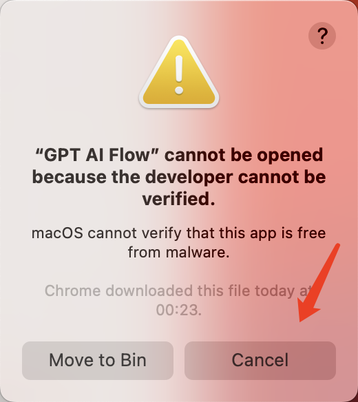

# 产品安装

通过内测的邮件收到下载链接后，点击进入链接。

## Windows

Windows 下载 .exe 文件后，即可直接安装。

## MacOS

根据 MacOs 电脑配置下载对应的 .dmg 文件, 下载完成后打开 .dmg 文件将 GPT AI Flow 工具拖进 Application 文件夹中, 打开工具过程中 MacOs 系统会提醒你有安全风险，请在 macOs 设置界面的 隐私&安全 允许 GPT Ai Flow 工具的运行。

