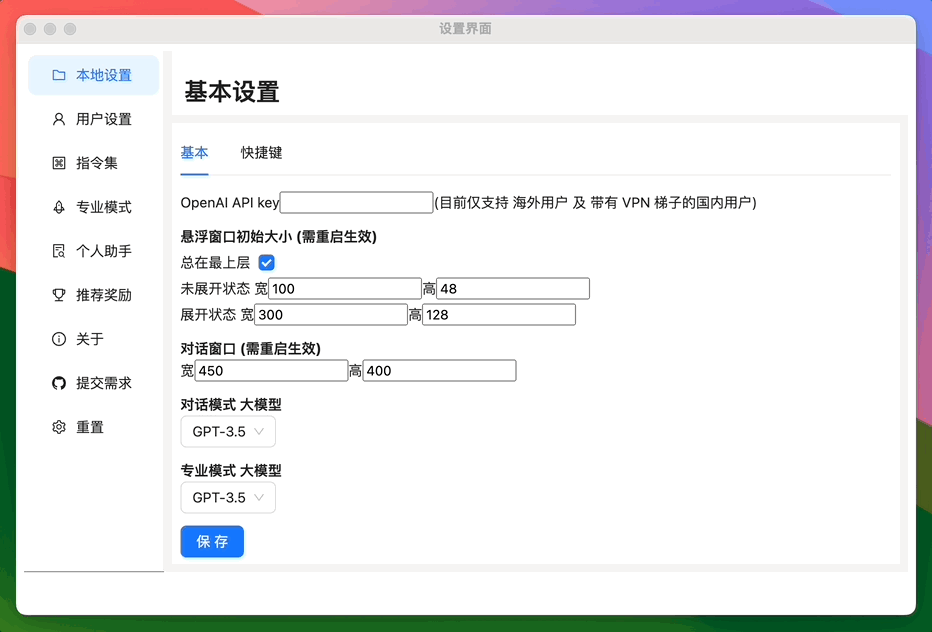
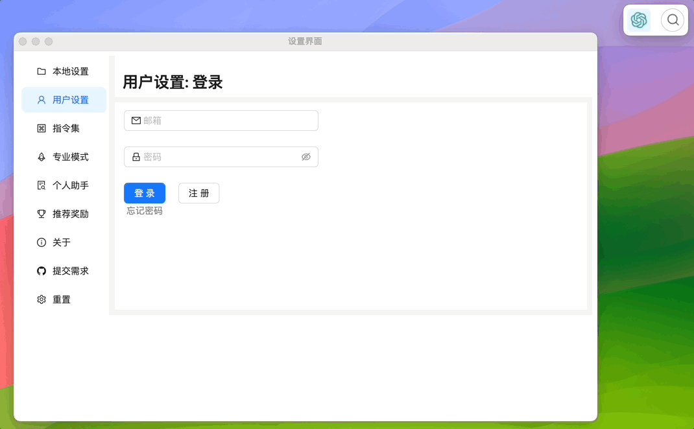
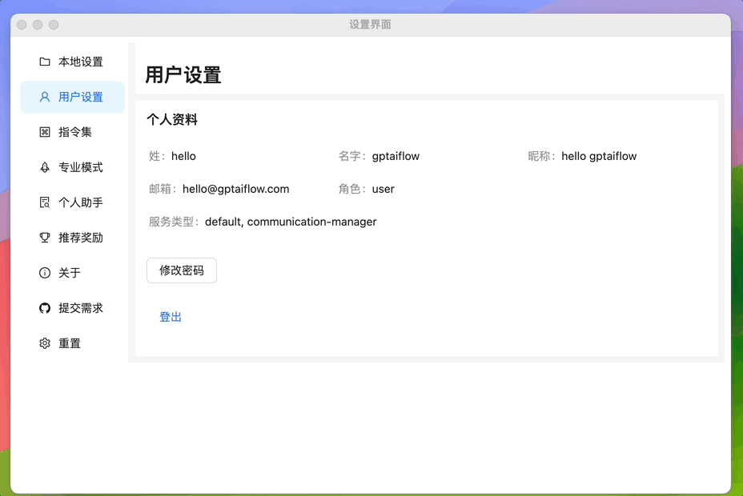
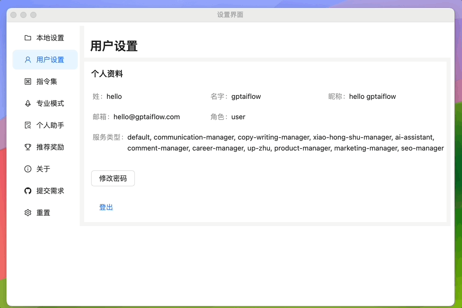
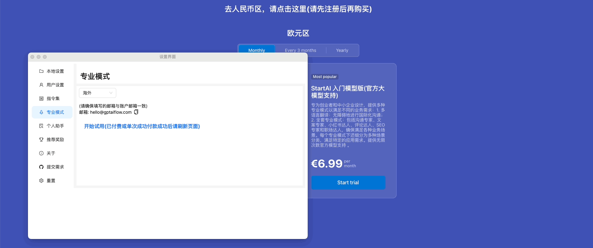
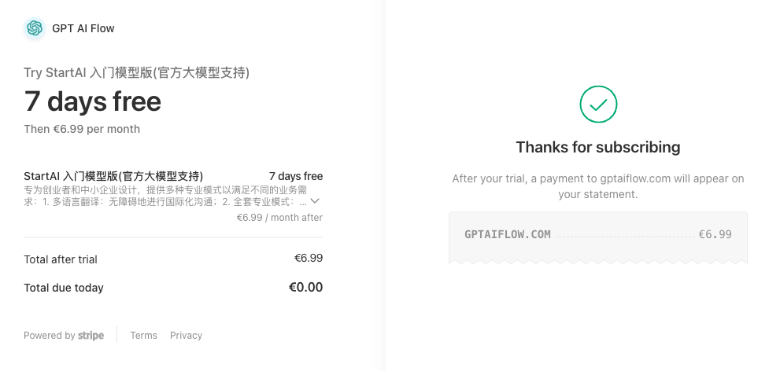
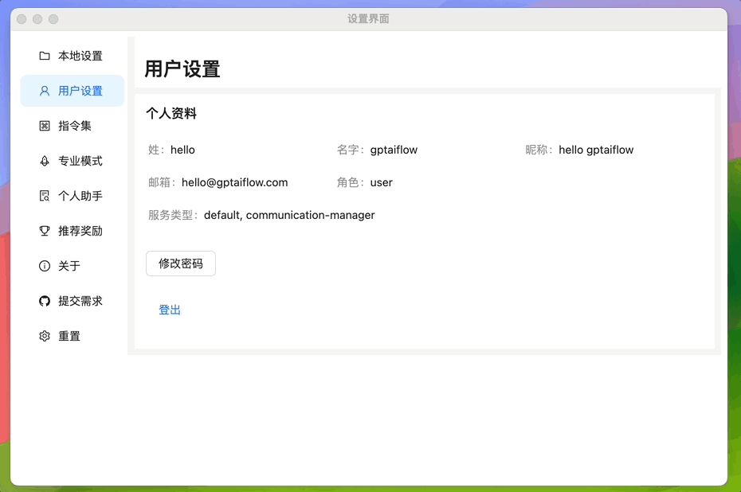

# 免费试用

本文将说明 GPT AI FLow 开启免费试用的方法。

## 打开软件注册界面

打开软件设置

## 填写注册信息

来到用户设置界面，点击`注册`按钮。填写注册信息，点击`提交`按钮显示注册成功。

:::tip
如果有邀请码的话，注册成功时邀请人和被邀请人都会获得一定奖励。  
通过邀请码注册时，被邀请者会直接激活免费试用。
:::

## 登录刚刚注册的账户

## 开启免费试用

### 国内地区

来到`专业模式`设置，点击`开始试用`按钮提供 7 天免费试用。

### 海外地区

来到`专业模式`设置，选择`海外`地区，点击`开始试用`链接。

输入支付信息，点击`开始试用`按钮。

支付确认。

查看海外订阅信息。

:::tip 试用期体验
如果遇到支付后仍然无法使用的问题，请联系我们，我们会第一时间联系您解决问题。

想要体验专业模式下的全部模块，您可以进入设置界面，选择“专业模式”选项，并开启 <a href="/download" style={{color: "#3875f6", fontSize: "1.2rem", fontWeight: "bolder", textDecoration: "none" }}>7 天免费试用期</a>。这将允许您在有限的时间内免费体验所有的专业功能。
:::

## 联系我们

- 立即体验**7 天免费试用期**:
  - [立即体验网页版](https://www.app.gptaiflow.com/login)
  - [下载软件体验全部功能](/download)
- 联系我们
  - 联系邮箱: hello@gptaiflow.com
  - 加入交流群: [点击这里](/communication-group)
  - 产品反馈: [点击这里](https://wj.qq.com/s2/13154598/1770/)
- 💬 有问题? 查看 FAQ 快速解决: [点击这里](/docs/proudct/gpt-ai-flow-guide-and-faq)

感谢您选择 GPT AI Flow, 共同打造未来超级个体的必备工具 ！
