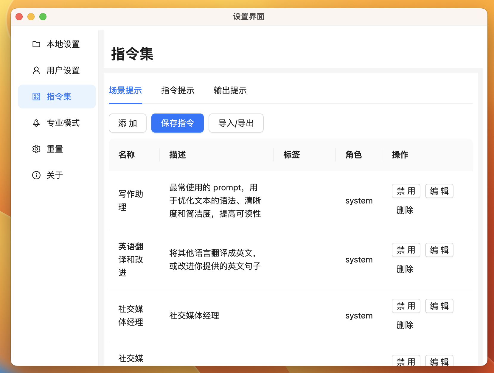

import Image from "@theme/IdealImage";

# 用户详解：悬浮窗口及指令集的操作与管理

## 悬浮窗口 {#floating-window}

    <Image img={require("./img/3-basic-presentation/2023-08-25-img-6-floating-window.png")} style={{ width: 300, marginLeft: "1rem", marginTop: "1rem" }} />
    <Image img={require("./img/3-basic-presentation/2023-08-25-img-7-extended-floating-window.png")} style={{ width: 500, marginLeft: "1rem", marginTop: "1rem" }} />

### 场景与指令

    <Image img={require("./img/3-basic-presentation/2023-08-25-img-15-floating-window-commands.png")} style={{ width: 300, marginLeft: "1rem", marginTop: "1rem" }} />
    <Image img={require("./img/3-basic-presentation/2023-08-25-img-16-floating-window-commands-2.png")} style={{ width: 300, marginLeft: "1rem", marginTop: "1rem" }} />
    <Image img={require("./img/3-basic-presentation/2023-08-25-img-17-floating-window-commands-3.png")} style={{ width: 300, marginLeft: "1rem", marginTop: "1rem" }} />

### 对话展示

在输入框中输入你的问题，回车后，便会在弹出的对话窗口得到回复。

### 窗口大小设置

支持用户自定义个人使用时所需的悬浮窗口和对话窗口的大小。

## 快捷键

使用与快捷键: [点击这里](/docs/proudct/ai-tool-shortcut-ultimate-guide)

## 指令集

在设置界面的 ‘指令集’ 中，我们可以自定义自己的指令，以便能够在 [基本悬浮窗模式](#floating-window) 与 [专业模式](/docs/intro/how-professional-mode-of-ai-flow-revolutionizes-content-creation) 中使用。

:::tip
一定要记得最后点击 **'保存指令'** 按钮，以更新所有指令设置。
:::

### 添加指令

### 修改指令

### 导入导出自定义指令集

:::note
我们可以操作的是由用户创建的自定义指令。
:::

## 重置内容

为保障用户的个人信息安全，我们将大部分设置内容存储在用户的本地电脑上。因此用户可以自主决定自己的数据处理方式。

### 清空对话

### 重置指令集 与 重置所有本地资料

## 视频展示

- 在设置窗口填写 OpenAI API Key，发起询问和搜索
  - youtube: https://youtu.be/Y1d_Zkx_KaU
- 通过快捷键，输入和搜索问题并使用复制按钮和对话框隐藏按钮
  - youtube: https://youtu.be/wR25u6XEvVQ
  - B 站: https://www.bilibili.com/video/BV1Gh4y1p7Yh/
- 增加、修改 和 删除 指令集
  - youtube: https://youtu.be/bjz4B_-9s3U
- 重置对话框内容，重置指令集，重置所有本地数据资料
  - youtube: https://youtu.be/Yuy46iTH7gs
