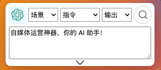
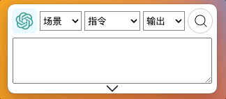
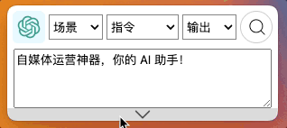
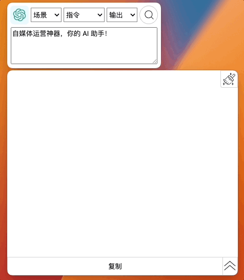

# 使用与快捷键

## 快捷键

### 选择指令

通过鼠标选择 AI 工具场景。

`Shift + up` 上方向键 和 `Shift + down` 下方向键,更换中间 `指令` 选项;

`Alt + up` 上方向键 和 `Alt + down` 下方向键，更换 🫱 右侧选框的输出选项；

### 复制文本

选择文本，按 `Ctrl + C` 复制，按 `Alt + /`，将已经复制文本粘贴到 GPT AI Flow 的输入框;

### 输入文本

选中输入框的情况下，按 `Shift + 回车` 换行，另起一行输入。

### 搜索 🔍

未选中软件时按 `Alt + 回车`，选中软件时按 `回车` 开启搜索提问；  
搜索过程中按`Alt + 回车` 或 选中软件按 `回车` 暂停搜索。

## 快捷键设置

## 联系我们

- 立即体验**半个月的免费试用期**: [点击这里](/download)
- 联系邮箱: hello@gptaiflow.com
- [💬 有问题? 联系我们或查看 FAQ](./6-faq.md)
- 产品反馈: [点击这里](https://wj.qq.com/s2/12214642/c9c6)

感谢您选择 GPT AI Flow, 共同打造未来超级个体的必备工具 ！
