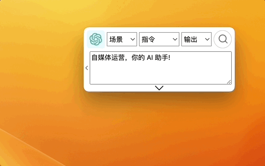
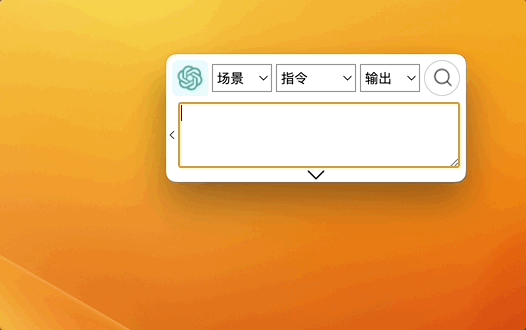
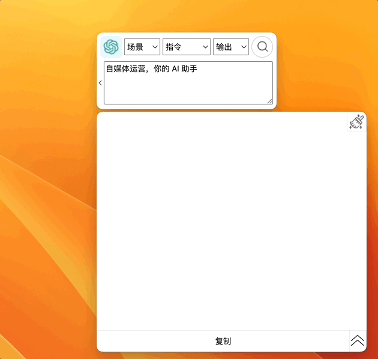
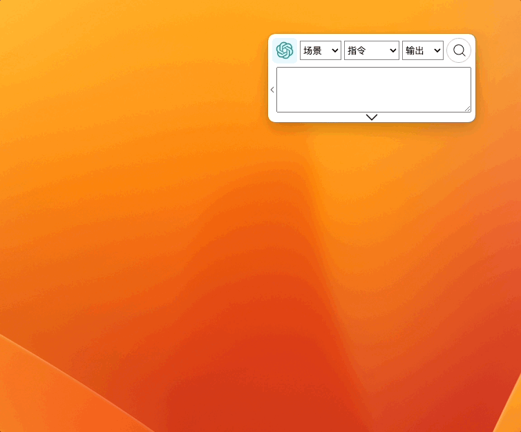

# 快捷键

## 基本使用

### 选择指令

通过鼠标选择 AI 工具场景。

`Shift + up` 上方向键 和 `Shift + down` 下方向键,更换中间 `指令` 选项;

`Alt + up` 上方向键 和 `Alt + down` 下方向键，更换 🫱 右侧选框的输出选项；

### 复制文本

选择文本，按 `Ctrl + C` 复制，按 `Alt + /`，将已经复制文本粘贴到 GPT AI Flow 的输入框;

### 输入文本

选中输入框的情况下，按 `Shift + 回车` 换行，另起一行输入。

### 搜索 🔍

未选中软件时按 `Alt + 回车`，选中软件时按 `回车` 开启搜索提问；  
搜索过程中按`Alt + 回车` 或 选中软件按 `回车` 暂停搜索。

## 高效使用

### 选中文本，直接按快捷键

自 v0.1.25 版本之后，我们不需要进行复制操作，选中文本，直接按 对应快捷键，便能够快速查找、翻译内容。

:::info
注意，此功能需要确保应用的权限。

- 请确保该应用在 MacOS 系统中获得 `设置 > 隐私与安全 > 辅助功能` 的权限。
- 请确保该应用在 Windows 系统中首次运行是通过右键选择 `以管理员身份运行`打开。

:::

### 自定义快捷键设置

配合 [自定义指令集](./2-basic-presentation.md#指令集) 使用，效率倍增！

## 显示隐藏

### 显示/隐藏主界面

### 显示/隐藏对话框

## 联系我们

- 立即体验**半个月的免费试用期**: [点击这里](/download)
- 联系邮箱: hello@gptaiflow.com
- [💬 有问题? 联系我们或查看 FAQ](./6-faq.md)
- 产品反馈: [点击这里](https://wj.qq.com/s2/12214642/c9c6)

感谢您选择 GPT AI Flow, 共同打造未来超级个体的必备工具 ！
