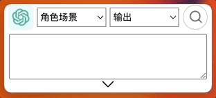
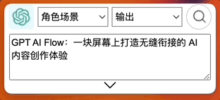
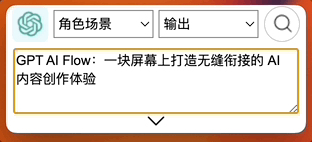

---
---

# 使用与快捷键

## 使用

### 在设置窗口填写 OpenAI API Key，发起询问和搜索

- youtube: https://youtu.be/Y1d_Zkx_KaU
- B 站: 审核中

### 通过快捷键，输入和搜索问题并使用复制按钮和对话框隐藏按钮

- youtube: https://youtu.be/wR25u6XEvVQ
- B 站: https://www.bilibili.com/video/BV1Gh4y1p7Yh/

<iframe src="//player.bilibili.com/player.html?bvid=BV1Gh4y1p7Yh&page=1" scrolling="no" border="0" frameBorder="no" framespacing="0" allowfullscreen="true"> </iframe>

### 增加、修改 和 删除 指令集

- youtube: https://youtu.be/bjz4B_-9s3U
- B 站: 审核中

### 重置对话框内容，重置指令集，重置所有本地数据资料

- youtube: https://youtu.be/Yuy46iTH7gs
- B 站: 审核中

## 快捷键

选择文本，按 `Ctrl + C` 复制，按 `Alt + /`，将已经复制文本粘贴到 GPT AI Flow 的输入框;

`Shift + up` 上方向键 和 `Shift + down` 下方向键,更换左侧选框 🫲 的角色场景选项;

`Alt + up` 上方向键 和 `Alt + down` 下方向键，更换 🫱 右侧选框的输出选项；

按 `Alt + 回车`，开启搜索提问
