import ContactUs from "../9-contact-us.md"

# 专业界面与关键使用技巧介绍

欢迎深入了解 GPT AI Flow 专业模式的使用方法。在这个页面上，我们将向您展示每个关键使用技巧，确保您可以充分利用这些功能来优化您的内容创作过程。

## 打开专业模式界面

在我们的专业界面中，你可以发现 `沟通助理`、`博客文案`、`小红书达人`、`AI 助理`、`评论管理`、`职业助理`、`up 主`、`产品经理`、`营销助理` 和 `SEO 助理` 等众多模块，每个模块下也会有不同的场景细分，并且我们还在不断努力拓展，未来它们将变得越来越丰富。


## 专业界面

在这里，我们拥有：

- `沟通助理`：提高你的互动质量。
- `博客文案`：精炼你的博文语言。
- `小红书达人`：提升你在平台的影响力。
- `AI 助理`：智能化管理日常任务。
- `评论管理`：一键生成有趣且贴合内容的评论。
- `职业助理`：为你的职业发展提供有力的文字支持。
- `UP 主`：为你的视频内容提供脚本和剪辑建议。
- `产品经理`：辅助产品规划与市场定位。
- `营销助理`：创作吸引用户的市场营销文案。
- `SEO 助理`：优化你的内容，提高搜索引擎的可见度。

### 布局介绍


### 二次微调场景与指令


### 结果编辑


## 半自动指令链

专业界面是以 `指令链` 为核心构建的，这意味着它旨在提供一个一体化的、高效率的操作环境，您可以轻松地根据需要编辑和修改内容，并根据个人喜好自由扩展其功能。简而言之，我们希望这个界面能够让您的使用体验既个性化又高效。

### 单指令链条

通过单个指令生成帖子内容。

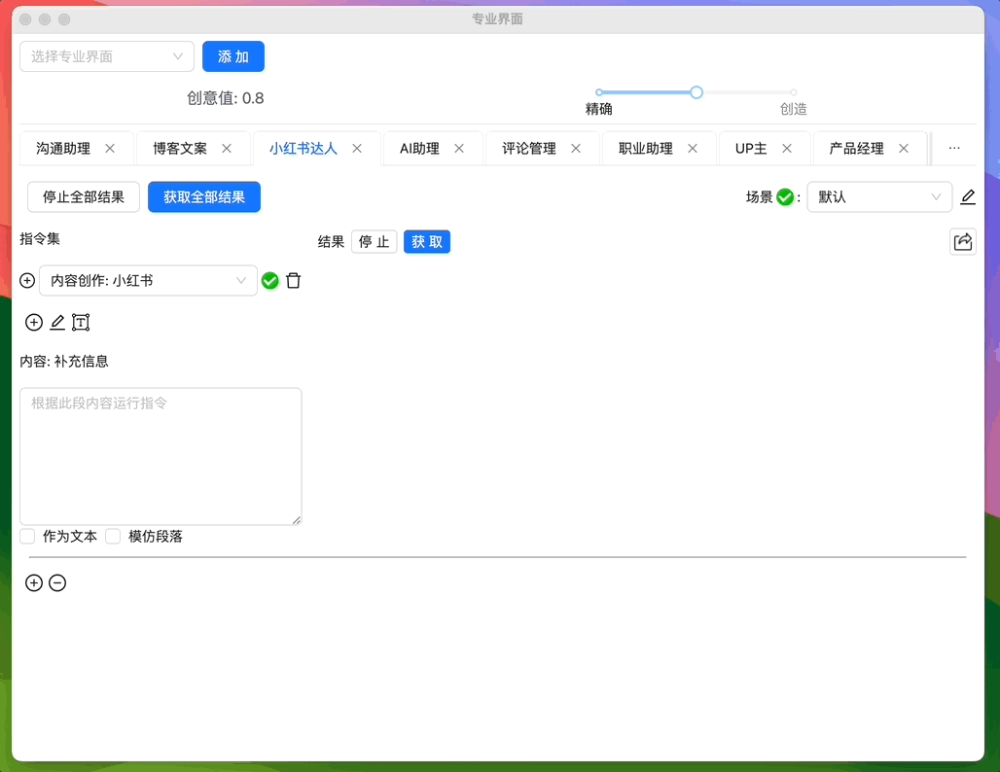

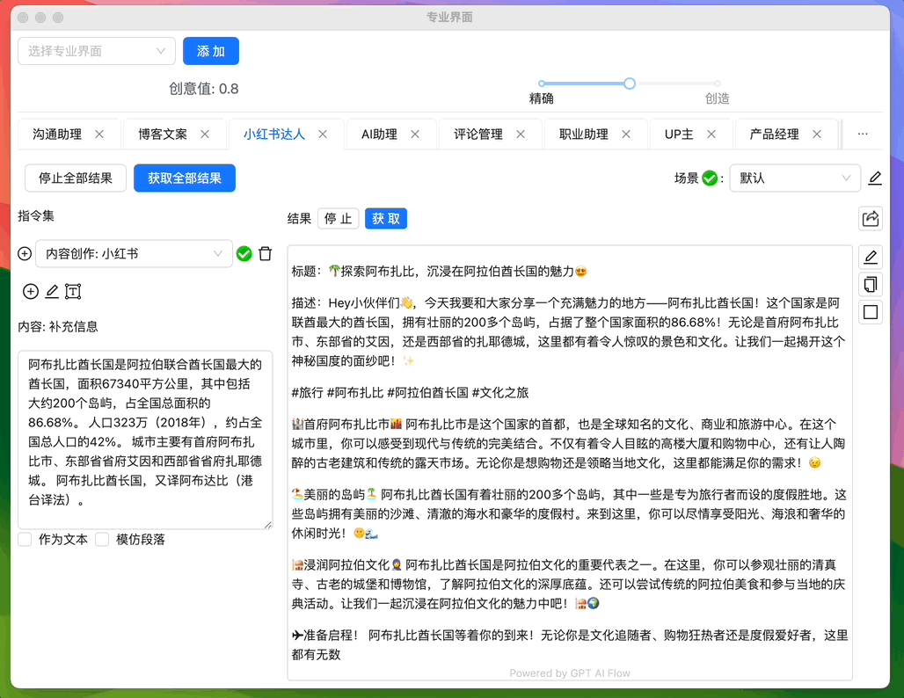

### 多指令链条

通过组合多个单一指令，获得一系列个输出结果链条。

组合 `指令链`。

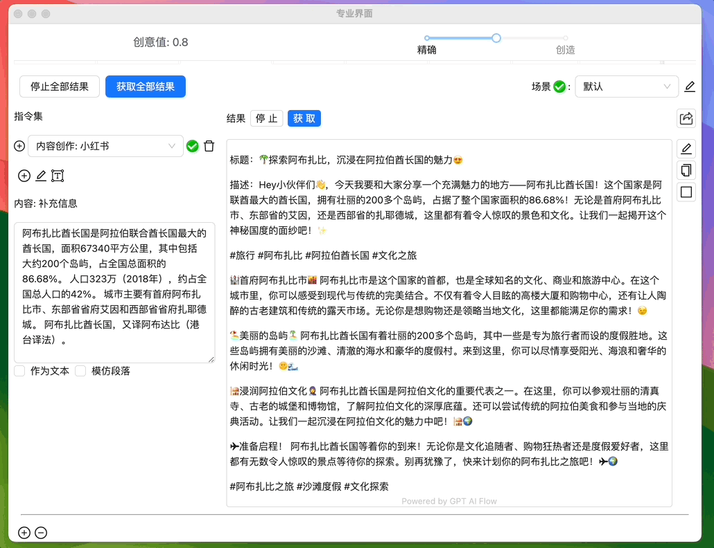

生成结果。

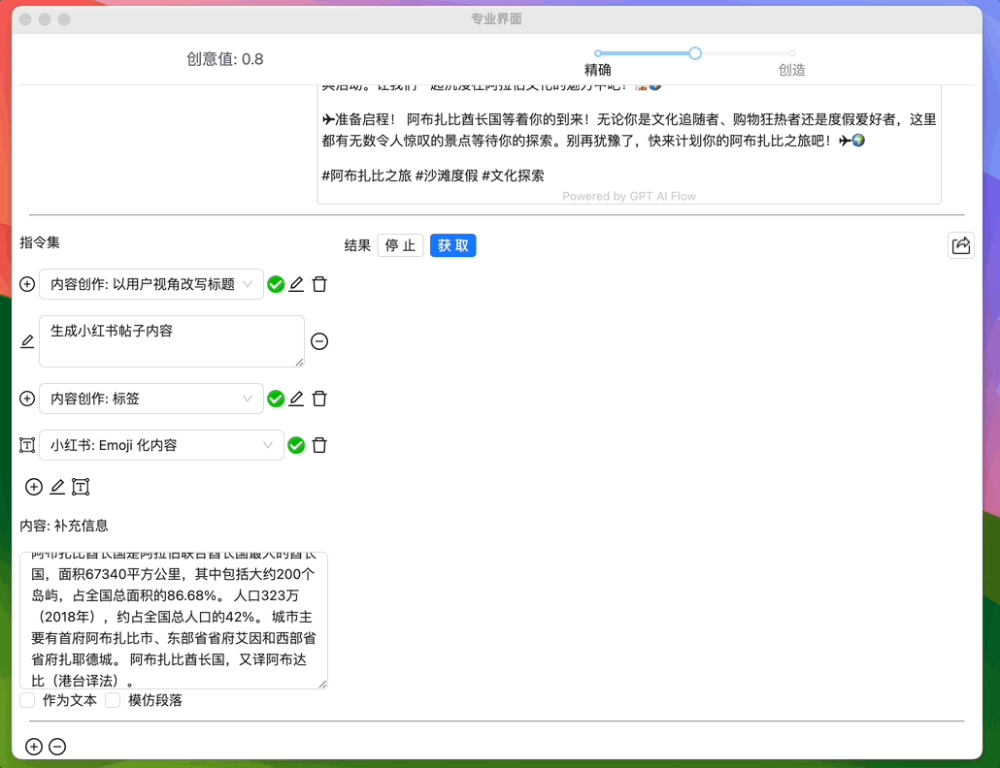


### 优化指令链

修改删掉 `指令链` 第三条指令，优化第二条指令结果。

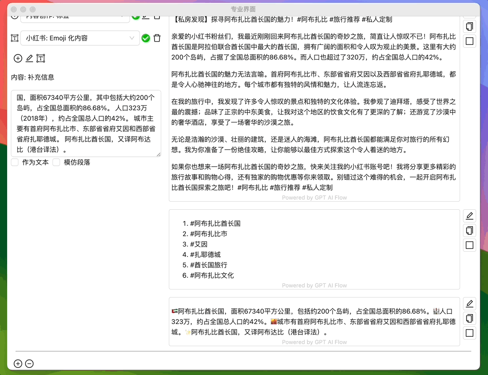

删掉补充信息，避免混淆刚刚修改好的第二个指令结果，重新生成第三个指令结果。

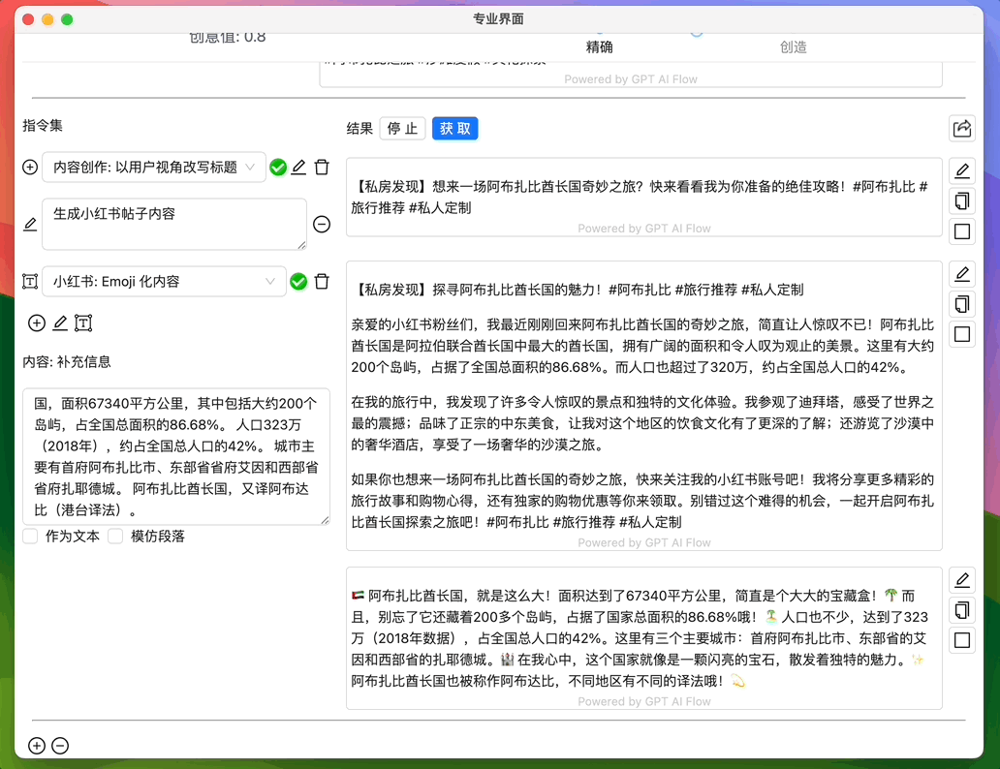

根据需要，通过多次生成或自定义指令，我们便能够得到自己想要的最好结果。

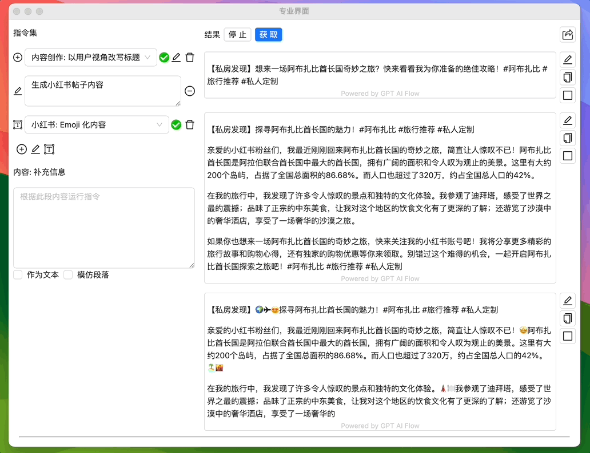

## 手动实现灵活的指令链

如果对上面那种自动化的调取的操作觉得比较难操作，我们能够手动去设置一个手动版本的指令链。

### 将指令链分散到多个工作区

将密集指令链分散为多工作区，运行 `生成小红书内容` 的自定义指令。


获得 `生成小红书内容` 的 `自定义指令` 结果。

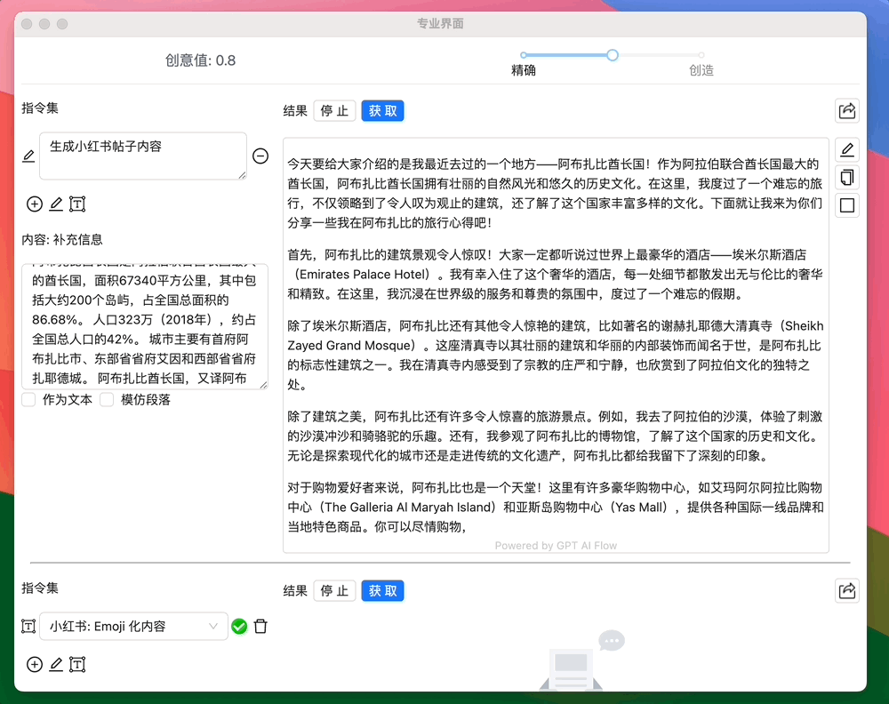

### 将第二工作区的结果复制到第工作区

点击第二工作区右侧的 `复制` 按钮，将结果作为第三工作区的 `补充信息`，点击 `获取`。

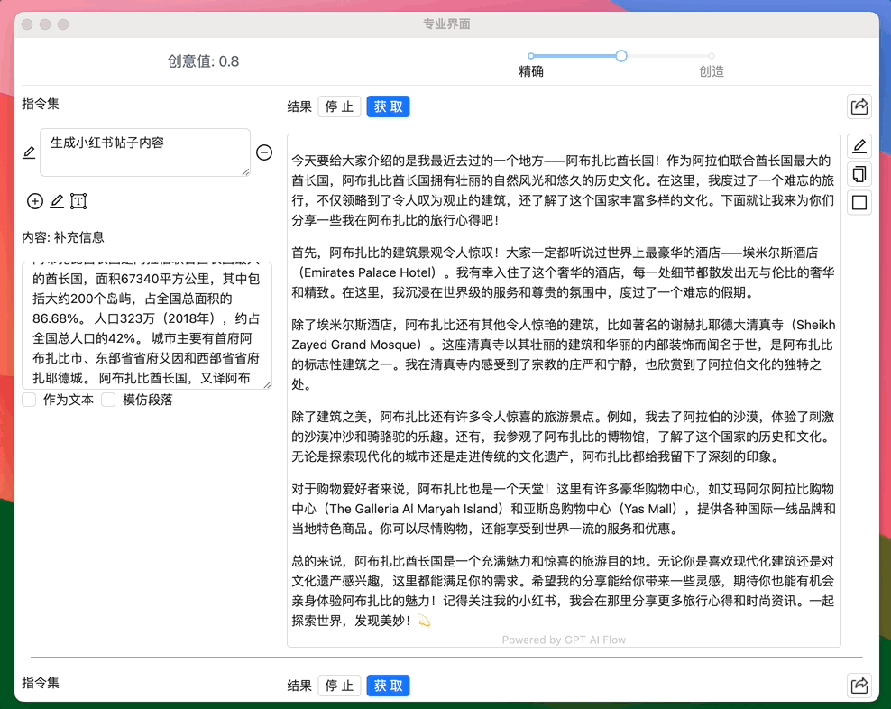

获得 `小红书: Emoji 化内容` 的 `输出指令` 结果。


### 优化手动指令链

#### 编辑优化 `指令` 结果

有时候，AI 并不能提供给我们文案的最佳答案，因此经常地我们需要在结果中直接编辑与优化结果。


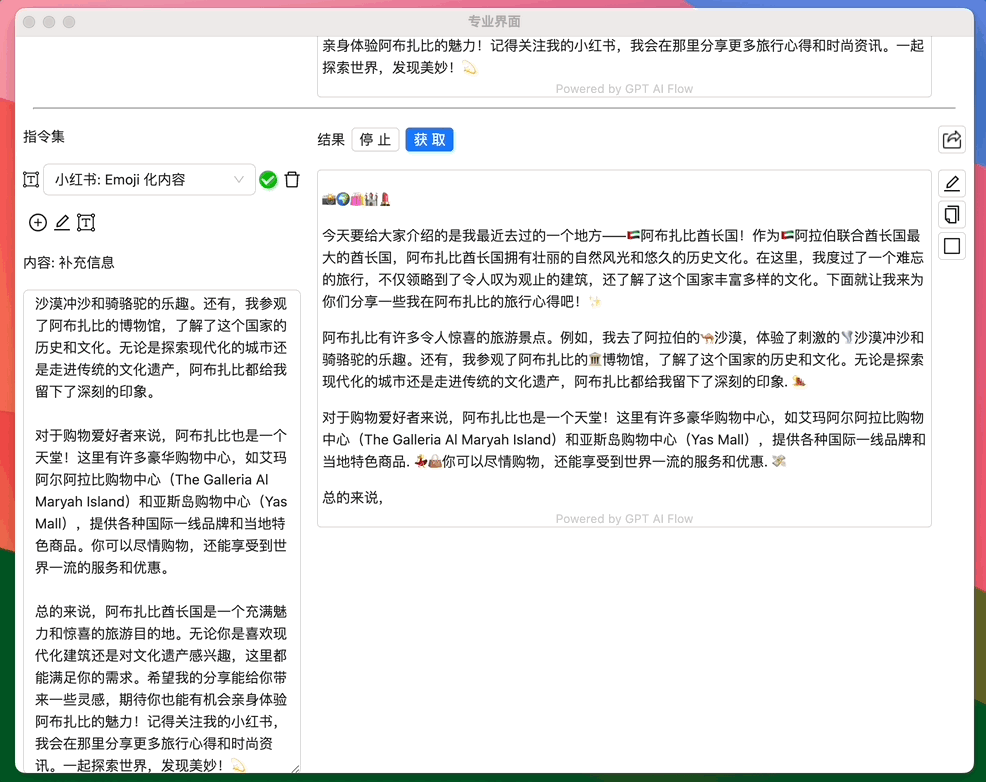

#### 更新补充信息，重新 `获取` 结果

如果觉得当前结果不太好，修改 `补充信息`，再次点击单一工作区的 `获取` 按钮 实现重新生成结果。

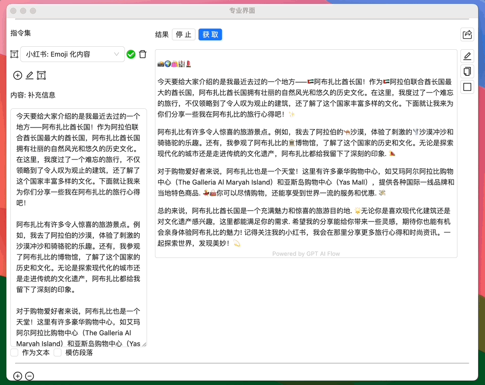


## 应用案例

更多使用案例: [点击这里](/docs/application-scenarios/introduction)  
`指令链` 在 SEO 助理中的使用: [点击这里](/docs/application-scenarios/seo-assistant)

## 联系我们

<ContactUs/>
```
