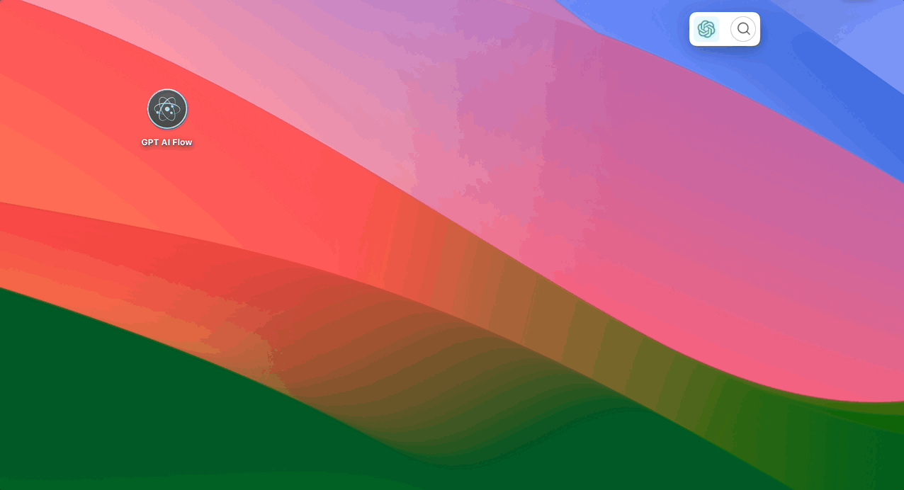
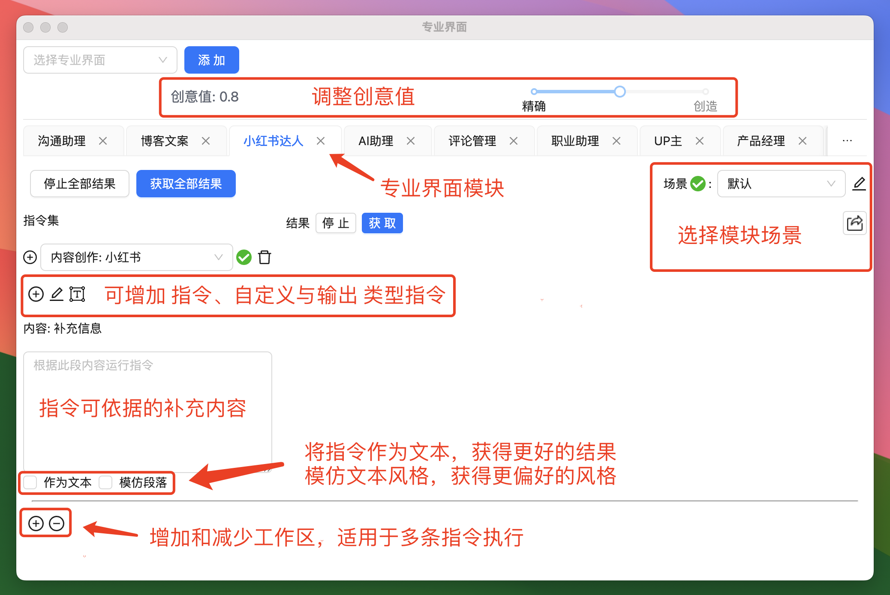
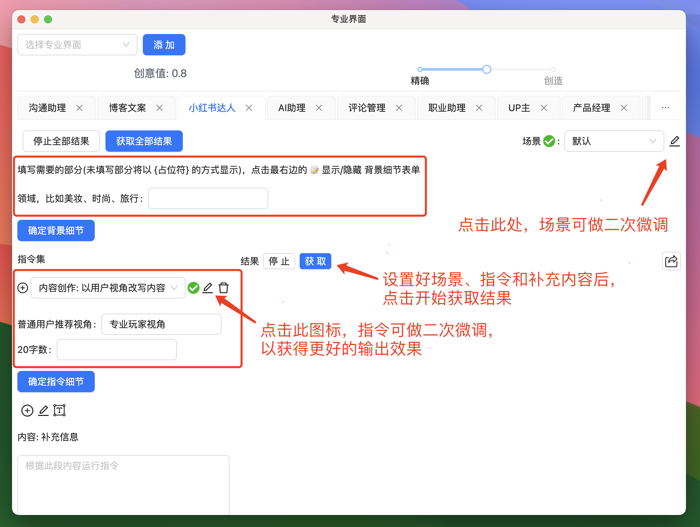
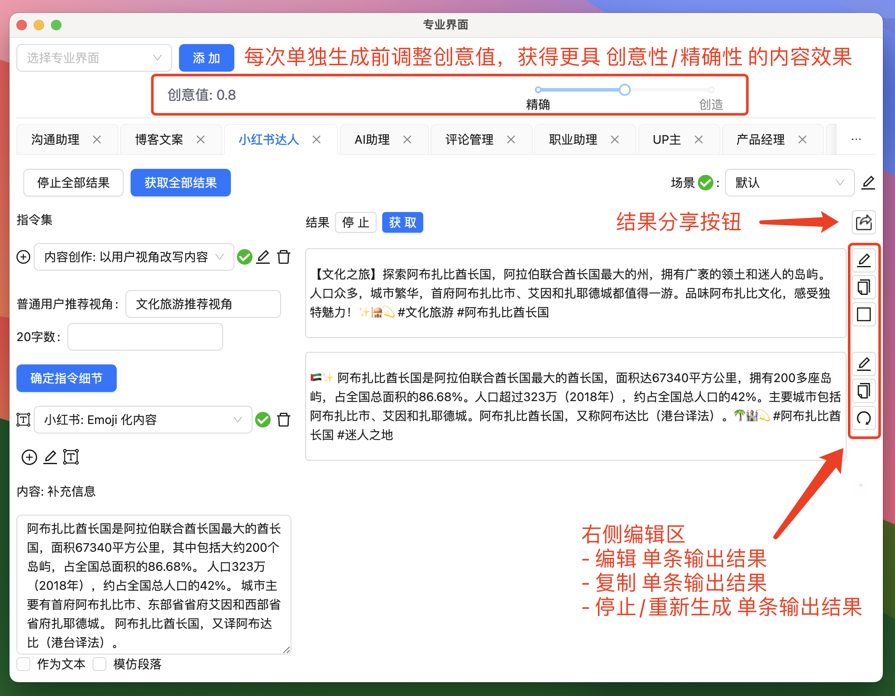

# 专业界面

欢迎深入了解 GPT AI Flow 专业模式的使用方法。在这个页面上，我们将向您展示每个关键使用技巧，确保您可以充分利用这些功能来优化您的内容创作过程。

## 打开专业模式界面

## 专业界面

### 布局介绍

### 二次微调场景与指令

### 结果编辑

## 应用案例

更多使用案例: [点击这里](/docs/application-scenarios/introduction)

## 联系我们

- 立即体验**7 天免费试用期**:
  - [立即体验网页版](https://www.app.gptaiflow.com/login)
  - [下载软件体验全部功能](/download)
- 联系我们
  - 联系邮箱: hello@gptaiflow.com
  - 加入交流群: [点击这里](/communication-group)
  - 产品反馈: [点击这里](https://wj.qq.com/s2/13154598/1770/)
- 💬 有问题? 查看 FAQ 快速解决: [点击这里](/docs/proudct/gpt-ai-flow-guide-and-faq)

感谢您选择 GPT AI Flow, 共同打造未来超级个体的必备工具 ！
