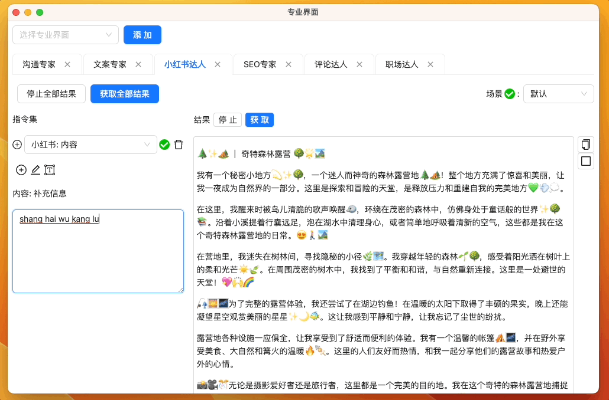

import Image from "@theme/IdealImage";

# 专业模式工作流

## 引入

在当下的信息化时代，我们被海量的数据所包围。手动处理这些数据既耗时又不准确，而 AI SaaS 产品恰恰能智能、迅速地为我们筛选和分析，助我们做出更明智的决策。

- **提高效率**: AI 可以自动完成许多日常任务，如数据分析，几乎不耗时，从而节省大量时间和劳动力。
- **明确决策**: AI 通过分析历史数据，为我们预测未来趋势，使决策更加具有前瞻性。
- **经济高效**: SaaS 模式让用户避免了购买昂贵硬件或软件的成本。只需按需支付，大大节省了投资。

虽然市场上的 AI SaaS 产品众多，但它们常常**缺乏针对具体场景的解决方案**。许多**内容创作者**在付费使用后发现，由于**不懂 AI 技术，很难达到所期望的效果**。而他们又常常忙于创作，无暇深入学习 AI。为了解决这个**不懂技术的痛点**，我们推出了 GPT AI Flow 的专业模式。

这款模式不只是一个 AI 工具，它是**专为内容创作者量身设计**的。我们**提供直观的界面和针对特定创作场景的微调模型**，使创作者可以轻松上手，不必**深挖 AI 技术的细节**。GPT AI Flow 的专业模式将 AI **真正地融入内容创作**，帮助创作者提高工作效率，同时保证输出内容的质量和创新性。

## 产品概述

介绍: [点击这里](../1-intro/index.md)

## 专业模式的核心优势

1. **创新的友好界面设计**: 我们的界面不仅具有创新性，而且注重用户体验，简洁的操作流程和可调参数为用户提供了流畅和高效的使用体验。
2. **广泛的应用场景**: 从沟通、文案、小红书、到 SEO，还扩展至评论和职场白领模块，我们为各种职业场景提供了覆盖。
3. **操作简洁，效果出色**: 利用预设的指令集和一键生成功能，我们确保内容迅速产出，同时保留了个性化调整的空间，以适应用户的独特风格。

我们有信心，你**只需体验片刻**，就会发现它能**显著地提升你的工作效率和内容质量**。这款工具将不仅仅是你工作中的辅助工具，它会迅速地成为你**日常工作的得力伙伴**。

## 竞品对比与优势

### 用户交互界面的创新性

- **我们**: 借助**创新性的专业界面**，我们为用户提供一键生成的便利，参数可随时调整，确保使用者得到一个友好、直观的操作体验。
- **竞品**: 多数只提供一个**单调、不易于调整参数的对话框**，显然缺乏深度的用户体验设计。

### 丰富与个性化的功能特点

- **我们**: 我们拥有多种丰富的模块，并配备了经过专家调试的指令集。为了满足用户的独特需求，我们还**支持广泛的个性化指令**设置。
- **竞品**: 或许只提供基础的功能，**且缺乏针对性和深度的个性化配置**选项。

### 实际应用中的成效

- **我们**: 我们的工具不仅仅是理论上的应用，我们已经实际为客户提供了小红书的运营服务，并**已经取得了显著的成果**，充分证实了我们工具的实际效能。
- **竞品**: 很多只**停留在工具的提供阶段**，而缺乏实际应用场景的验证和反馈。

## 专业界面模块

### 多语翻译员（🎉 免费提供 🎉）

- 功能简介: 为您提供即时、准确的多语种文本翻译功能，助您跨越语言障碍。
- 核心特点:
  - 支持常用多种语言
  - 高准确度与自然的语义表达
  - 用户友好的界面设计，一键翻译

[立即体验](/download)

### 沟通专家

- 功能简介: 强化您的表达能力，确保您在各种场景下的沟通更为流畅和高效。
- 核心特点:
  - 实时纠正语法和用词，确保清晰的沟通。
  - 提供多种实际沟通场景的模板和建议，如项目协作、团队成员反馈等。
  - 深化话语的说服力，助您在各种交际场合更有信心。

与年龄比自己大，拥有成功经验的上司沟通

### 文案专家

#### 文案策略与创意专家

- 功能简介：卓越的文案设计与策略，为您的品牌和信息提供无与伦比的吸引力。
- 核心特点：
  - 🚀 针对不同的目标受众量身打造的文案。
  - 📜 提供丰富的文案模板和实例，覆盖各种需求。
  - 🧠 智能文案审核与修饰，确保每个字句都为您赢得关注。
  - 🔎 结合市场洞察，为您的产品或服务推荐合适的文案策略。

#### 文章与内容优化师

- 功能简介：从文章结构到段落细节，全方位地提升您内容的质量和吸引力。
- 核心特点：
  - 📖 为您提供文章框架、段落建议和具体内容。
  - ✍️ 按照您的需要调整文本的风格，无论是正式、轻松、幽默还是朴素。
  - 🧹 高效地修正拼写、语法错误，清理冗余和过时的词汇。
  - 🎨 精准地澄清意思、加强段落间的过渡和优化段落结构。

#### 广告与品牌传播师

- 功能简介：基于深入的市场理解，为您提供独特且引人注目的广告文案和品牌传播方案。
- 核心特点：
  - 🌎 考虑多语言和跨文化效应，为跨国品牌打造完美文案。
  - 📣 设计具有冲击力的广告标语和宣传活动，增强品牌的市场吸引力。
  - 🎤 提供针对特定国家或文化市场的广告策略和文案建议。

### 小红书达人

- 功能简介：专为小红书用户打造的高效内容创作工具。
- 核心特点：
  - 为您生成符合小红书独特风格的文字、图片和标题
  - 提供当前热门的话题、标签以及内容建议
  - 紧贴小红书核心用户群的喜好，为您量身打造内容结构和语言风格
- 成功案例：[小红书实战案例: 巴黎去哪玩](./5-user-testimonial.md#小红书达人)

尝试发一篇旅游的小红书帖子

最终效果

### SEO 专家

- 功能概述：确保您的在线内容在搜索引擎中取得卓越表现，获得更高的排名。
- 核心能力：
  - 自动优化：自动生成针对 SEO 的标题、摘要、标签和关键词，为您的内容提供最佳的在线可见性。
  - 关键词策略：深入分析您的目标市场，提供关键词建议并提炼最有潜力的词汇。
  - 内容升级：根据当前的 SEO 趋势，提供内容结构、风格和策略的专业建议。
- 真实应用：[小红书实战案例: follow Paris 每周活动推荐](./5-user-testimonial.md#seo-专家)

### 评论达人

- 功能简介: 为您提供深度、多维度的评论撰写服务，确保您的评价准确、中肯且有说服力。
- 核心特点:
  - 能够平衡批评与赞赏，形成具有吸引力的评论。
  - 针对不同的电影、书籍、音乐作品、艺术作品等提供深入的评论和批评
  - 为您的评论注入专业性、真实性和深度，提升用户参与度和购买决策

### 职场达人

- 功能简介: 帮助您在职场中更好地展现自己，为您提供求职、沟通、晋升等方面的专业指导。
- 核心特点:
  - 根据您的经验和技能生成优质的简历和求职信
  - 提供不同工作场景下的沟通和谈判策略
  - 解答关于职业发展的各类疑惑

<!-- [开始使用](#) -->

### up 主

- 功能简介: 为内容创作者提供脚本创作、视频规划和创意建议，使其内容既专业又充满吸引力。
- 核心特点:
  - 提供多种风格的脚本生成，如知识分享、科技评测、搞笑短片等
  - 结合清晰有逻辑的讲述风格，确保内容流畅且引人入胜
  - 动态分析受众喜好，为 up 主提供实时创意与反馈

### 产品经理

- 功能简介: 专为产品团队设计的工具，助力完成需求转化、用户体验优化和产品策略规划。
- 核心特点:
  - 自动生成用户吸引文案、产品标题、介绍和说明
  - 动态分析用户需求与反馈，快速转化为具体的产品特性与优化建议
  - 结合市场趋势和技术，为产品提供迭代策略与上线推广计划

### 营销专家

- 功能简介: 提供全方位的营销策划、内容创意和执行策略，助力品牌和产品实现卓越的市场表现。
- 核心特点:
  - 自动生成吸引眼球的营销推广邮件、文案、合作提案和广告创意
  - 设计专业的营销活动策划、内容营销文章和社交媒体推广策略
  - 注重数据驱动，将营销策略高效转化为实际操作

## 如何获得和启用专业模式

### 1. 价格和购买方式

我们为您提供了具有竞争力的价格结构。具体的价格详情及购买链接，请访问我们的[官方购买页面](/business/prices-table)。

### 2. 启动与配置流程

- 步骤一: 完成[软件的注册和安装](./1-registration-process.md#下载-gpt-ai-flow-软件安装)。
- 步骤二: 启动软件后，首先进入设置界面输入您的 OpenAI API key。此步骤确保软件与您的 OpenAI 账户进行链接。

- 步骤三: 软件需要注册登录才能够使用，在设置界面进行账户注册并登录。完成此步骤后，您可能需要重新启动软件以确保设置生效。

- 步骤四: 软件重启后，在主界面点击悬浮窗左侧的箭头按钮，即可打开专业模式界面。

- 步骤五: 如果想使用全部的专家模块需要订阅我们的软件，来到设置界面的‘专业模式’，点击成为早期会员链接。

在弹出的窗口中选择 StartAI 入门工具版，填入支付方式(请确保填写的邮箱与当前账户一致)后，重启启动软件查看专业界面即可访问全部的模块。

- 步骤六: 回到软件，再次进入专业界面看看是否能够使用所有模块，如果不行的话请重启软件即可使用。

:::tip 试用期体验
如果遇到支付后仍然无法使用的问题，请联系我们，我们会第一时间联系您解决问题。

想要体验专业模式下的全部模块，您可以进入设置界面，选择“专业模式”选项，并开启 <a href="/download" style={{color: "#3875f6", fontSize: "1.2rem", fontWeight: "bolder", textDecoration: "none" }}>7 天免费试用期</a>。这将允许您在有限的时间内免费体验所有的专业功能。
:::

## 结论

在今天的数字化世界中，AI SaaS 产品的需求呈指数级增长，其中带来的效率和决策优势无疑对任何行业都有不小的吸引力。但问题在于: **如何选择一个真正适合自己，且具有高度应用价值的工具？**

从您刚看过的内容中，我们相信 GPT AI Flow 的专业模式已经为您提供了**明确的答案**。

这不仅仅是一个帮助您高效工作的工具，更是一个真正理解内容创作者需求，为您量身打造的助手。**无需您深入了解复杂的 AI 技术，我们为您简化了所有的步骤，从界面设计到功能调优，每一处都为了确保您能够简单、高效、创新地完成工作。**

比较市场上的竞品，您会发现 GPT AI Flow 在实际应用中的效益、用户体验以及功能特点上均表现出色。**实际的应用案例和真实客户反馈都印证了这一点。**

**为何要选择我们？**因为您值得拥有这样一款工具，它能够真正助您一臂之力，无论是简化工作流程，提高工作效率，还是保障内容质量，GPT AI Flow 都能够做到。

最后，我们真诚地**邀请您尝试我们的产品**。您可以通过 [官方购买页面](/business/prices-table) 了解价格详情，或是**先尝试 7 天免费试用期，感受它为您带来的变化**。相信您会发现，与 GPT AI Flow 一同工作，每一天都将变得更加轻松、高效。

期待您的加入，成为未来的引领者，与您共同开创职业新纪元！

## 联系我们

- 立即体验**7 天免费试用期**: [点击这里](/download)
- 联系邮箱: hello@gptaiflow.com
- [💬 有问题? 联系我们或查看 FAQ](./6-faq.md)
- 产品反馈: [点击这里](https://wj.qq.com/s2/12214642/c9c6)

感谢您选择 GPT AI Flow, 共同打造未来超级个体的必备工具 ！
