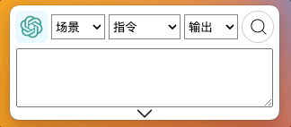
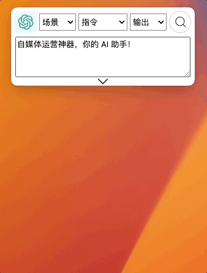
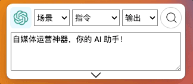
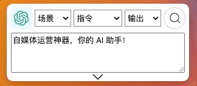
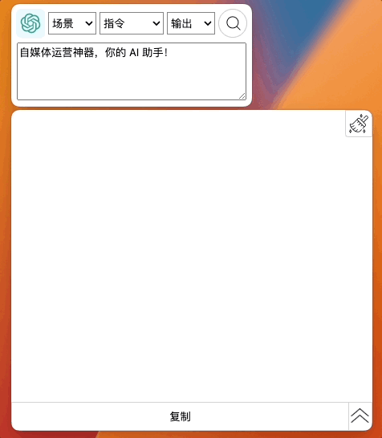

---
---

# 使用与快捷键

## 使用

- 在设置窗口填写 OpenAI API Key，发起询问和搜索
  - youtube: https://youtu.be/Y1d_Zkx_KaU
- 通过快捷键，输入和搜索问题并使用复制按钮和对话框隐藏按钮
  - youtube: https://youtu.be/wR25u6XEvVQ
  - B 站: https://www.bilibili.com/video/BV1Gh4y1p7Yh/
- 增加、修改 和 删除 指令集
  - youtube: https://youtu.be/bjz4B_-9s3U
- 重置对话框内容，重置指令集，重置所有本地数据资料
  - youtube: https://youtu.be/Yuy46iTH7gs

## 快捷键

选择文本，按 `Ctrl + C` 复制，按 `Alt + /`，将已经复制文本粘贴到 GPT AI Flow 的输入框;

通过鼠标选择 AI 工具场景。

`Shift + up` 上方向键 和 `Shift + down` 下方向键,更换中间 `指令` 选项;

`Alt + up` 上方向键 和 `Alt + down` 下方向键，更换 🫱 右侧选框的输出选项；

未选中软件时按 `Alt + 回车`，选中软件时按 `回车` 开启搜索提问；  
搜索过程中，按 `回车` 暂停搜索。

选中输入框的情况下，按 `Shift + 回车` 换行，另起一行输入。

## 联系我们

- 立即体验: [点击这里](/download)
- 联系邮箱: hello@gptaiflow.com
- [💬 有问题? 联系我们或查看 FAQ](../2-proudct/5-faq.md)
- 产品反馈: [点击这里](https://wj.qq.com/s2/12214642/c9c6)

感谢您选择 GPT AI Flow ！
