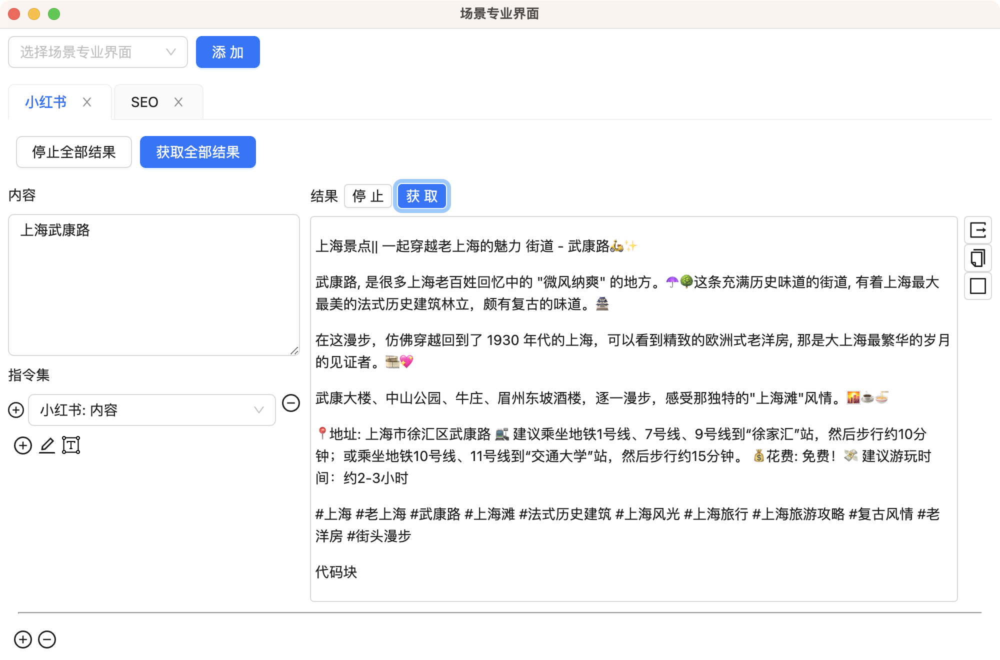
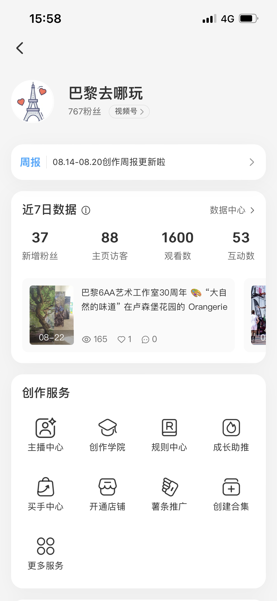
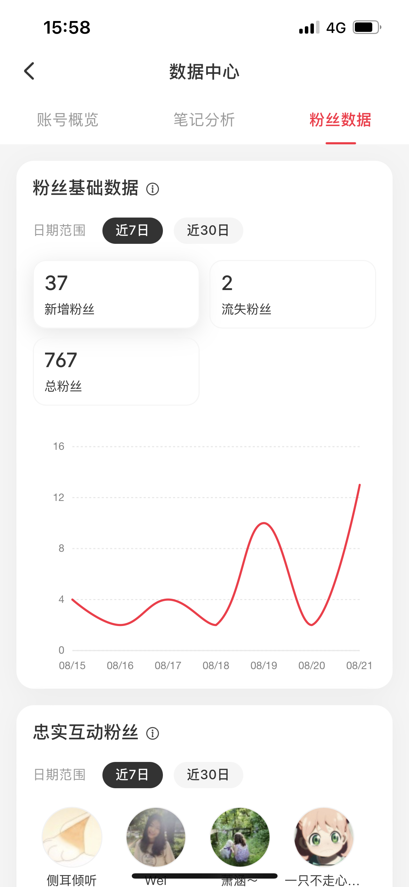
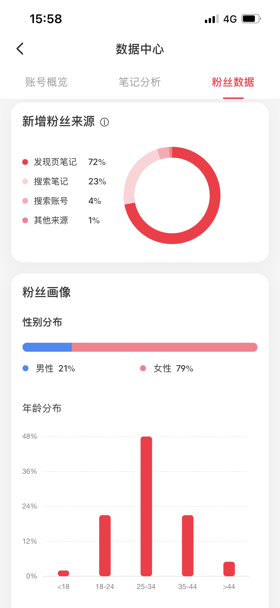
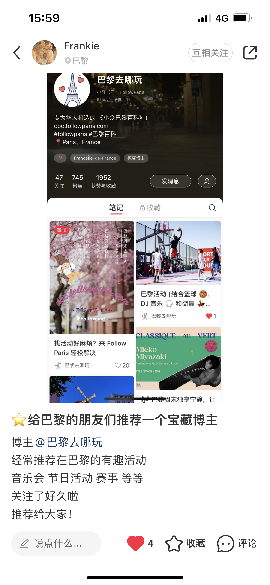

# 专业模式工作

## 引入

在当下的信息化时代，我们被海量的数据所包围。手动处理这些数据既耗时又不准确，而 AI SaaS 产品恰恰能智能、迅速地为我们筛选和分析，助我们做出更明智的决策。

- **提高效率**: AI 可以自动完成许多日常任务，如数据分析，几乎不耗时，从而节省大量时间和劳动力。
- **明确决策**: AI 通过分析历史数据，为我们预测未来趋势，使决策更加具有前瞻性。
- **经济高效**: SaaS 模式让用户避免了购买昂贵硬件或软件的成本。只需按需支付，大大节省了投资。

虽然市场上的 AI SaaS 产品众多，但它们常常缺乏针对具体场景的解决方案。许多内容创作者在付费使用后发现，由于不懂 AI 技术，很难达到所期望的效果。而他们又常常忙于创作，无暇深入学习 AI。为了解决这个痛点，我们推出了 GPT AI Flow 的专业模式。

这款模式不只是一个 AI 工具，它是**专为内容创作者量身设计**的。我们**提供直观的界面和针对特定创作场景的微调模型**，使创作者可以轻松上手，不必**深挖 AI 技术的细节**。GPT AI Flow 的专业模式将 AI **真正地融入内容创作**，帮助创作者提高工作效率，同时保证输出内容的质量和创新性。

## 产品概述

介绍: [点击这里](../1-intro/index.md)

高效产品模块: [点击这里](./2-modules.md)

## 专业模式的核心优势

1. **创新的友好界面设计**：我们的界面不仅具有创新性，而且注重用户体验，简洁的操作流程和可调参数为用户提供了流畅和高效的使用体验。
2. **广泛的应用场景**：从沟通、文案、小红书、到 SEO，还扩展至评论和职场白领模块，我们为各种职业场景提供了覆盖。
3. **操作简洁，效果出色**：利用预设的指令集和一键生成功能，我们确保内容迅速产出，同时保留了个性化调整的空间，以适应用户的独特风格。

我们有信心，你**只需体验片刻**，就会发现它能**显著地提升你的工作效率和内容质量**。这款工具将不仅仅是你工作中的辅助工具，它会迅速地成为你**日常工作的得力伙伴**。

## 竞品对比与优势

### 用户交互界面的创新性

- **我们**: 借助创新性的专业界面，我们为用户提供一键生成的便利，参数可随时调整，确保使用者得到一个友好、直观的操作体验。
- **竞品**: 多数只提供一个单调、不易于交互的对话框，显然缺乏深度的用户体验设计。

### 丰富与个性化的功能特点

- **我们**: 我们拥有多种丰富的模块，并配备了经过专家调试的指令集。为了满足用户的独特需求，我们还支持广泛的个性化指令设置。
- **竞品**: 或许只提供基础的功能，且缺乏针对性和深度的个性化配置选项。

### 实际应用中的成效

- **我们**: 我们的工具不仅仅是理论上的应用，我们已经实际为客户提供了小红书的运营服务，并取得了显著的成果，充分证实了我们工具的实际效能。
- **竞品**: 很多只停留在工具的提供阶段，而缺乏实际应用场景的验证和反馈。

## 应用案例

### 沟通模式展示

### 小红书模式展示

- 介绍 1-2 个真实的应用案例，展示如何在实际场景中使用此产品的专业模式。
- 该案例所带来的具体成果或效益。

## 客户反馈和评价

“巴黎去哪玩”在小红书平台的关注数，仅在一个月内便增长了 40%。您也有机会创造如此佳绩！

> "使用这套工具后，我的工作效率提高了 50%！" ——满意的用户张先生

## 如何获得和启用专业模式

- 价格结构和购买链接。
- 简单的启动和配置指南。

## 结论

## 联系我们

- 立即体验: [点击这里](/download)
- 联系邮箱: hello@gptaiflow.com
- [💬 有问题? 联系我们或查看 FAQ](./5-faq.md)
- 产品反馈: [点击这里](https://wj.qq.com/s2/12214642/c9c6)

感谢您选择 GPT AI Flow ！
