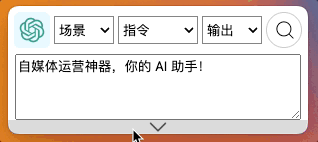
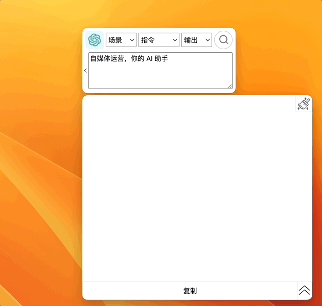
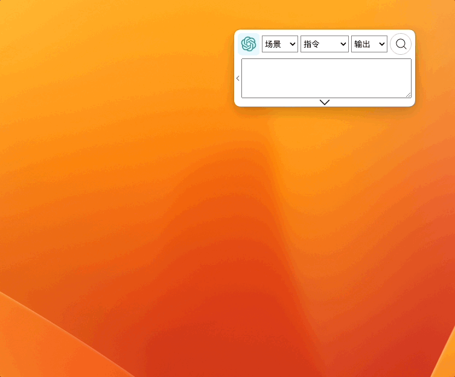
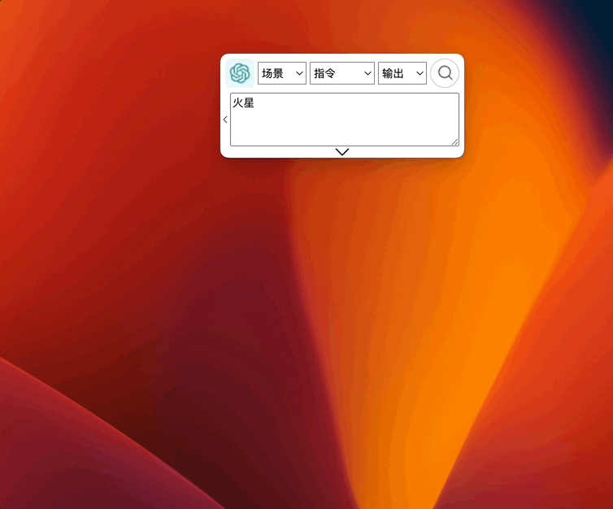
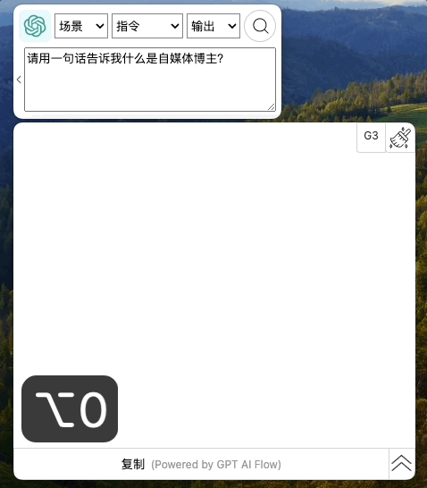
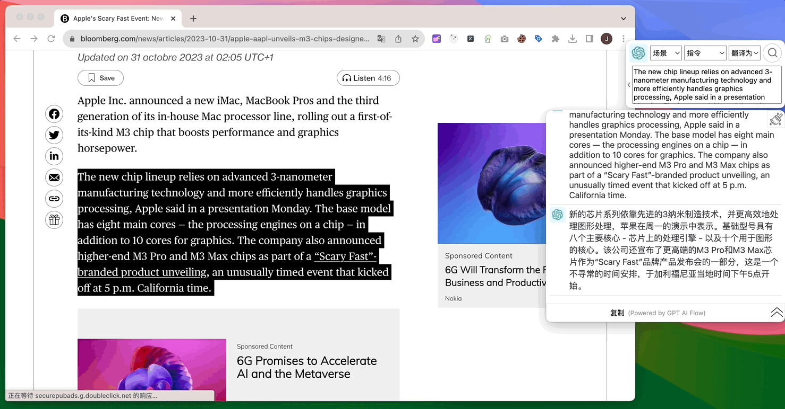
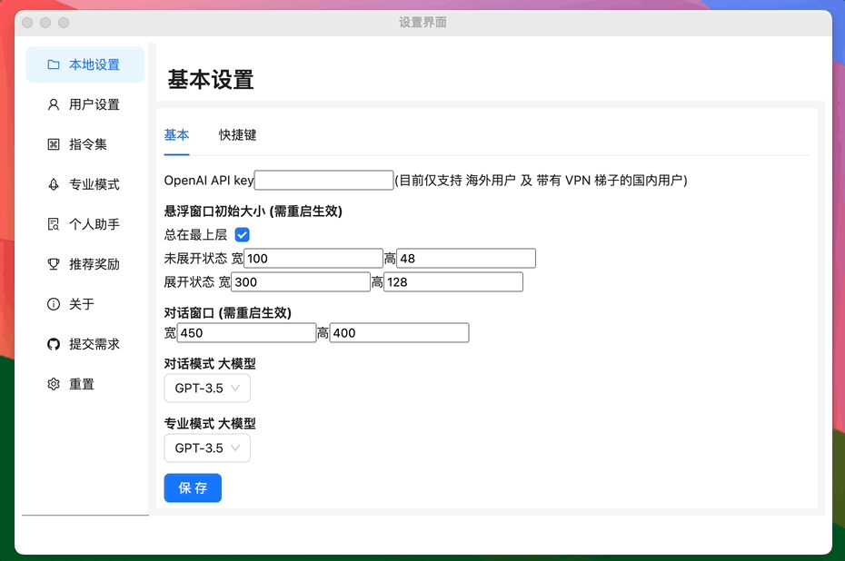

import ContactUs from "../9-contact-us.md"

# AI 工具快捷键大全：一键操作提升效率的完整指南

## 基本使用

### 选择指令

通过鼠标选择 AI 工具场景。

`Shift + up` 上方向键 和 `Shift + down` 下方向键,更换中间 `指令` 选项;

`Alt + up` 上方向键 和 `Alt + down` 下方向键，更换 🫱 右侧选框的输出选项；

### 复制文本

选择文本，按 `Ctrl + C` 复制，按 `Alt + /`，将已经复制文本粘贴到 GPT AI Flow 的输入框;

### 输入文本

选中输入框的情况下，按 `Shift + 回车` 换行，另起一行输入。

### 搜索 🔍

未选中软件时按 `Alt + 回车`，选中软件时按 `回车` 开启搜索提问；  
搜索过程中按`Alt + 回车` 或 选中软件按 `回车` 暂停搜索。

## 显示/隐藏界面

### 显示/隐藏主界面

按下 `Shift + Alt + Space` 键可以方便地显示/隐藏主窗口，并且光标会自动聚焦到主窗口并可编辑。

### 显示/隐藏对话框

按下 `Alt + Space` 键可以方便地显示/隐藏对话窗口。

## 操作对话历史

### 快速清空对话历史

方法 1: `Alt + 0` 快捷键: 快速清空对话历史；

方法 2: 点击对话框右上角的刷子按钮清空对话历史。

## 切换 AI 大模型类型

点击对话框右上角的 `G3` 或 `G4` 实现快速模型切换，使用 `G4` 解决复杂的问题，能够获得更全面的答案。

:::tip
想要获得 G4 的切换请在试用时候选择工具版。
:::

## 高级快捷键用法

### 选中文本，直接按快捷键

自 v0.1.25 版本之后，我们不需要进行复制操作，选中文本，直接按 对应快捷键，便能够快速查找、翻译内容。

配合 [用户自定义快捷键](#用户专属快捷键) 与 [自定义指令集](/docs/proudct/basic-presentation#指令集) 设置自己的专属快捷键。

:::info
注意，此功能需要确保应用的权限。

- 请确保该应用在 MacOS 系统中获得 `设置 > 隐私与安全 > 辅助功能` 的权限。
- 请确保该应用在 Windows 系统中首次运行是通过右键选择 `以管理员身份运行`打开。
- 另外如果是使用 Windows 系统的用户，在确定应用有足够权限的情况下，需要快速的按 `Alt+1` 、 `Alt+2` 或 `Alt+3` 快捷键才能够保证它们的正常使用，如果发现快捷键并未正常工作，请多试几次，需要快速按下去，立刻松手才能够正常触发。

:::

## 用户自定义快捷键

配合 [用户自定义指令集](/docs/proudct/basic-presentation#指令集) 使用，效率倍增！

## 联系我们

<ContactUs/>
