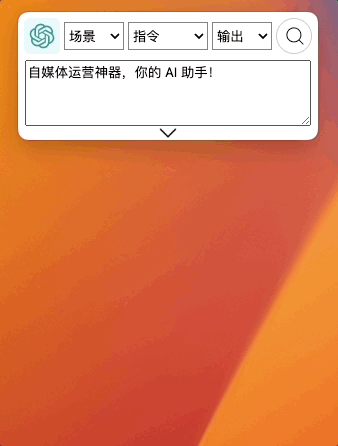
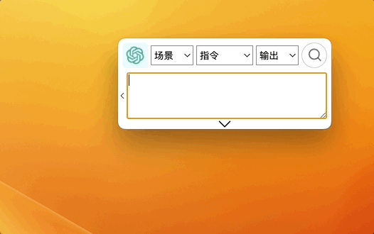
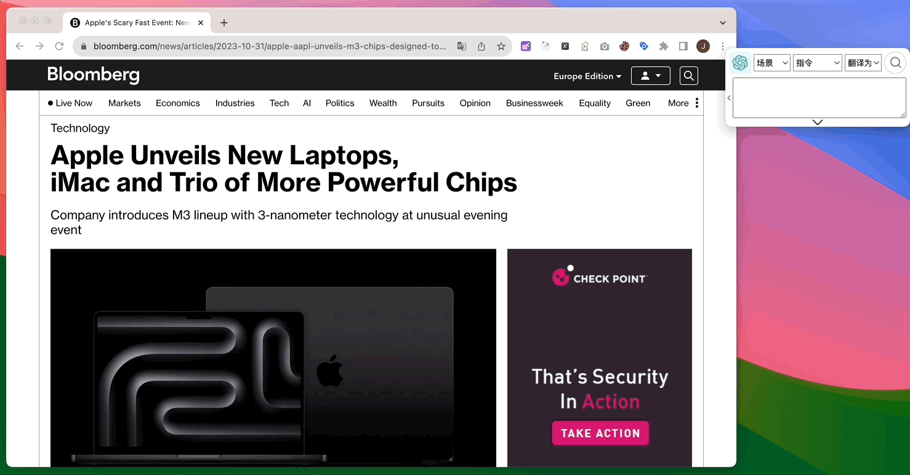

# AI 工具快捷键大全：一键操作提升效率的完整指南

## 基本使用

### 选择指令

通过鼠标选择 AI 工具场景。

`Shift + up` 上方向键 和 `Shift + down` 下方向键,更换中间 `指令` 选项;

`Alt + up` 上方向键 和 `Alt + down` 下方向键，更换 🫱 右侧选框的输出选项；

### 复制文本

选择文本，按 `Ctrl + C` 复制，按 `Alt + /`，将已经复制文本粘贴到 GPT AI Flow 的输入框;

### 输入文本

选中输入框的情况下，按 `Shift + 回车` 换行，另起一行输入。

### 搜索 🔍

未选中软件时按 `Alt + 回车`，选中软件时按 `回车` 开启搜索提问；  
搜索过程中按`Alt + 回车` 或 选中软件按 `回车` 暂停搜索。

## 高效使用

### 选中文本，直接按快捷键

自 v0.1.25 版本之后，我们不需要进行复制操作，选中文本，直接按 对应快捷键，便能够快速查找、翻译内容。

:::info
注意，此功能需要确保应用的权限。

- 请确保该应用在 MacOS 系统中获得 `设置 > 隐私与安全 > 辅助功能` 的权限。
- 请确保该应用在 Windows 系统中首次运行是通过右键选择 `以管理员身份运行`打开。
- 另外如果是使用 Windows 系统的用户，在确定应用有足够权限的情况下，需要快速的按 `Alt+1` 、 `Alt+2` 或 `Alt+3` 快捷键才能够保证它们的正常使用，如果发现快捷键并未正常工作，请多试几次，需要快速按下去，立刻松手才能够正常触发。

:::

### 自定义快捷键设置

配合 [自定义指令集](/docs/proudct/user-guide-floating-window-commands-management#指令集) 使用，效率倍增！

## 显示隐藏

### 显示/隐藏主界面

按下 `Shift + Alt + Space` 键可以方便地显示/隐藏主窗口，并且光标会自动聚焦到主窗口并可编辑。

### 显示/隐藏对话框

按下 `Alt + Space` 键可以方便地显示/隐藏对话窗口。

## 联系我们

- 立即体验**7 天免费试用期**:
  - [立即体验网页版](https://www.app.gptaiflow.com/login)
  - [下载软件体验全部功能](/download)
- 联系我们
  - 联系邮箱: hello@gptaiflow.com
  - 加入交流群: [点击这里](/communication-group)
  - 产品反馈: [点击这里](https://wj.qq.com/s2/13154598/1770/)
- 💬 有问题? 查看 FAQ 快速解决: [点击这里](/docs/proudct/gpt-ai-flow-guide-and-faq)

感谢您选择 GPT AI Flow, 共同打造未来超级个体的必备工具 ！
