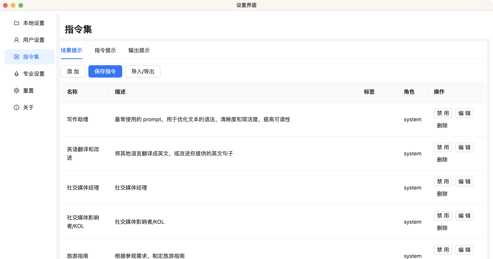

# 常见问题

## GPT AI Flow 工具 可以支持在国内使用吗 ？

目前我们的软件版本能够在 国内/海外 使用，我们推荐国内用户配合“梯子魔法”来无风险的使用此款工具。

## 使用 GPT AI Flow 时，需要用户提供什么信息吗 ？

所有的用户都需要提供 OpenAI 的 API 密匙。

- 如果用户选择 `免费版` 或 `入门工具版`，用户需要提供 OpenAI 的 API 密匙。
- 如果用户选择 `入门模型版`，用户无需提供任何信息。

:::info 注意
这个密匙请保存保管好，不要发给任何人。  
如何申请 OpenAI API 密匙: [点击这里](/blog/how-to-register-for-OpenAI-account-and-get-OpenAI-api-key)
:::

## 我如何找到 GPT AI Flow 的教程 ？

未来我们会整理 AI 工具的使用方式，以文章的方式放在这个网站上，请收藏我们的网站。另一方面，更多与 AI 相关的知识和视频内容正在制作中，很快将会与大家见面！请关注 [小卡大脑洞](https://space.bilibili.com/137975681) 频道，关注 AI 发展和应用，提升 10 倍个人效率，成为超级个体。

<iframe src="//player.bilibili.com/player.html?aid=490716983&bvid=BV1sN411i7Uh&cid=1259490531&p=1" scrolling="no" border="0" frameBorder="no" framespacing="0" allowFullScreen="true"> </iframe>

## 现在我可以加入自定义指令吗 ？

可以的，在设置界面中，我们能够设置场景、指令与输出提示。

## 如何导出自定义指令？

重制所有本地存储之前，请确保你已经导出所有自定义指令。  
因为我们不会将它们保存到云上，提前导出或者经常被分避免丢失自定义指令。

## 如果产品使用出现问题，是否有什么快速的解决办法吗 ？

### 常规检查

请按照以下步骤检查：

- 是否是最新版本的 GPT AI Flow？
  - 您可以通过 '设置界面' 的关于栏目找到当前版本信息，如果发现本地版本与官方[最新版本](../7-product-release/index.md)不一致，请到 [软件下载页面](/download) 下载最新版本。
- 是否填写了正确可用的 OpenAI API key？
- 是否已经注册并登录用户？
- 填写和登录后，仍然无法使用，请重启软件，再试一次。

### 最终解决办法

目前有一个非常快速的解决问题的办法，就是将软件的本地存储重置掉。

重置方法是，在电脑的右上角或右下角找到软件的图标，右键打开菜单选择‘重置所有本地存储’，之后重新打开软件即可，或者到设置界面的‘重置界面’点击重置所有数据。

这个操作需要**谨慎**，因为这会清除之前加入的所有自定义指令。**请记住，重置所有本地数据后需要重新填写 OpenAI `API key`。**

## 为什么我无法使用 OpenAI 的 GPT-4 模型？

是否能够使用 GPT-4 模型取决于你的 OpenAI 账户是否开通的 GPT-4 API 的访问权限。

开启方法有两个：

1. 购买一个月的 OpenAI Plus 账户，系统会自动帮你开启你的 GPT-4 API 访问权限。
2. 所有在 OpenAI API 花费超过 1 美元的用户，都会授予 GPT-4 API(8k)的访问权限。

## 联系我们

- 立即体验**7 天免费试用期**:
  - [网页版立即体验](https://www.app.gptaiflow.com/login)
  - [完整体验点击这里](/download)
- 联系邮箱: hello@gptaiflow.com
- [💬 有问题? 联系我们或查看 FAQ](./6-faq.md)
- 产品反馈: [点击这里](https://wj.qq.com/s2/12214642/c9c6)

感谢您选择 GPT AI Flow, 共同打造未来超级个体的必备工具 ！
