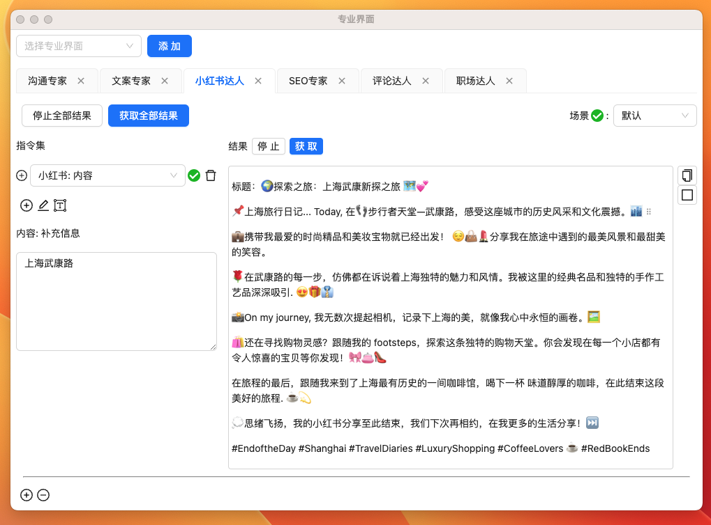

import {CardsForFeatures} from "../../src/pages/astro-theme/components/Features";

# 专业界面模块

<CardsForFeatures />

:::tip
使用所有专业模块需要有大模型的支持。
:::

## 免费专业模块

### 夸夸小助手 {#praise-assistant}

### 回复领导 {#response-to-leader}

### 朋友圈文案 {#peng-you-quan}

### 群发消息 {#group-notice}

### mbti 研究员 {#mbti-researcher}

## 付费专业模块

### 文案专家

#### 文案策略与创意专家

- 功能简介：卓越的文案设计与策略，为您的品牌和信息提供无与伦比的吸引力。
- 核心特点：
  - 🚀 针对不同的目标受众量身打造的文案。
  - 📜 提供丰富的文案模板和实例，覆盖各种需求。
  - 🧠 智能文案审核与修饰，确保每个字句都为您赢得关注。
  - 🔎 结合市场洞察，为您的产品或服务推荐合适的文案策略。

#### 文章与内容优化师

- 功能简介：从文章结构到段落细节，全方位地提升您内容的质量和吸引力。
- 核心特点：
  - 📖 为您提供文章框架、段落建议和具体内容。
  - ✍️ 按照您的需要调整文本的风格，无论是正式、轻松、幽默还是朴素。
  - 🧹 高效地修正拼写、语法错误，清理冗余和过时的词汇。
  - 🎨 精准地澄清意思、加强段落间的过渡和优化段落结构。

#### 广告与品牌传播师

- 功能简介：基于深入的市场理解，为您提供独特且引人注目的广告文案和品牌传播方案。
- 核心特点：
  - 🌎 考虑多语言和跨文化效应，为跨国品牌打造完美文案。
  - 📣 设计具有冲击力的广告标语和宣传活动，增强品牌的市场吸引力。
  - 🎤 提供针对特定国家或文化市场的广告策略和文案建议。

### 小红书达人

- 功能简介：专为小红书用户打造的高效内容创作工具。
- 核心特点：
  - 为您生成符合小红书独特风格的文字、图片和标题
  - 提供当前热门的话题、标签以及内容建议
  - 紧贴小红书核心用户群的喜好，为您量身打造内容结构和语言风格
- 成功案例：[小红书实战案例: 巴黎去哪玩](./5-user-testimonial.md#小红书达人)

尝试发一篇旅游的小红书帖子

最终效果

### SEO 专家

- 功能概述：确保您的在线内容在搜索引擎中取得卓越表现，获得更高的排名。
- 核心能力：
  - 自动优化：自动生成针对 SEO 的标题、摘要、标签和关键词，为您的内容提供最佳的在线可见性。
  - 关键词策略：深入分析您的目标市场，提供关键词建议并提炼最有潜力的词汇。
  - 内容升级：根据当前的 SEO 趋势，提供内容结构、风格和策略的专业建议。
- 真实应用：[小红书实战案例: follow Paris 每周活动推荐](./5-user-testimonial.md#seo-专家)

### 评论达人

- 功能简介: 为您提供深度、多维度的评论撰写服务，确保您的评价准确、中肯且有说服力。
- 核心特点:
  - 能够平衡批评与赞赏，形成具有吸引力的评论。
  - 针对不同的电影、书籍、音乐作品、艺术作品等提供深入的评论和批评
  - 为您的评论注入专业性、真实性和深度，提升用户参与度和购买决策

### 职场达人

- 功能简介: 帮助您在职场中更好地展现自己，为您提供求职、沟通、晋升等方面的专业指导。
- 核心特点:
  - 根据您的经验和技能生成优质的简历和求职信
  - 提供不同工作场景下的沟通和谈判策略
  - 解答关于职业发展的各类疑惑

<!-- [开始使用](#) -->

### up 主

- 功能简介: 为内容创作者提供脚本创作、视频规划和创意建议，使其内容既专业又充满吸引力。
- 核心特点:
  - 提供多种风格的脚本生成，如知识分享、科技评测、搞笑短片等
  - 结合清晰有逻辑的讲述风格，确保内容流畅且引人入胜
  - 动态分析受众喜好，为 up 主提供实时创意与反馈

### 产品经理

- 功能简介: 专为产品团队设计的工具，助力完成需求转化、用户体验优化和产品策略规划。
- 核心特点:
  - 自动生成用户吸引文案、产品标题、介绍和说明
  - 动态分析用户需求与反馈，快速转化为具体的产品特性与优化建议
  - 结合市场趋势和技术，为产品提供迭代策略与上线推广计划

### 营销专家

- 功能简介: 提供全方位的营销策划、内容创意和执行策略，助力品牌和产品实现卓越的市场表现。
- 核心特点:
  - 自动生成吸引眼球的营销推广邮件、文案、合作提案和广告创意
  - 设计专业的营销活动策划、内容营销文章和社交媒体推广策略
  - 注重数据驱动，将营销策略高效转化为实际操作
