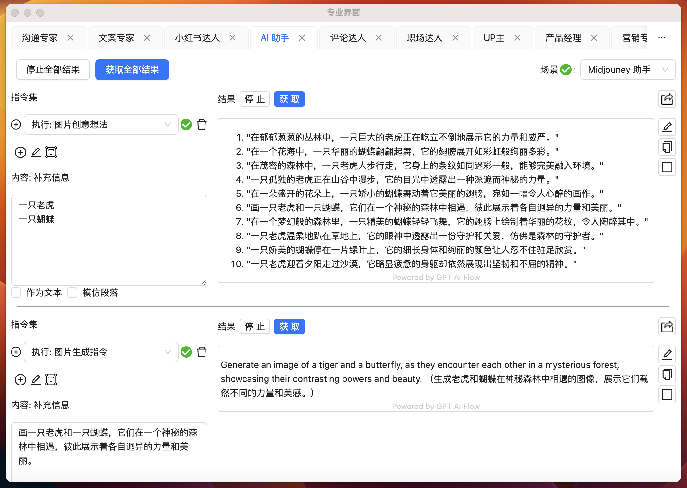

# AI 助理

## Midjourney 助手



```text
Generate an image of a tiger and a butterfly, as they encounter each other in a mysterious forest, showcasing their contrasting powers and beauty.（生成老虎和蝴蝶在神秘森林中相遇的图像，展示它们截然不同的力量和美感。）
```


## 联系我们

- 立即体验**7 天免费试用期**:
  - [立即体验网页版](https://www.app.gptaiflow.com/login)
  - [下载软件体验全部功能](/download)
- 联系我们
  - 联系邮箱: hello@gptaiflow.com
  - 加入交流群: [点击这里](/communication-group)
  - 产品反馈: [点击这里](https://wj.qq.com/s2/13154598/1770/)
- 💬 有问题? 查看 FAQ 快速解决: [点击这里](/docs/proudct/gpt-ai-flow-guide-and-faq)

感谢您选择 GPT AI Flow, 共同打造未来超级个体的必备工具 ！
