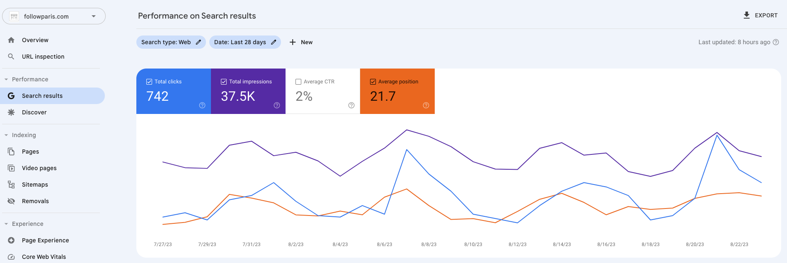

import Image from "@theme/IdealImage";

# 用户案例

## 巴黎去哪玩

### 小红书达人

“[巴黎去哪玩(2023.08.25)](https://www.xiaohongshu.com/user/profile/56cf33c550c4b408633787cf)”在小红书平台的关注数，仅在一个月内便增长了 40%。您也有机会创造如此佳绩！

    <Image img={require("./img/15-user-testimonial/followparis/2023-08-23-img-1-xiaohognshu-followparis-7-days-data.png")} style={{ width: 300, marginLeft: "1rem", marginTop: "1rem" }} />
    <Image img={require("./img/15-user-testimonial/followparis/2023-08-23-img-2-xiaohognshu-followparis-7-days-data.png")} style={{ width: 300, marginLeft: "1rem", marginTop: "1rem" }} />
    <Image img={require("./img/15-user-testimonial/followparis/2023-08-23-img-3-xiaohognshu-followparis-7-days-data.png")} style={{ width: 300, marginLeft: "1rem", marginTop: "1rem" }} />
    

    得到其他小红书博主的推荐
        <Image img={require("./img/15-user-testimonial/followparis/2023-08-23-img-5-xiaohognshu-followparis-be-recommanded.png")} style={{ width: 300 }} />
    

### SEO 助理

[Follow Paris 巴黎去哪玩(2023.08.25)](https://www.followparis.com/zh/que-faire-a-paris-cette-semaine) 网站 SEO 排行 Goolge 搜索首页。

数据：过去 28 天谷歌搜索流量 3.75 万，自然点击 742 人。

Google 搜索关键词：

- que faire à paris cette semaine
- que faire a paris cette semaine
- follow paris
- paris cette semaine
- quoi faire à paris cette semaine
- que faire cette semaine à paris
- que faire cette semaine à paris

:::info 用户反馈

> "使用这套工具后，我的工作效率提高了 50%！" ——满意的用户张先生

:::

## 联系我们

- 立即体验**7 天免费试用期**:
  - [立即体验网页版](https://www.app.gptaiflow.com/login)
  - [下载软件体验全部功能](/download)
- 💬 有问题? 查看 FAQ 快速解决: [点击这里](/docs/proudct/gpt-ai-flow-guide-and-faq)
- 联系我们
  - 联系邮箱: hello@gptaiflow.com
  - 加入交流群: [点击这里](/communication-group)
  - 产品反馈: [点击这里](https://wj.qq.com/s2/13154598/1770/)

感谢您选择 GPT AI Flow, 共同打造未来超级个体的必备工具 ！
