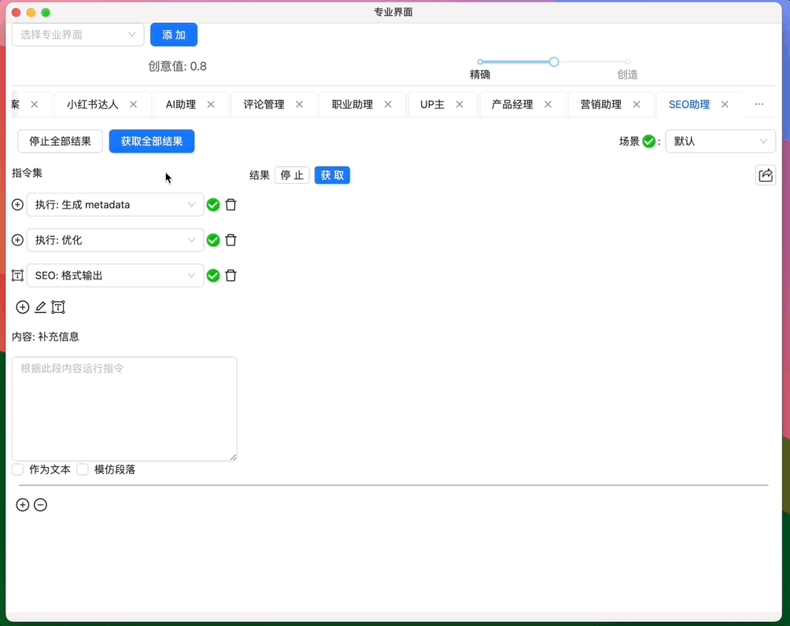
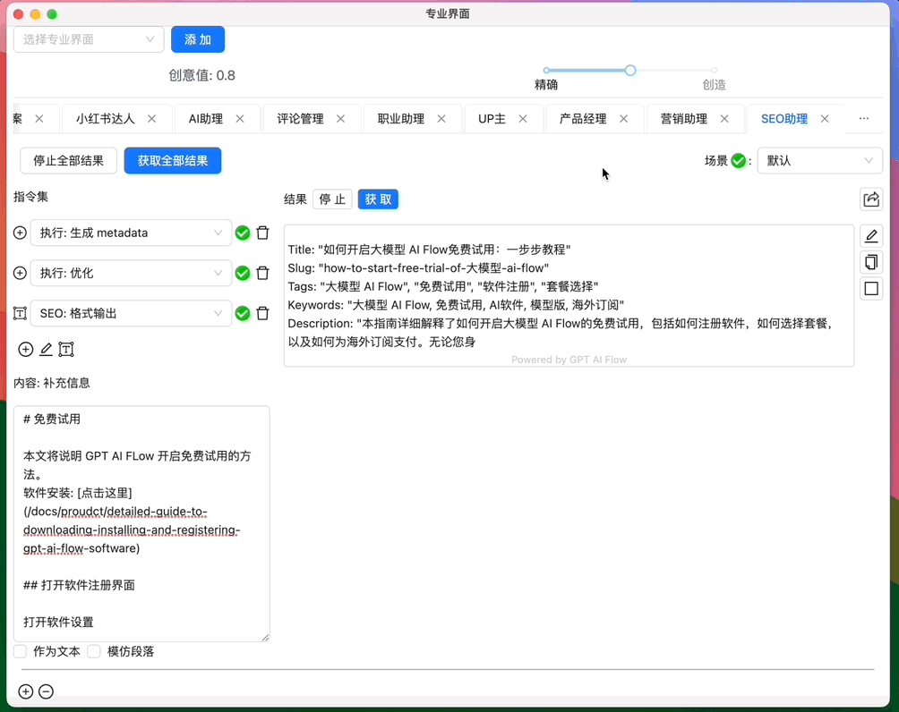
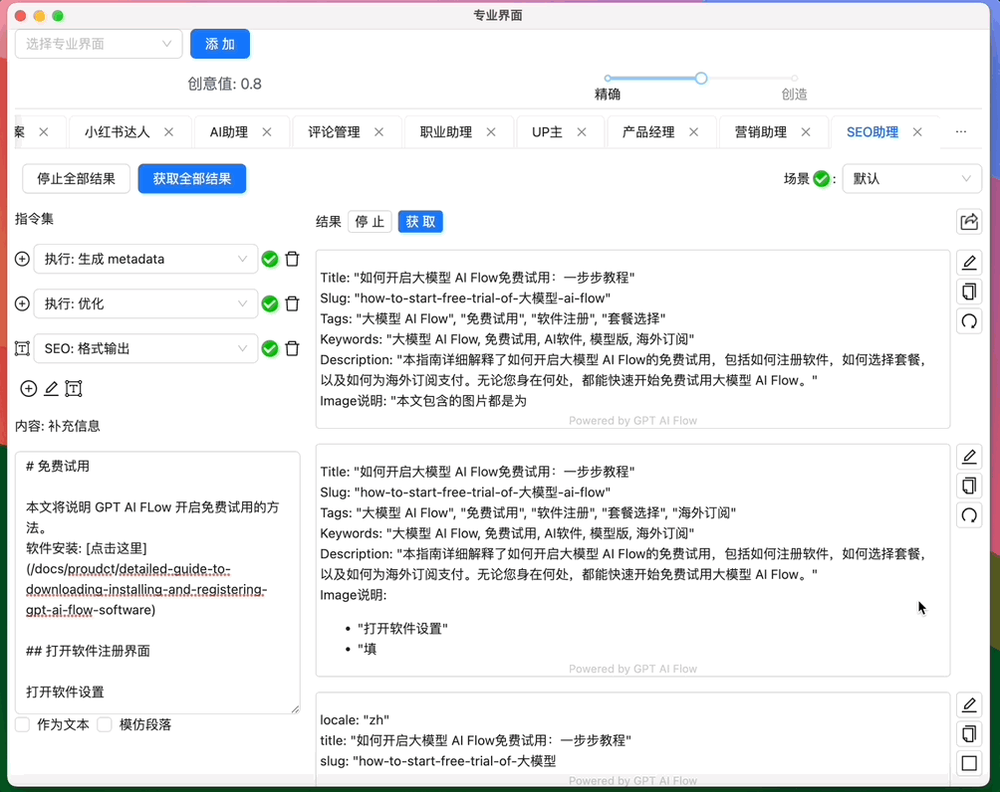

import ContactUs from "../9-contact-us.md"

# SEO 助理

## 选择不同的模型支持

由于 SEO 是比较复杂的操作过程，我们选择 `GPT-4` 作为支持模型，并在 SEO 助理专业模块中设置 `指令链` 生成内容。

## 指令链的设置与修改

对于中途不想要的内容，我们可以中途停止生成，或者之后对生成结果进行修改。上一份指令的结果将作为 `指令链` 下一个指令的输入内容。

## 拿去最终结果

`指令链` 的最后就是整个链条的最终结果，点击复制拿去最终结果，或者通过分享按钮，分享整个指令链结果的生成过程。

## 联系我们

<ContactUs/>
