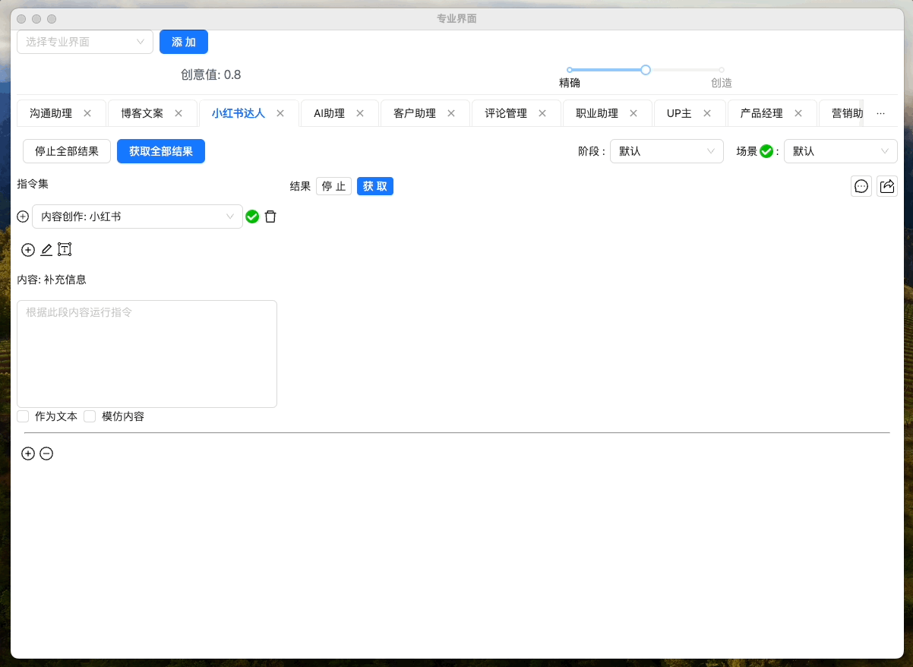
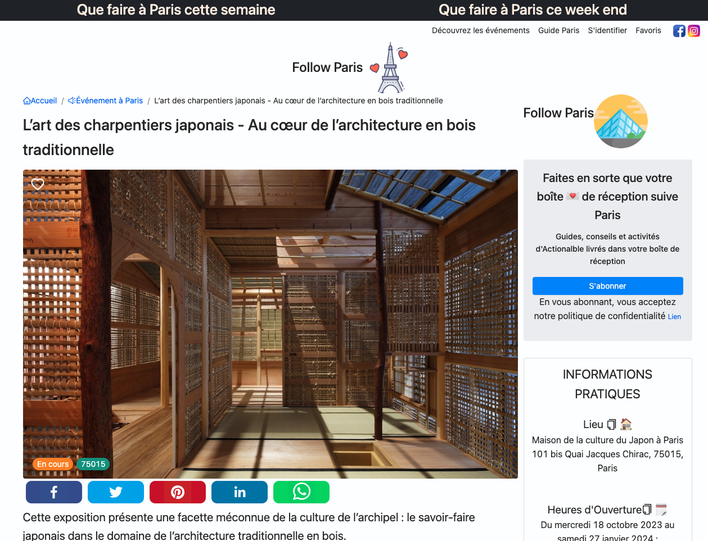
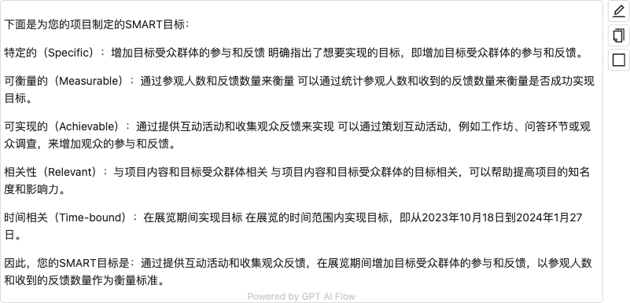
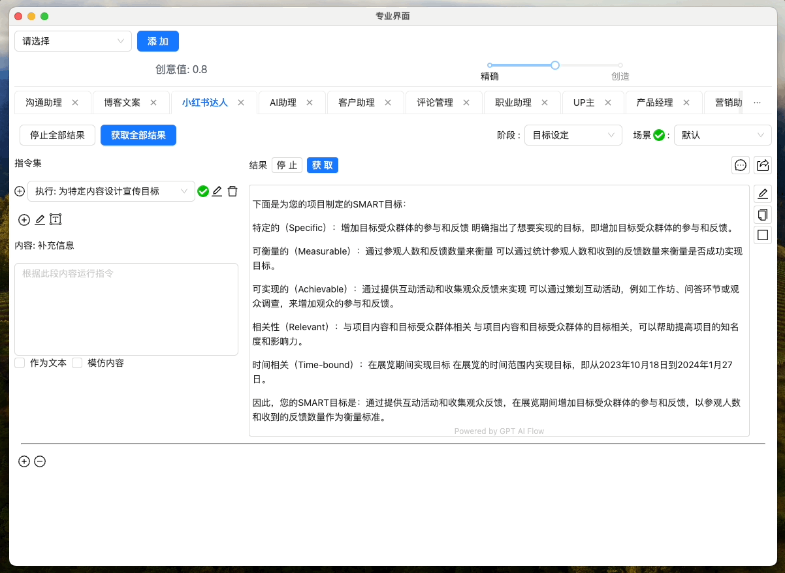
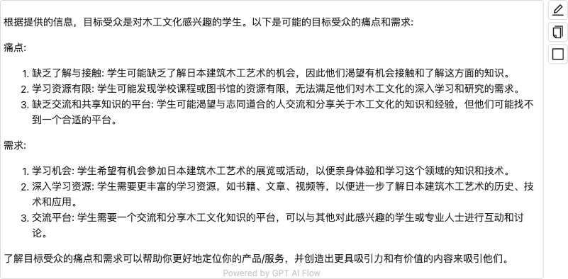
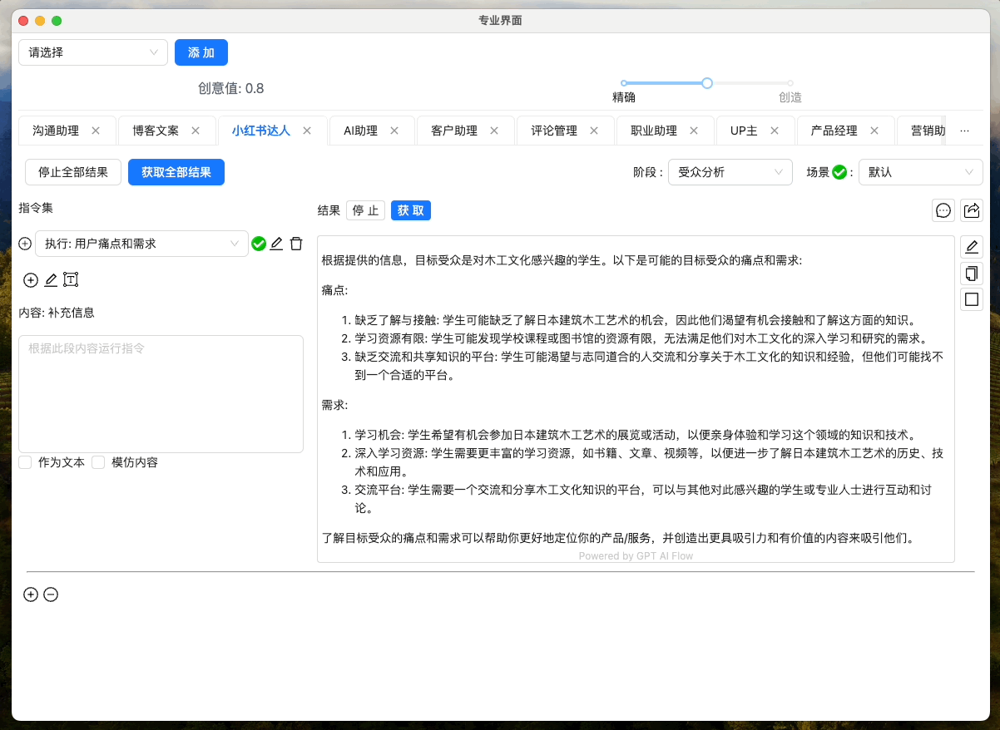
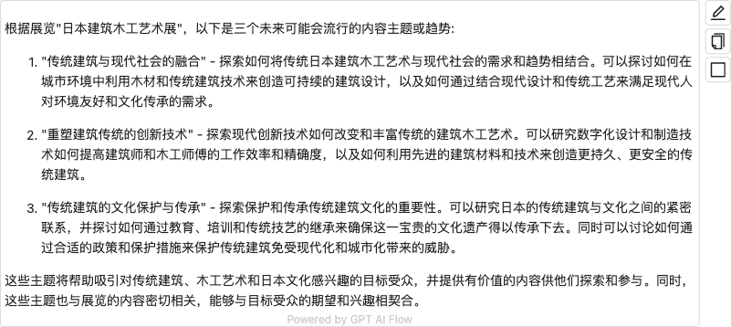
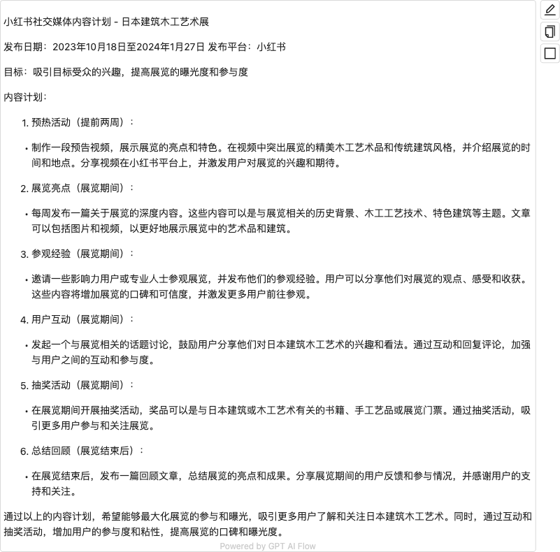

import Image from "@theme/IdealImage";
import ContactUs from "../9-contact-us.md"

# 小红书达人

## 实操 ✨ 如何用 AI 打造爆款小红书护肤帖

<iframe src="//player.bilibili.com/player.html?aid=920448706&bvid=BV1Fu4y177o3&cid=1319631924&p=1" scrolling="no" border="0" frameBorder="no" framespacing="0" allowFullScreen> </iframe>

## 简介

<Image img={require("./img/2-xiaoHongShu/2023-11-02-img-13-xiaohongshu-with-ai.png")} style={{ width: 300 }} />

根据内容创作的流程，制定内容创作模型与指令，从 `目标设定`、`受众分析` 到 `主题研究与构思`，再到 `内容规划`、`框架设计` 和 `内容创作`，我们为您提供一站式服务，让您的创作过程更加高效。

- **目标设定**：帮助您明确内容创作的目标，提供更具针对性的创作指导。
- **受众分析**：了解您的受众群体，为您的内容创作提供更精准的受众定位。
- **主题研究与构思**：基于大数据和行业洞察，为您提供热门和有前景的主题构思。
- **内容规划**：为您提供完整的内容规划建议，帮助您形成高效的创作流程。
- **内容框架设计**：为您的内容提供合理的框架设计，使其结构更清晰，易读性更强。
- **内容创作**：基于以上分析和规划，最终生成具有吸引力和影响力的内容。



## 活动内容创作信息



### 目标设定


最终结果



<!-- ```text
下面是为您的项目制定的SMART目标：

特定的（Specific）：增加目标受众群体的参与和反馈
明确指出了想要实现的目标，即增加目标受众群体的参与和反馈。

可衡量的（Measurable）：通过参观人数和反馈数量来衡量
可以通过统计参观人数和收到的反馈数量来衡量是否成功实现目标。

可实现的（Achievable）：通过提供互动活动和收集观众反馈来实现
可以通过策划互动活动，例如工作坊、问答环节或观众调查，来增加观众的参与和反馈。

相关性（Relevant）：与项目内容和目标受众群体相关
与项目内容和目标受众群体的目标相关，可以帮助提高项目的知名度和影响力。

时间相关（Time-bound）：在展览期间实现目标
在展览的时间范围内实现目标，即从2023年10月18日到2024年1月27日。

因此，您的SMART目标是：通过提供互动活动和收集观众反馈，在展览期间增加目标受众群体的参与和反馈，以参观人数和收到的反馈数量作为衡量标准。
``` -->

### 受众分析





<!-- ```text
根据提供的信息，目标受众是对木工文化感兴趣的学生。以下是可能的目标受众的痛点和需求:

痛点:
1. 缺乏了解与接触: 学生可能缺乏了解日本建筑木工艺术的机会，因此他们渴望有机会接触和了解这方面的知识。
2. 学习资源有限: 学生可能发现学校课程或图书馆的资源有限，无法满足他们对木工文化的深入学习和研究的需求。
3. 缺乏交流和共享知识的平台: 学生可能渴望与志同道合的人交流和分享关于木工文化的知识和经验，但他们可能找不到一个合适的平台。

需求:
1. 学习机会: 学生希望有机会参加日本建筑木工艺术的展览或活动，以便亲身体验和学习这个领域的知识和技术。
2. 深入学习资源: 学生需要更丰富的学习资源，如书籍、文章、视频等，以便进一步了解日本建筑木工艺术的历史、技术和应用。
3. 交流平台: 学生需要一个交流和分享木工文化知识的平台，可以与其他对此感兴趣的学生或专业人士进行互动和讨论。

了解目标受众的痛点和需求可以帮助你更好地定位你的产品/服务，并创造出更具吸引力和有价值的内容来吸引他们。
``` -->

### 主题研究与构思





<!-- ```text
根据展览"日本建筑木工艺术展"，以下是三个未来可能会流行的内容主题或趋势:

1. "传统建筑与现代社会的融合" - 探索如何将传统日本建筑木工艺术与现代社会的需求和趋势相结合。可以探讨如何在城市环境中利用木材和传统建筑技术来创造可持续的建筑设计，以及如何通过结合现代设计和传统工艺来满足现代人对环境友好和文化传承的需求。

2. "重塑建筑传统的创新技术" - 探索现代创新技术如何改变和丰富传统的建筑木工艺术。可以研究数字化设计和制造技术如何提高建筑师和木工师傅的工作效率和精确度，以及如何利用先进的建筑材料和技术来创造更持久、更安全的传统建筑。

3. "传统建筑的文化保护与传承" - 探索保护和传承传统建筑文化的重要性。可以研究日本的传统建筑与文化之间的紧密联系，并探讨如何通过教育、培训和传统技艺的继承来确保这一宝贵的文化遗产得以传承下去。同时可以讨论如何通过合适的政策和保护措施来保护传统建筑免受现代化和城市化带来的威胁。

这些主题将帮助吸引对传统建筑、木工艺术和日本文化感兴趣的目标受众，并提供有价值的内容供他们探索和参与。同时，这些主题也与展览的内容密切相关，能够与目标受众的期望和兴趣相契合。
``` -->

### 内容规划




<!-- ```text
小红书社交媒体内容计划 - 日本建筑木工艺术展

发布日期：2023年10月18日至2024年1月27日
发布平台：小红书

目标：吸引目标受众的兴趣，提高展览的曝光度和参与度

内容计划：

1. 预热活动（提前两周）：
- 制作一段预告视频，展示展览的亮点和特色。在视频中突出展览的精美木工艺术品和传统建筑风格，并介绍展览的时间和地点。分享视频在小红书平台上，并激发用户对展览的兴趣和期待。

2. 展览亮点（展览期间）：
- 每周发布一篇关于展览的深度内容。这些内容可以是与展览相关的历史背景、木工工艺技术、特色建筑等主题。文章可以包括图片和视频，以更好地展示展览中的艺术品和建筑。

3. 参观经验（展览期间）：
- 邀请一些影响力用户或专业人士参观展览，并发布他们的参观经验。用户可以分享他们对展览的观点、感受和收获。这些内容将增加展览的口碑和可信度，并激发更多用户前往参观。

4. 用户互动（展览期间）：
- 发起一个与展览相关的话题讨论，鼓励用户分享他们对日本建筑木工艺术的兴趣和看法。通过互动和回复评论，加强与用户之间的互动和参与度。

5. 抽奖活动（展览期间）：
- 在展览期间开展抽奖活动，奖品可以是与日本建筑或木工艺术有关的书籍、手工艺品或展览门票。通过抽奖活动，吸引更多用户参与和关注展览。

6. 总结回顾（展览结束后）：
- 在展览结束后，发布一篇回顾文章，总结展览的亮点和成果。分享展览期间的用户反馈和参与情况，并感谢用户的支持和关注。

通过以上的内容计划，希望能够最大化展览的参与和曝光，吸引更多用户了解和关注日本建筑木工艺术。同时，通过互动和抽奖活动，增加用户的参与度和粘性，提高展览的口碑和曝光度。
``` -->

### 内容框架设计


<!-- ```text
这个内容计划看起来非常完整和具有吸引力！以下是一些建议，以使你的内容与大学生产生更多的共鸣：
1.引入大学生活元素：在分享逃脱游戏、艺术表演和音乐会的同时，提到这些活动对大学生的吸引力和适用性。比如，逃脱游戏可以作为一个团队建设的活动，艺术表演可以作为一个文化交流的机会，音乐会可以作为一个放松和狂欢的时刻。通过这样的角度，让大学生们觉得这些活动能够为他们带来不仅仅是娱乐，还能与他们的生活和价值观产生共鸣。
2.在穿搭指南中融入大学生时尚趋势：了解大学生们的时尚偏好和流行趋势，将这些元素融入到你的穿搭指南中。例如，探讨大学生们喜欢的品牌、风格和搭配方式，同时提供一些经济实惠的购物建议。这样可以让大学生们感到你对他们的了解，并提供实用的时尚建议。
3. 增加学生优惠和折扣：在独家优惠和合作中，与品牌合作提供专门针对大学生的优惠和折扣。这样可以吸引更多的大学生参与，并使他们觉得你的内容对他们有帮助和价值。
4.与大学生互动：在不同平台上与大学生粉丝互动，回答他们的问题，听取他们的建议和意见。可以通过进行问答、投票、调查等方式，增加与大学生的互动性。这不仅可以帮助你更好地了解他们的需求和兴趣，还可以增加他们对你的内容的参与感和归属感。
5.分享个人的大学生活经历：在分享旅行心得时，可以分享一些你自己的大学生活经历和回忆。例如，与大学生们分享你在大学期间参加的类似活动，以及你对这些活动的感受和收获。这样可以让大学生们感到你与他们有共同的经历和话题，加强与他们之间的连接和共鸣。
希望这些建议对你的内容计划有所帮助！祝你在小红书上取得更大的成功
``` -->

### 内容创作


<!-- ```text
【独家盛宴】探索艺术、迷题和挑战！如
大家好！我是你们的小红书达人，今天要给大家带来一个超级独特的活动！🎉
🏰 在巴黎的神秘Hotel de Ville，Maison Étudiante 举办了一场令人兴奋的活动，让你置身于艺术、脑筋急转弯和音乐的世界！💃
🌐 这是一次互联的沉浸体验，你将与朋友们一起解决生态转型主题的谜团，展现你们团队精神和智慧的力量！🔑
✨ 活动包括令人兴奋的逃生游戏，精彩的戏剧表演，动感的舞蹈表演，还有一场震撼人心的音乐会！🎧
💃 最后，我们将以一场电子音乐DJ表演为活动画上句号，让你在音乐的海洋中尽情放松！🎉
📍 活动具体信息：时间：xX月XX日（周六）晚上8点地点：巴黎Hotel de Ville 交通：地铁XX号线
XX站下车 价格：XX欧元/人 预约链接：xXXXXXXXXX
🔥 这场盛宴只能容纳有限的人数，所以赶快通过预约链接报名吧！不要错过这个难得的机会！🔥
#艺术之夜＃谜团挑战 ＃巴黎活动 ＃音乐盛会 #Hoteldeville #沉浸体验
``` -->

## 视频案例

<iframe src="//player.bilibili.com/player.html?aid=915921783&bvid=BV13u4y1C7jF&cid=1265469812&p=1" scrolling="no" border="0" frameBorder="no" framespacing="0" allowFullScreen> </iframe>

## 用户案例

[小红书: 巴黎去哪玩](/docs/application-scenarios/user-testimonial#小红书达人)

## 联系我们

<ContactUs/>
