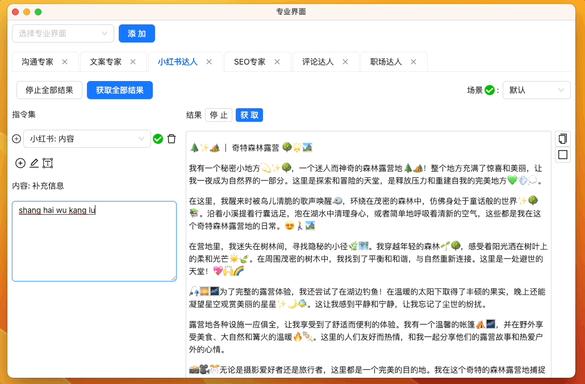

# 小红书达人

[网页版立即体验](https://www.app.gptaiflow.com/login)

- 功能简介：专为小红书用户打造的高效内容创作工具。
- 核心特点：
  - 为您生成符合小红书独特风格的文字、图片和标题
  - 提供当前热门的话题、标签以及内容建议
  - 紧贴小红书核心用户群的喜好，为您量身打造内容结构和语言风格
- 成功案例：[小红书实战案例: 巴黎去哪玩](./5-user-testimonial.md#小红书达人)

尝试发一篇旅游的小红书帖子

最终效果

## 小红书珠宝

<iframe src="//player.bilibili.com/player.html?aid=915921783&bvid=BV13u4y1C7jF&cid=1265469812&p=1" scrolling="no" border="0" frameBorder="no" framespacing="0" allowFullScreen> </iframe>
