import ContactUs from "../9-contact-us.md"

# 小红书达人

## 简介

根据内容创作的流程，制定内容创作模型与指令，从 `目标设定`、`受众分析` 到 `主题研究与构思`，再到 `内容规划`、`框架设计` 和 `内容创作`，我们为您提供一站式服务，让您的创作过程更加高效。


- **目标设定**：帮助您明确内容创作的目标，提供更具针对性的创作指导。
- **受众分析**：了解您的受众群体，为您的内容创作提供更精准的受众定位。
- **主题研究与构思**：基于大数据和行业洞察，为您提供热门和有前景的主题构思。
- **内容规划**：为您提供完整的内容规划建议，帮助您形成高效的创作流程。
- **内容框架设计**：为您的内容提供合理的框架设计，使其结构更清晰，易读性更强。
- **内容创作**：基于以上分析和规划，最终生成具有吸引力和影响力的内容。


## 发布一篇活动帖子

活动信息

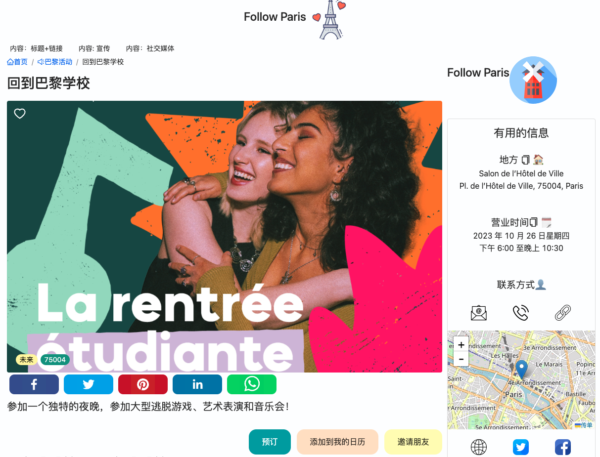

### 目标设定

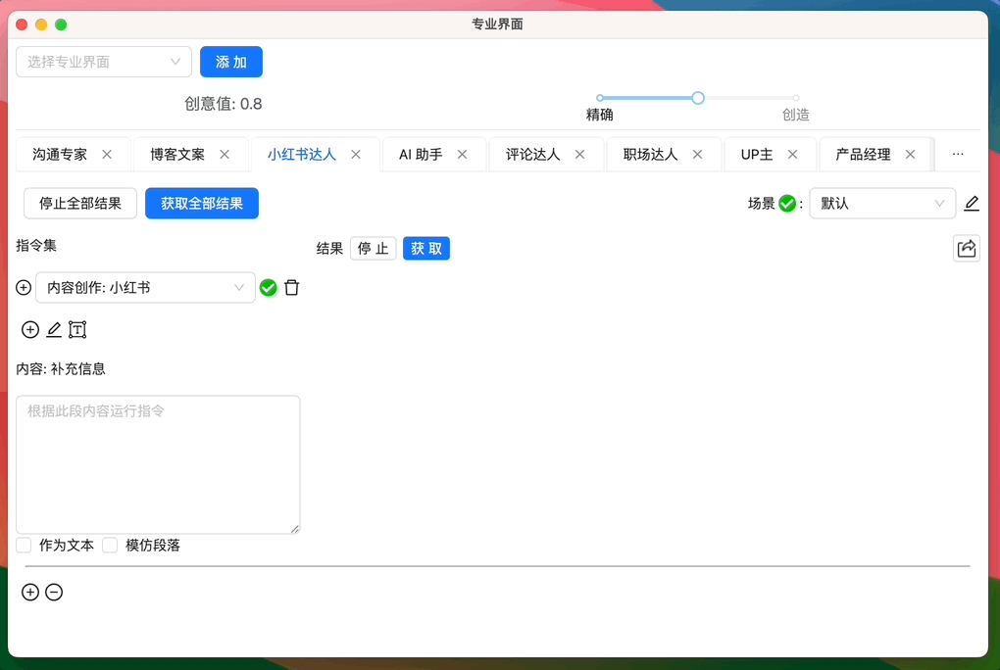

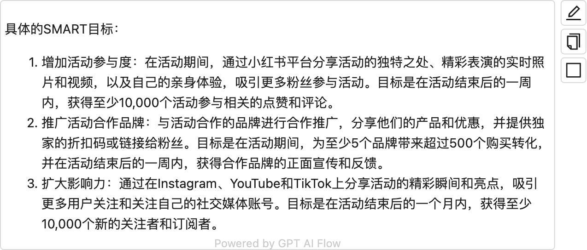

<!-- ```text
具体的SMART目标：
1.增加活动参与度：在活动期间，通过小红书平台分享活动的独特之处、精彩表演的实时照片和视频，以及自己的亲身体验，吸引更多粉丝参与活动。目标是在活动结束后的一周内，获得至少10,000个活动参与相关的点赞和评论。
2.推广活动合作品牌：与活动合作的品牌进行合作推广，分享他们的产品和优惠，并提供独家的折扣码或链接给粉丝。目标是在活动期间，为至少5个品牌带来超过500个购买转化，并在活动结束后的一周内，获得合作品牌的正面宣传和反馈。
3.扩大影响力：通过在Instagram、YouTube和TikTok上分享活动的精彩瞬间和亮点，吸引更多用户关注和关注自己的社交媒体账号。目标是在活动结束后的一个月内，获得至少10,000个新的关注者和订阅者.
``` -->

### 受众分析

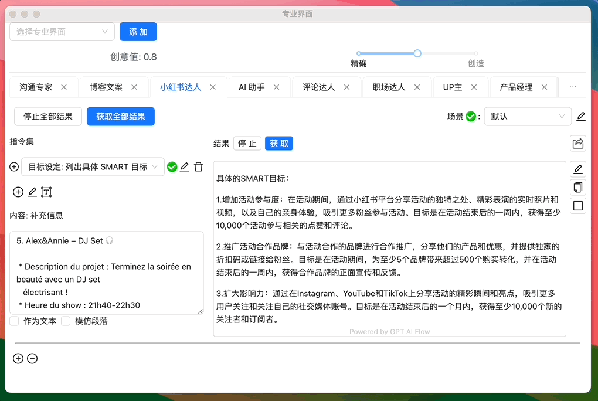

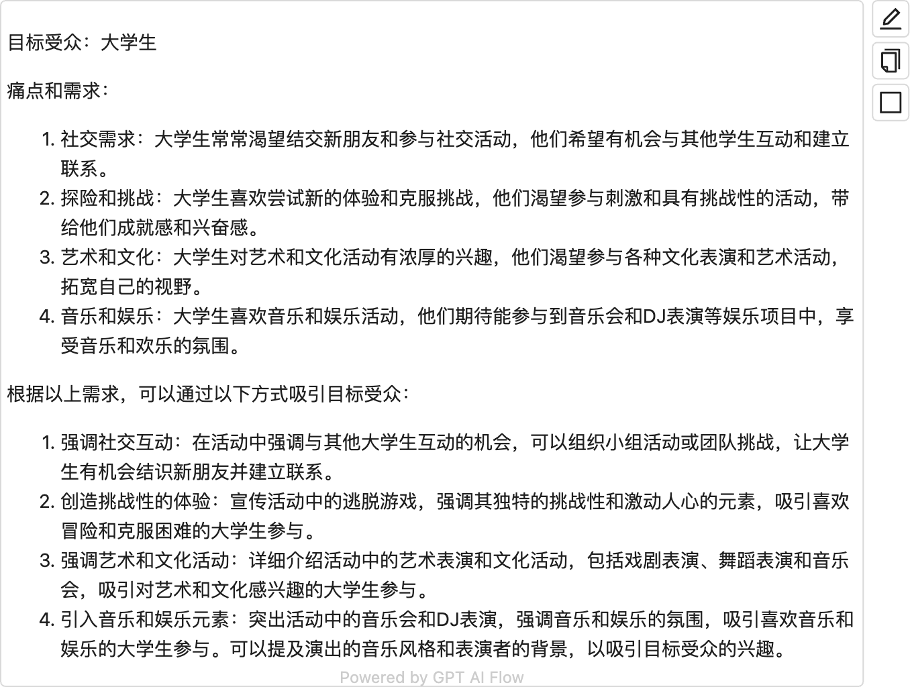

<!-- ```text
目标受众：大学生
痛点和需求：
1.社交需求：大学生常常渴望结交新朋友和参与社交活动，他们希望有机会与其他学生互动和建立联系。
2. 探险和挑战：大学生喜欢尝试新的体验和克服挑战，他们渴望参与刺激和具有挑战性的活动，带给他们成就感和兴奋感。
3. 艺术和文化：大学生对艺术和文化活动有浓厚的兴趣，他们渴望参与各种文化表演和艺术活动，拓宽自己的视野。
4.音乐和娱乐：大学生喜欢音乐和娱乐活动，他们期待能参与到音乐会和DJ表演等娱乐项目中，享受音乐和欢乐的氛围。
根据以上需求，可以通过以下方式吸引目标受众：
1.强调社交互动：在活动中强调与其他大学生互动的机会，可以组织小组活动或团队挑战，让大学生有机会结识新朋友并建立联系。
2.创造挑战性的体验：宣传活动中的逃脱游戏，强调其独特的挑战性和激动人心的元素，吸引喜欢冒险和克服困难的大学生参与。
3.强调艺术和文化活动：详细介绍活动中的艺术表演和文化活动，包括戏剧表演、舞蹈表演和音乐会，吸引对艺术和文化感兴趣的大学生参与。
4.引入音乐和娱乐元素：突出活动中的音乐会和DJ表演，强调音乐和娱乐的氛围，吸引喜欢音乐和娱乐的大学生参与。可以提及演出的音乐风格和表演者的背景，以吸引目标受众的兴趣
``` -->

### 主题研究与构思

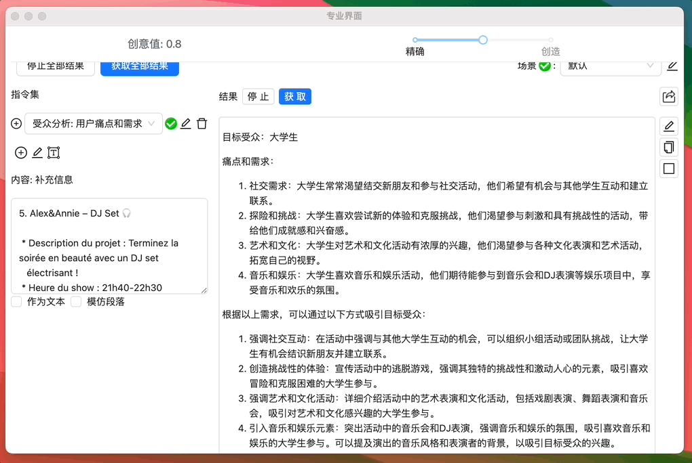

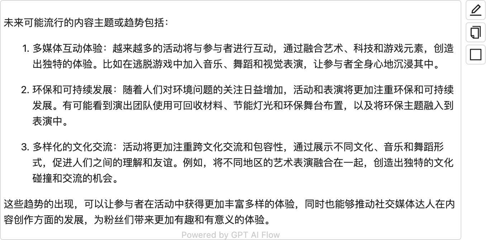

<!-- ```text
未来可能流行的内容主题或趋势包括：
1.多媒体互动体验：越来越多的活动将与参与者进行互动，通过融合艺术、科技和游戏元素，创造出独特的体验。比如在逃脱游戏中加入音乐、舞蹈和视觉表演，让参与者全身心地沉浸其中。
2.环保和可持续发展：随着人们对环境问题的关注日益增加，活动和表演将更加注重环保和可持续发展。有可能看到演出团队使用可回收材料、节能灯光和环保舞台布置，以及将环保主题融入到表演中。
3.多样化的文化交流：活动将更加注重跨文化交流和包容性，通过展示不同文化、音乐和舞蹈形式，促进人们之间的理解和友谊。例如，将不同地区的艺术表演融合在一起，创造出独特的文化碰撞和交流的机会。
这些趋势的出现，可以让参与者在活动中获得更加丰富多样的体验，同时也能够推动社交媒体达人在内容创作方面的发展，为粉丝们带来更加有趣和有意义的体验
``` -->

### 内容规划

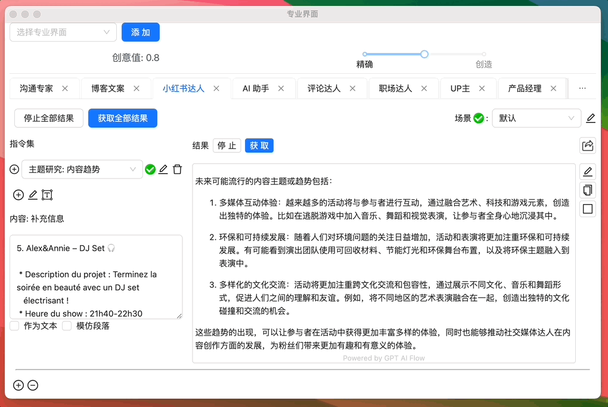

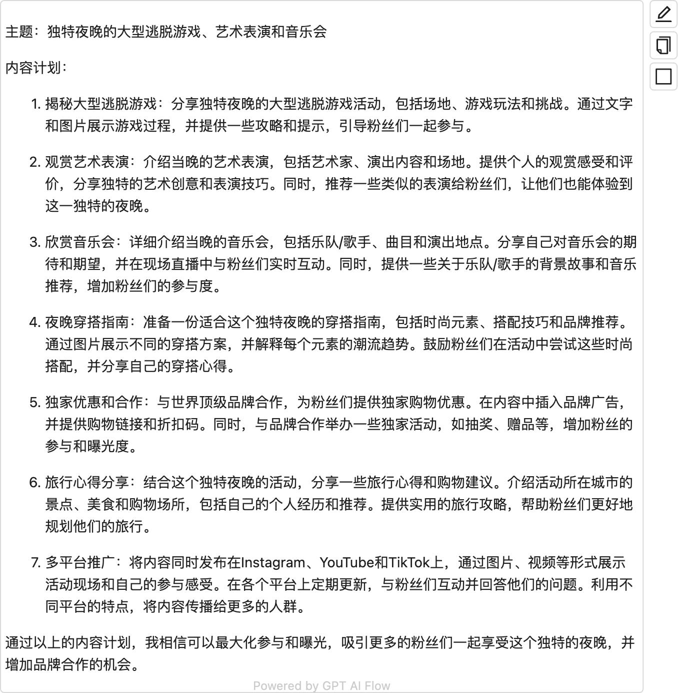

<!-- ```text
主题：独特夜晚的大型逃脱游戏、艺术表演和音乐会

内容计划：

1. 揭秘大型逃脱游戏：分享独特夜晚的大型逃脱游戏活动，包括场地、游戏玩法和挑战。通过文字和图片展示游戏过程，并提供一些攻略和提示，引导粉丝们一起参与。

2. 观赏艺术表演：介绍当晚的艺术表演，包括艺术家、演出内容和场地。提供个人的观赏感受和评价，分享独特的艺术创意和表演技巧。同时，推荐一些类似的表演给粉丝们，让他们也能体验到这一独特的夜晚。

3. 欣赏音乐会：详细介绍当晚的音乐会，包括乐队/歌手、曲目和演出地点。分享自己对音乐会的期待和期望，并在现场直播中与粉丝们实时互动。同时，提供一些关于乐队/歌手的背景故事和音乐推荐，增加粉丝们的参与度。

4. 夜晚穿搭指南：准备一份适合这个独特夜晚的穿搭指南，包括时尚元素、搭配技巧和品牌推荐。通过图片展示不同的穿搭方案，并解释每个元素的潮流趋势。鼓励粉丝们在活动中尝试这些时尚搭配，并分享自己的穿搭心得。

5. 独家优惠和合作：与世界顶级品牌合作，为粉丝们提供独家购物优惠。在内容中插入品牌广告，并提供购物链接和折扣码。同时，与品牌合作举办一些独家活动，如抽奖、赠品等，增加粉丝的参与和曝光度。

6. 旅行心得分享：结合这个独特夜晚的活动，分享一些旅行心得和购物建议。介绍活动所在城市的景点、美食和购物场所，包括自己的个人经历和推荐。提供实用的旅行攻略，帮助粉丝们更好地规划他们的旅行。

7. 多平台推广：将内容同时发布在Instagram、YouTube和TikTok上，通过图片、视频等形式展示活动现场和自己的参与感受。在各个平台上定期更新，与粉丝们互动并回答他们的问题。利用不同平台的特点，将内容传播给更多的人群。

通过以上的内容计划，我相信可以最大化参与和曝光，吸引更多的粉丝们一起享受这个独特的夜晚，并增加品牌合作的机会。
``` -->

### 内容框架设计

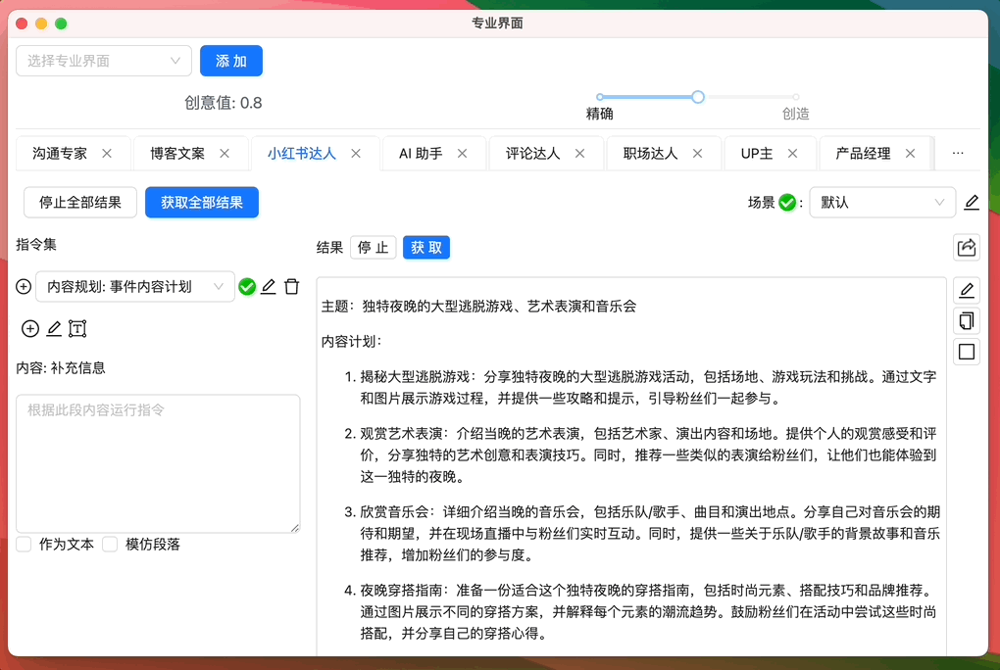

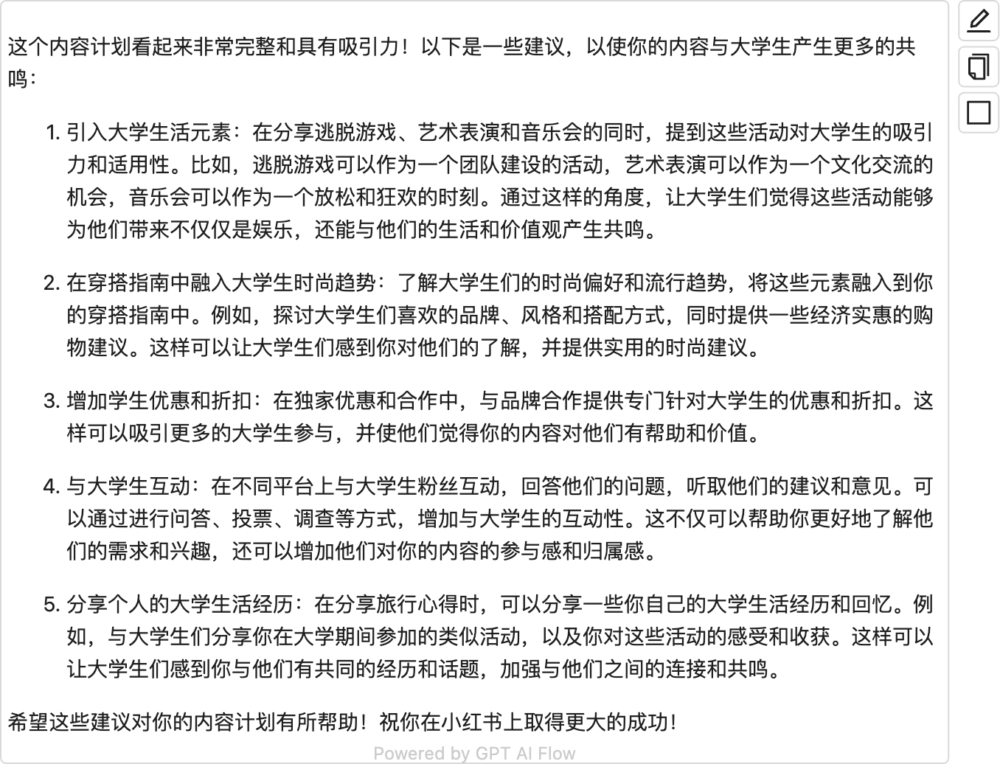

<!-- ```text
这个内容计划看起来非常完整和具有吸引力！以下是一些建议，以使你的内容与大学生产生更多的共鸣：
1.引入大学生活元素：在分享逃脱游戏、艺术表演和音乐会的同时，提到这些活动对大学生的吸引力和适用性。比如，逃脱游戏可以作为一个团队建设的活动，艺术表演可以作为一个文化交流的机会，音乐会可以作为一个放松和狂欢的时刻。通过这样的角度，让大学生们觉得这些活动能够为他们带来不仅仅是娱乐，还能与他们的生活和价值观产生共鸣。
2.在穿搭指南中融入大学生时尚趋势：了解大学生们的时尚偏好和流行趋势，将这些元素融入到你的穿搭指南中。例如，探讨大学生们喜欢的品牌、风格和搭配方式，同时提供一些经济实惠的购物建议。这样可以让大学生们感到你对他们的了解，并提供实用的时尚建议。
3. 增加学生优惠和折扣：在独家优惠和合作中，与品牌合作提供专门针对大学生的优惠和折扣。这样可以吸引更多的大学生参与，并使他们觉得你的内容对他们有帮助和价值。
4.与大学生互动：在不同平台上与大学生粉丝互动，回答他们的问题，听取他们的建议和意见。可以通过进行问答、投票、调查等方式，增加与大学生的互动性。这不仅可以帮助你更好地了解他们的需求和兴趣，还可以增加他们对你的内容的参与感和归属感。
5.分享个人的大学生活经历：在分享旅行心得时，可以分享一些你自己的大学生活经历和回忆。例如，与大学生们分享你在大学期间参加的类似活动，以及你对这些活动的感受和收获。这样可以让大学生们感到你与他们有共同的经历和话题，加强与他们之间的连接和共鸣。
希望这些建议对你的内容计划有所帮助！祝你在小红书上取得更大的成功
``` -->

### 内容创作

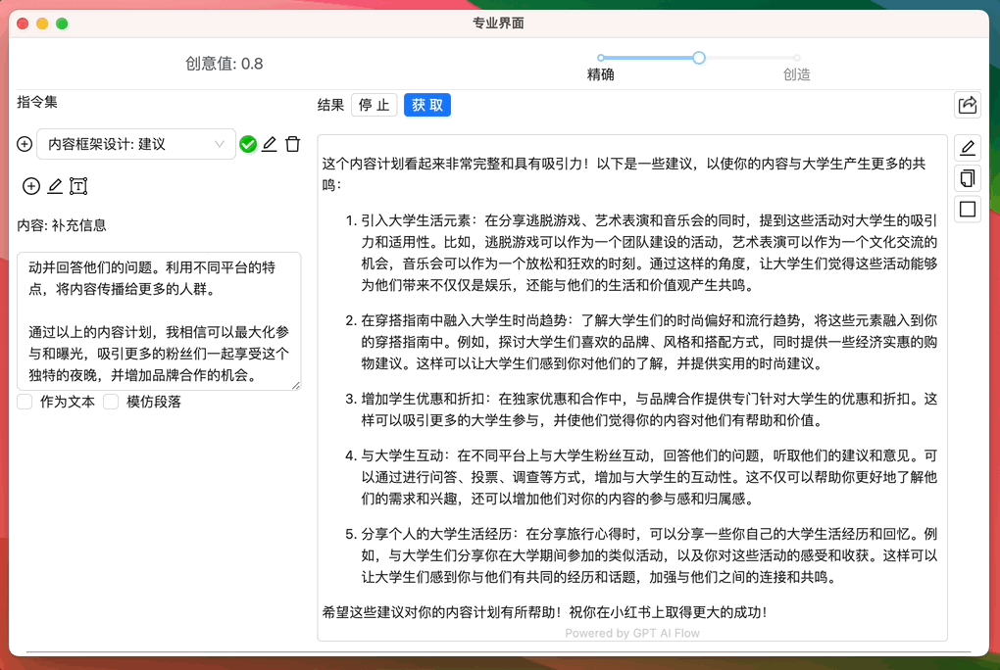

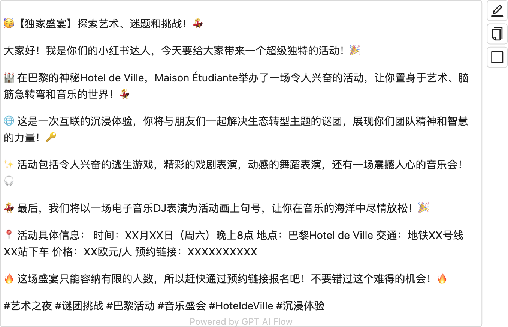

<!-- ```text
【独家盛宴】探索艺术、迷题和挑战！如
大家好！我是你们的小红书达人，今天要给大家带来一个超级独特的活动！🎉
🏰 在巴黎的神秘Hotel de Ville，Maison Étudiante 举办了一场令人兴奋的活动，让你置身于艺术、脑筋急转弯和音乐的世界！💃
🌐 这是一次互联的沉浸体验，你将与朋友们一起解决生态转型主题的谜团，展现你们团队精神和智慧的力量！🔑
✨ 活动包括令人兴奋的逃生游戏，精彩的戏剧表演，动感的舞蹈表演，还有一场震撼人心的音乐会！🎧
💃 最后，我们将以一场电子音乐DJ表演为活动画上句号，让你在音乐的海洋中尽情放松！🎉
📍 活动具体信息：时间：xX月XX日（周六）晚上8点地点：巴黎Hotel de Ville 交通：地铁XX号线
XX站下车 价格：XX欧元/人 预约链接：xXXXXXXXXX
🔥 这场盛宴只能容纳有限的人数，所以赶快通过预约链接报名吧！不要错过这个难得的机会！🔥
#艺术之夜＃谜团挑战 ＃巴黎活动 ＃音乐盛会 #Hoteldeville #沉浸体验
``` -->

## 视频案例

<iframe src="//player.bilibili.com/player.html?aid=915921783&bvid=BV13u4y1C7jF&cid=1265469812&p=1" scrolling="no" border="0" frameBorder="no" framespacing="0" allowFullScreen> </iframe>

## 用户案例

[小红书: 巴黎去哪玩](/docs/application-scenarios/user-testimonial#小红书达人)

## 联系我们

<ContactUs/>
