# 超级个体：探索 AIGC 与人类合作的无限可能

## 开头

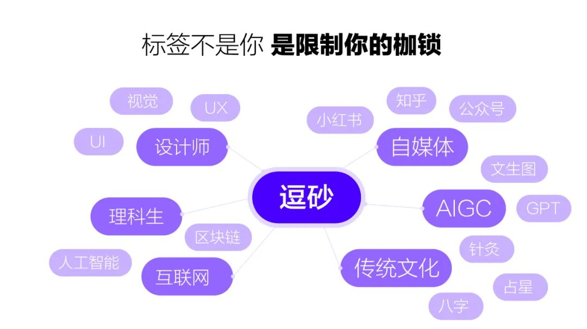

让我们先从个人标签说起，这里是我的一些标签，一个设计师，一个大学学的是食品化学的转行设计师，我还是一个自媒体人，除了前沿的人工智能，我对中西方最古老的文化感兴趣，我会针灸，会占星。

但是这些标签只是一些过去人生的标记，它们都不是我。我认为我们每个人，都其实是无限可能的存在。但是大部分的时候大家都被这些标签限制住了，比如，我高中因为被贴了好学生的标签，没有选择自己当时最爱的艺术设计，而大学毕业终于开始试图撕掉之前的标签，重新转行做了设计师。

我那个时候做了一个设计类的社群叫非科班设计，里面全是一些奇奇怪怪背景的设计师，学医的，学金融的，学机械的，学中文的等等……

其实对于很多人来说，转行去做了自己喜欢的职业，梦想成真之后会认为这就是终点了，是可以为之奋斗一生的事业。是月亮与六便士里的那个月亮。但这其实是一个陷阱，你只是从一个标签中脱离出来进入了另一个标签，从一种限制里面出来换成了另外一种限制。

这些标签其实并不重要，他们都只是限制你的枷锁而已。

我为什么会在开头说这些，因为这一点在现在这个 AIGC 的时代变得越发明显了。

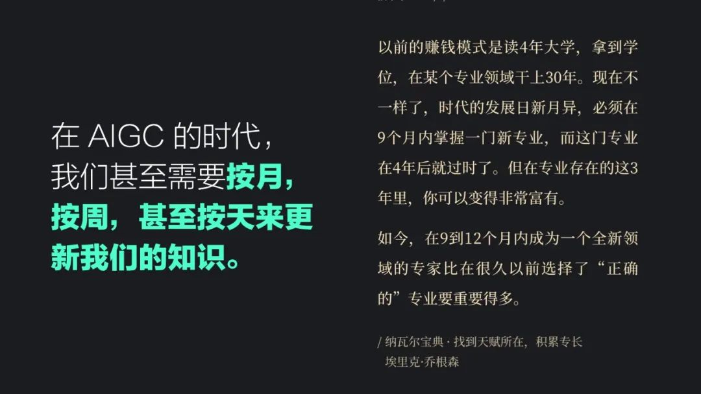

这个是《纳瓦尔宝典》里的一段话，这本书是 2020 年出版的，这段话是我印象最深刻的一段。读四年大学，然后在一个职位上干 30 年，这是一个我们上一辈十分常见的生存方式。但是现在已经完全不一样了。

在 AIGC 的时代，我们甚至需要按月，按周，甚至按天来更新我们的知识。

现在大家都在恐惧 chatgpt 是否会取代自己也不过才出来刚刚 4 个月。在 AI 绘画这个领域，我是从去年 3 月份开始关注的，还记得那时候的 disco diffusion 非常不擅长画人物，所以有人专门去研究如何写提示词来绘制人物，然后 midjouney 和 dalle 出现了，它直接在模型和算法的层面把这个问题解决了。

也就是说，那些研究在模型出来的一瞬间就过时了，中间可能也就只有 2 个月。类似的事情也发生在最近，无论是 stable diffusion 还是 midjouney 大家一开始也只能通过提示词和调参来控制输出。

但是 controlnet 这个技术的出现让大家更加精准的控制输出，以前那些为了让输出稳定，做了大量研究的写词攻略就失效了。

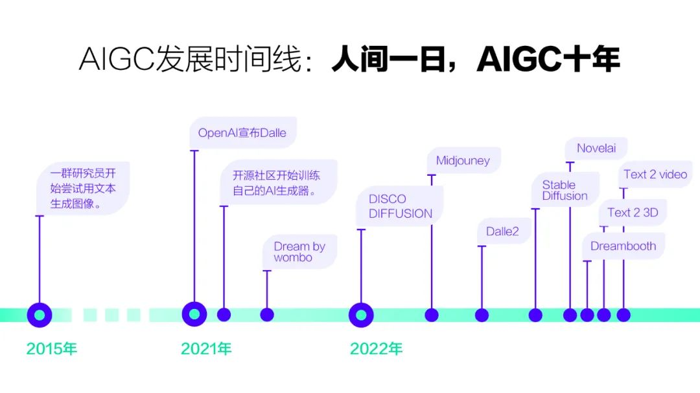

这张图是过去几年，AIGC 大事件的时间轴。在 22 年之前，AIGC 的发展都是非常缓慢的，只是一个非常小众的领域，大家对此毫不在意。我记得去年刚开始的时候，我还可以按月来去学习 AIGC 的知识，大新闻每个月也就发生那么一两次，在研究 disco diffusion 和 midjouney 的时候根本没有想到事情会进展到今天这样。画一些精度不够高的图可能就是极限了。没有人会想到现在任何一个领域的任何一个职位都有可能被 AI 侵入。

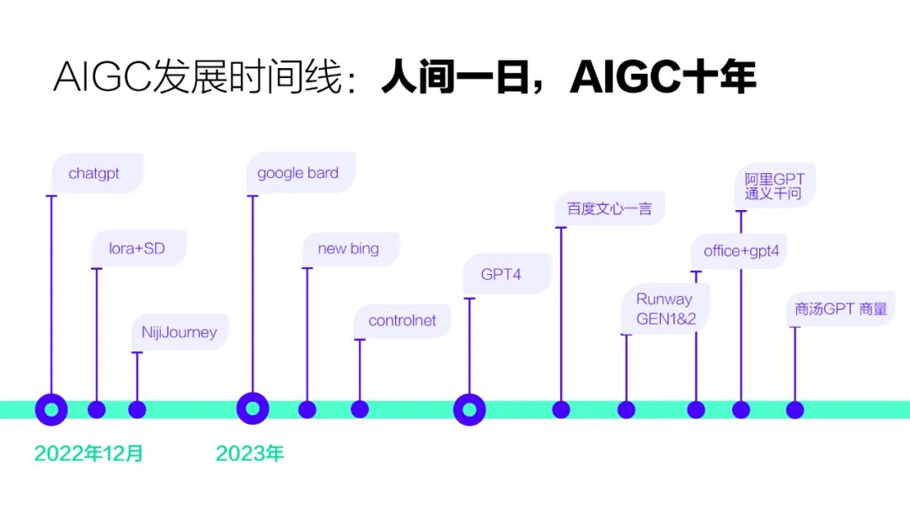

大概从去年的 12 月开始，aigc 的发展速度就开始指数级的上升了，标志性的事件有 chatgpt 的发布，AI 绘画领域的 lora 模型和 controlnet 也迅速的发展了起来。lora 模型的自训练和 controlnet 对画面的控制能力，都让文生图变得更加的落地，补全了它进入工作流的最后一块拼图。

而在去年大部分的时候 AIGC 指的就是文生图，但是在今年大家看到了以 chatgpt 为首的大语言模型的潜力，所以在今年的第一季度，全球都在卯足了劲卷大语言模型。

这里分享一个比较有趣的例子，AI 生成绘画领域大量的画师因为版权在抵制这个技术，大家也都期待法律上能尽早的能够完善相关的立法。而与此同时，我的律师朋友，在使用了 chatgpt 之后跟我说，chatgpt 写法律文书写的太好了，已经能达到初中级律师的水平，她也在担心自己的工作是否会被取代。

被取代的焦虑无差别的笼罩着每一个人和每一家公司。

## AIGC 将会带来什么？

在这种大环境下，我们个人能做些什么？我今天来并不是为了散播焦虑的，也不是给大家讲鸡汤让大家对未来过度乐观的。

我的观点是：AIGC 必然会取代一大批人，造成大量的失业。但与此同时，它也会给小公司和个人带来从未有过的机遇。

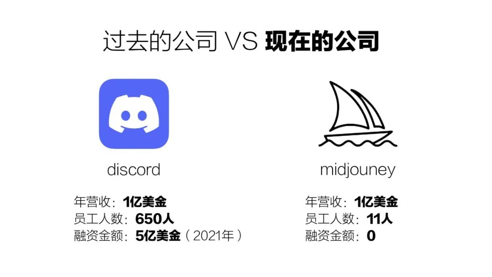

在 AIGC 的时代，公司会变成什么样？其实 midjouney 就是一个很好的例子，它没有软件，没有 App，没有融资，靠着 11 个人自筹资金，在不到一年的时间拥有了全球千万用户，年营收上亿美金。

我们同样可以对比它寄生其中的 discord 这家公司，discord 同样也是一家非常优秀的公司，但是它仍然是一个非常正统的互联网公司。巧的是 discord 的营收一年也是一亿美金，但是呢，它需要不断的融资，并且最新的数据显示它的员工人数目前是 650 人。

不仅是 midjourney，目前全球 AIGC 领域最强的公司 openai 也不过只有一百名员工而已。在 AIGC 的时代下，我们将会看到公司变得越来越小，但是产品的影响力却非常大。

劳动密集的公司会越来越少，几个人，十几个人的小公司将随处可见。大公司也会开始瘦身，产业开始从以人驱动，转变为以算法和算力驱动。

这是小公司的机会，我们可以观察到一个很奇特的现象，现在全球那么多大公司都在卷 GPT，但是没有一家比得过 openai 的，哪怕号称技术实力最强的 google 也不例外。在 AI 绘画领域也是如此，SD 开源后 AI 绘画工具非常多，但是 MJ 仍然是效果最好的那个。

对于公司如此，那么对于个人呢？

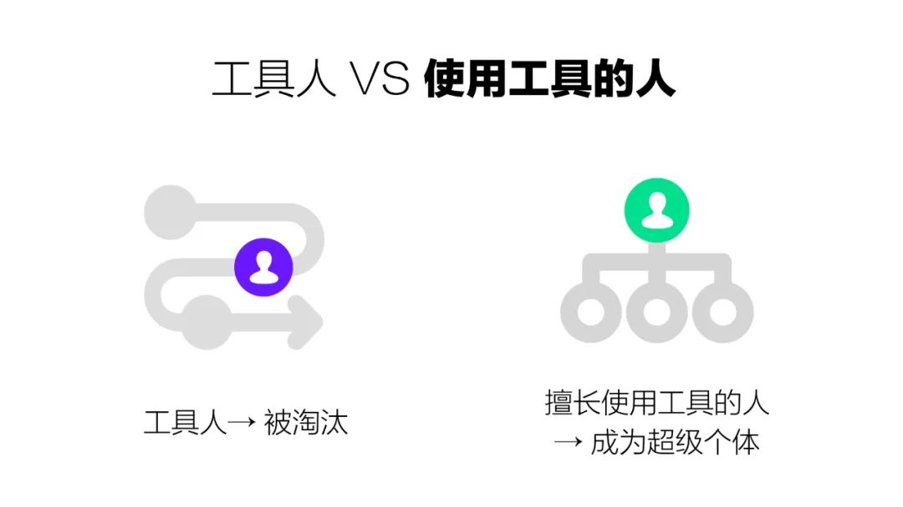

在我眼里，人可以大致可以分成 2 类，一种是工具人，另一种是使用工具的人。

我们大部分人的工作是作为这个工业链条的一部分，而这一次 AIGC 带来的技术革命从根源上把游戏规则改变了。之前这个社会需要的是那些能够在流水线上专注于拧螺丝的人，

在互联网行业的设计圈里，流传着一个这样的故事，一个腾讯的设计师，画微信的对话框画了整整五年。在腾讯画对话框可能已经是很多人羡慕的工作了，但是在现在这个时代这种类型的工作存在着巨大的风险。

当这个生产的链条被改变时，那么它上面的那些螺丝钉也就没有存在的必要了。

我今天还在脉脉上看到一个消息说，网易的游戏项目组在激进的推进 AI，无论是原画还是文案，都必须掌握，掌握不了就可以走人了。这个消息应该是真的，因为我最近见过的所有创业的老板们都在想着怎么使用 AIGC 去给自己降本增效。

但是如果你是使用工具的人，那么情况就不一样了。

这两类人最大的区别其实在于——是否会通过使用杠杆去拓展自己的能力边界。

## AIGC 就是这个时代给个体最大的杠杆

AIGC 带来的不仅仅是科技革命带来的生产力的提升。它是一种可以无限生产杠杆的杠杆。

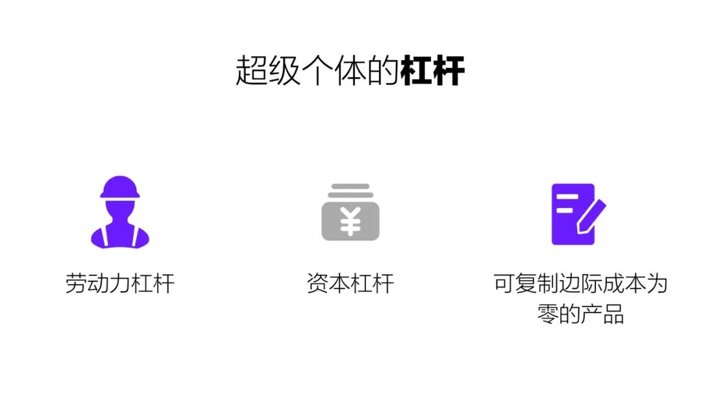

什么是杠杆？

我们每个人一天都只有 24 小时，这是这个世界上最公平的事情。真正的财富并不是银行卡里的数字，而是时间。没有人可以让自己的一天多出 2 小时。

我们去公司上班，相当于打包出卖了自己的时间，一份时间一分钱，你的收入和你付出的时间直接相关。但是问题在于你的时间就这么多，时间不增加的情况下，你收入的天花板就是限定的。而且你停止工作的时候，这个收入也就停止了。

而杠杆呢？是一份单位时间可以换取多渠道多角度的资源。你的收益取决于你的决策能力，而不是花费的时间。哪怕你不工作的时候，仍然在增加自己的资源。

这样的杠杆有哪些呢？

最常见最古老的就是劳动力资源了，比如我想做一个游戏，但是我不会画画也不会代码怎么办呢？那就需要我花钱去购买他人的时间帮我完成这些工作。这种属于通过劳动力杠杆去拓展自己的技能。

再举个例子，我是一个设计师，但是太多人找我做设计了，项目做不过来怎么办？就需要再招聘其它设计师来帮我完成。这种就是劳动力杠杆。劳动力杠杆是一种非常古老的杠杆，任何一家公司的老板都在使用这个杠杆。

在过去，一个公司的员工规模越大，意味着它的收益也大。但是劳动力杠杆有个非常致命的问题，就是你的产出来源于对人的控制。而人是非常不可控的，成本也非常高，为了让员工的产出可控才诞生出来了所谓的管理学。

我们都知道，大公司容易有大公司病。这是因为人员庞杂，因为利益或者一些其他原因，上面的决策信息无法快速有效的传达下去。

那么第二种杠杆就方便很多了。资本杠杆，其实就是钱生钱的杠杆。对于有了一些资产的人，可以通过投资来拓展自己的资产。这个因为跟 AIGC 关系不大，我就不展开来说了。

最后这个杠杆叫可无限复制，并且边际成本为零的产品。什么样的东西符合这个特性？书籍，尤其是电子书。任何一种形式的自媒体。网络课程，软件产品 等等，

这个其实很好理解，就拿写书来说，我花半年时间写一本书，这本书在未来的任何时间都可以持续的给我带来收益。我们把这里的书，换成线上课程，换成软件也是一样。

但是这类杠杆有一个问题，它们大部分都是创造性的产品，它们需要你会一些特定的技能，比如写作，比如编程，比如绘画。而这些技能在过去需要大量的时间去学习，还需要大量的时间才能制作出来。

但是在 AIGC 的时代不一样了，相当于第一类杠杆和第二类杠杆合并了，

我们可以通过 AIGC 的工具去创造一些可以无限复制的产品。而不需要花费高额的金钱去购买劳动力，又或者去大量的消耗自己的时间。

AIGC 相当于给了你一个可以自己生产杠杆的杠杆。

如果你只是把它当成一个提升自己工作效率的工具，只是让自己变成了一个更好用的工具人，那就太浪费了。

## AIGC 如何拓展能力边界

一个人的能力一般会受限于下面三个要素：时间，技能 和 信息。

我会先从时间和技能的角度举一些案例。然后再详细说一下 AIGC 在信息的获取层面可以做哪些事情。

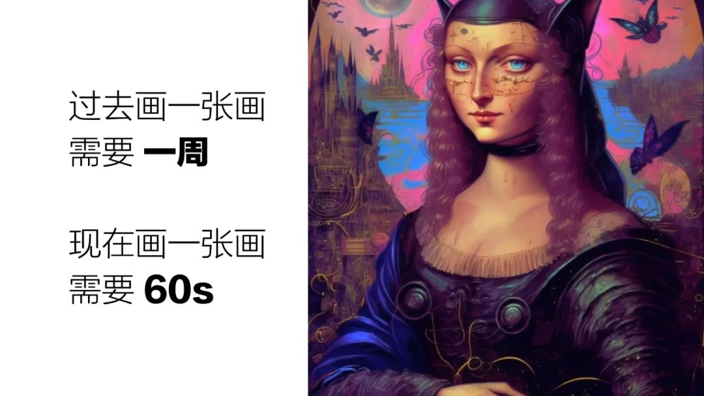

这是一张混合了赛博朋克风格的蒙娜丽莎的插画，在过去一个插画师绘制类似水准的画，大概需要一周的时间。现在我们任何一个没有任何绘画基础的人只需要 60 s 就可以完成

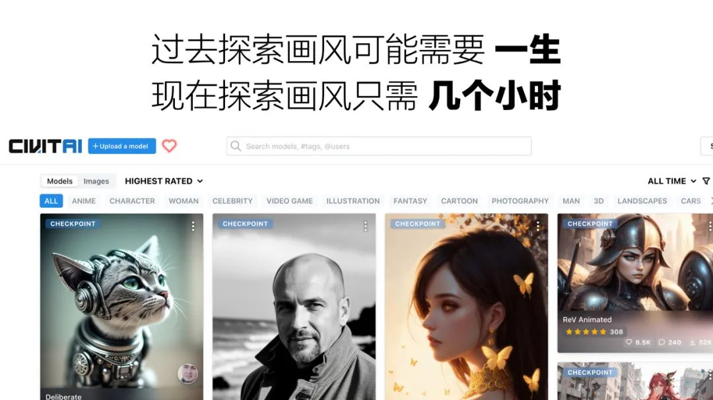

我知道其实用 AI 训练画风在版权上有争议。但是在过去，一个人学会一个画风，只是 copy 不是创造的那种，都需要花费大量的时间。很多人终其一生都花在复制别人的画风，并且一辈子也不一定能掌握多少种。

但是现在你只需要一百张左右的图，就可以训练出特定的画风，你可以让不同的画风进行融合，调整他们的权重比例，从而生成独一无二的风格。

而这些只需要几个小时。

我们可以在有限的生命里，去探索更多的可能性。整个绘画史，都是不同元素风格的排列组合，并不存在什么空前绝后的原创。

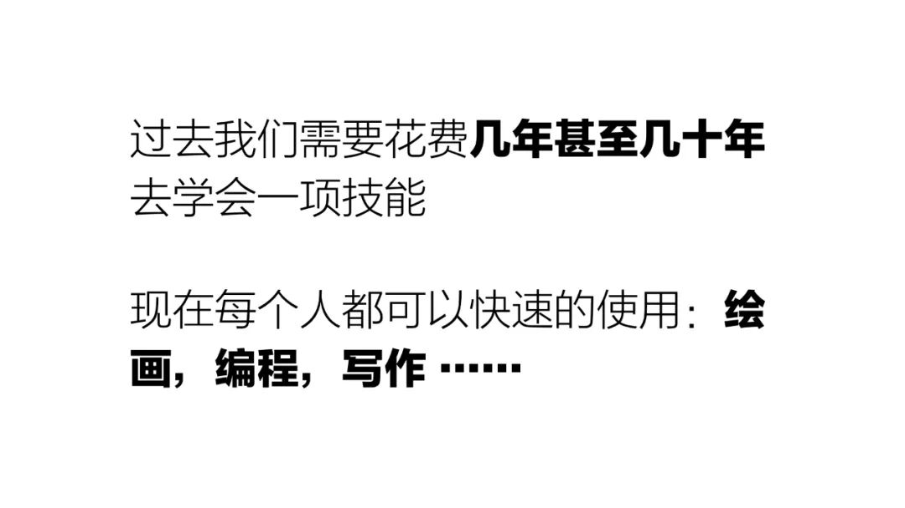

我们从来没有如此快速的，去获取这些生产性的技能来进行内容的创作。

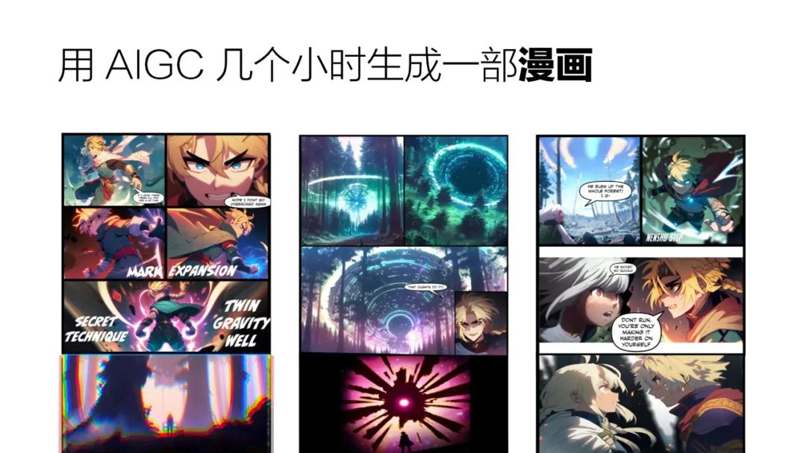

就拿漫画和动画来说，一直是一个劳动密集型的行业，但是在 AIGC 的技术加持下，已经有人通过 chatgpt 写故事，再通过文生图工具，几个小时就能制作出一本漫画。

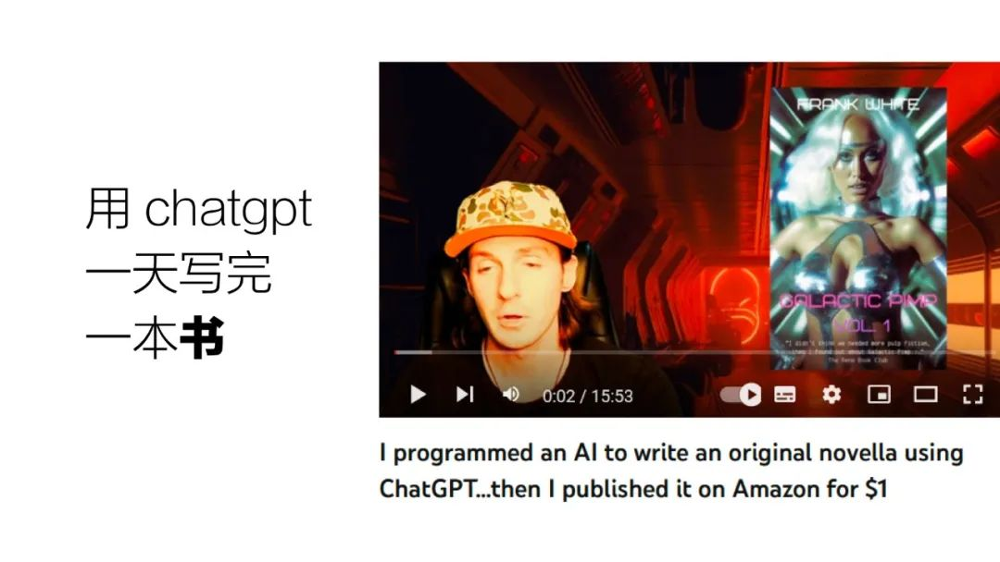

还有人用 chatgpt 用一天写了一本 100 多页的书，并且拿到亚马逊买，售价一美金。据说亚马逊上人类和 gpt 合作的书籍已经越来越多了，甚至他们单独有个 chatgpt 类别的分区。

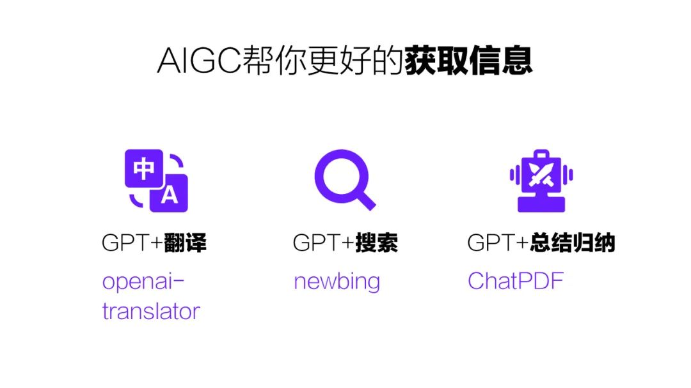

## AIGC 帮你更好的获取信息

除了用 AIGC 去拓展技能和节省时间，其实它最大的用处去帮助你获取更多的信息。一个人获取信息的能力直接决定了他看到什么样的世界，成为什么样的人。AIGC 在帮助大家抹平信息差方面是非常有帮助的。

我目前观察到的主要有三个方面，第一个是可以帮助你突破语言的壁垒，也就是翻译。虽然说在 chatgpt 之前就有非常多的机器翻译软件，但是大家也都知道机翻和人类去翻译差别巨大。

大部分的机器翻译，都需要人工去校对才能使用。但是 chatgpt 的翻译已经达到了母语的程度，差错已经很小了。这意味着你可以无障碍浏览其他语言的信息，我自己在 aigc 方面最前沿的信息都是通过英文的媒体去获取的，但是我本人的英文其实并不好。

chatgpt 加搜索，这个目前能看到的产品就 newbing，我们之前通过搜索引擎去获取信息，但是往往会得到一些不想要的垃圾消息，看到一些不想看到的广告和无效信息。gpt 结合搜索可以让信息的获取更加的高效。

我们还可以通过 gpt 去帮助我们归纳和总结，比如我去看一篇论文，论文太长我看不太懂怎么办？可以把这篇论文喂给 gpt，然后让它来讲给你听。

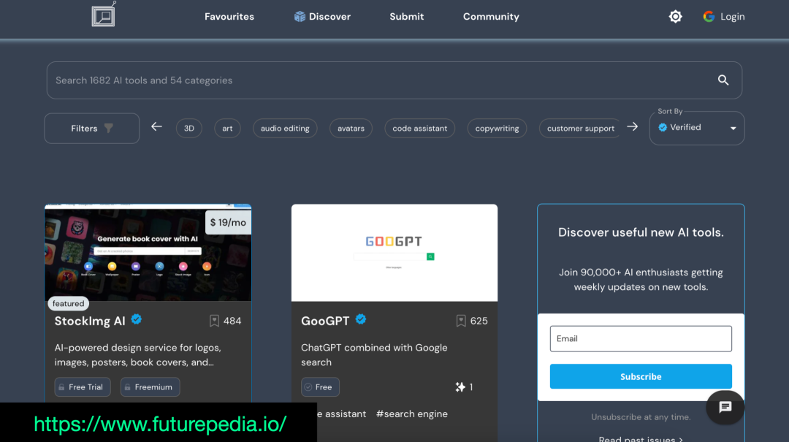

另外分享一个 AIGC 的工具网站，这个网站整合了 1680 种最新的 AIGC 工具，并且做了很详细的分类和介绍，这里的每一种都可以在一个方向拓展你的能力边界。

https://www.futurepedia.io/‌

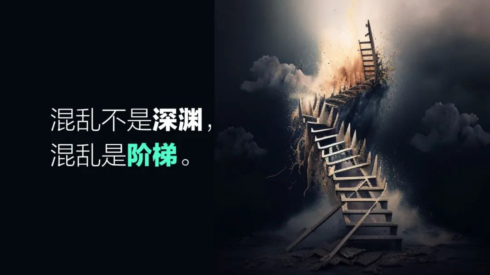

其实 aigc 这个技术是个双刃剑，在未来的三五年之内，会颠覆掉很多我们已经熟悉的模式。

它会造成一个相对混乱的时期，但是这个混乱是深渊还是阶梯，取决于你是如何看待和使用它。

## 来源

- 转载自：https://www.8btc.com/article/6813510
