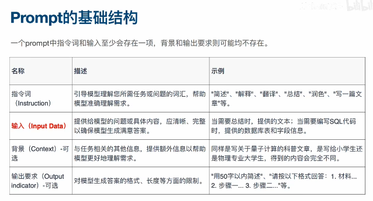

# ChatGPT 使用技巧

## 通用类技巧

- 让 ChatGPT 扮演专家
  - 具有20年从业经验的世界500强的营销顾问
- 告诉 ChatGPT 你的身份
  - 分享你的认知
- 限制 ChatGPT 的回答长度
  - 有些你希望 ChatGPT 直接回答
  - 有些你希望能够详细说明
- 让 ChatGPT 一步步思考
- 明确你的要求和目的
- 提供充分的背景信息
- 始终结构化思考你的 prompt

- 系统化设计你的自定义指令 (Custom Instruction)

## 工作效率提升类技巧

- 让 ChatGPT 帮你生成个性化简历
- 让 ChatGPT 帮你写周报
- 让 ChatGPT 给你提供思考方向
- 将特定角色融入你的工作流中（产品经理写 PRD）
- 将顶级企业的工作方法融入你的工作流（亚马逊的 PRFAQ）
- 让 ChatGPT 帮你写小红书等图文内容
- 让 ChatGPT 帮你写视频脚本
- 让 ChatGPT 将你的想法实现为产品

## 学习效率提升类技巧

- 直接让 ChatGPT 总结一本书的内容
- 基于你的目标，让 ChatGPT 帮你选择性阅读
- 学习过程让 ChatGPT 解释概念，提供更多示例
- 让 ChatGPT 考察你的学习成果
- 整理笔记与撰写书评

## 写作效率提升类技巧

- 让 ChatGPT 帮你回复邮件
- 让 ChatGPT 作为编辑帮你润色文章
- 让 ChatGPT 梳理大纲再进行写作
- 用特定作家的口吻写作
- 用特定作家的口吻进行翻译
