import Image from "@theme/IdealImage";
import ContactUs from "../9-contact-us.md"

# 小红书达人

## 实操 ✨ 如何用 AI 打造爆款小红书护肤帖

<iframe src="//player.bilibili.com/player.html?aid=920448706&bvid=BV1Fu4y177o3&cid=1319631924&p=1" scrolling="no" border="0" frameBorder="no" framespacing="0" allowFullScreen> </iframe>

## 简介

<Image img={require("./img/2-xiaoHongShu/2023-11-02-img-13-xiaohongshu-with-ai.png")} style={{ width: 300 }} />

根据内容创作的流程，制定内容创作模型与指令，从 `目标设定`、`受众分析` 到 `主题研究与构思`，再到 `内容规划`、`框架设计` 和 `内容创作`，我们为您提供一站式服务，让您的创作过程更加高效。

- **目标设定**：帮助您明确内容创作的目标，提供更具针对性的创作指导。
- **受众分析**：了解您的受众群体，为您的内容创作提供更精准的受众定位。
- **主题研究与构思**：基于大数据和行业洞察，为您提供热门和有前景的主题构思。
- **内容规划**：为您提供完整的内容规划建议，帮助您形成高效的创作流程。
- **内容框架设计**：为您的内容提供合理的框架设计，使其结构更清晰，易读性更强。
- **内容创作**：基于以上分析和规划，最终生成具有吸引力和影响力的内容。

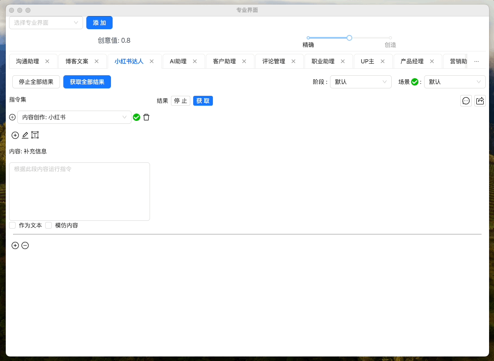

## 活动内容创作信息

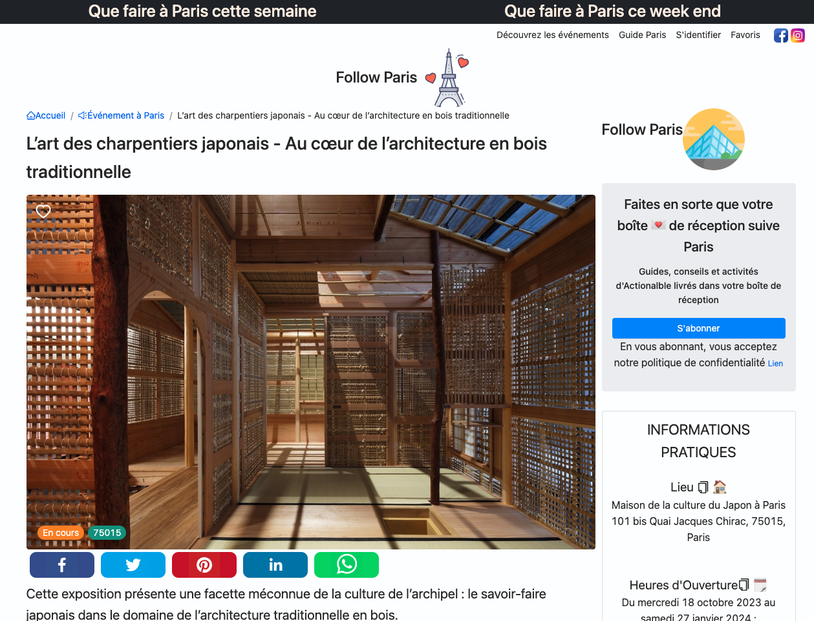

### 目标设定


最终结果

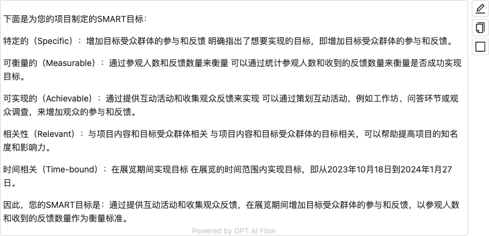

<!-- ```text
下面是为您的项目制定的SMART目标：

特定的（Specific）：增加目标受众群体的参与和反馈
明确指出了想要实现的目标，即增加目标受众群体的参与和反馈。

可衡量的（Measurable）：通过参观人数和反馈数量来衡量
可以通过统计参观人数和收到的反馈数量来衡量是否成功实现目标。

可实现的（Achievable）：通过提供互动活动和收集观众反馈来实现
可以通过策划互动活动，例如工作坊、问答环节或观众调查，来增加观众的参与和反馈。

相关性（Relevant）：与项目内容和目标受众群体相关
与项目内容和目标受众群体的目标相关，可以帮助提高项目的知名度和影响力。

时间相关（Time-bound）：在展览期间实现目标
在展览的时间范围内实现目标，即从2023年10月18日到2024年1月27日。

因此，您的SMART目标是：通过提供互动活动和收集观众反馈，在展览期间增加目标受众群体的参与和反馈，以参观人数和收到的反馈数量作为衡量标准。
``` -->

### 受众分析

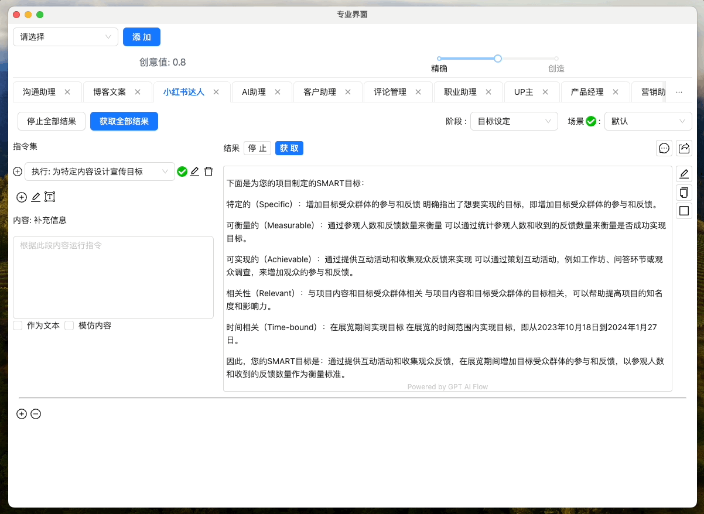

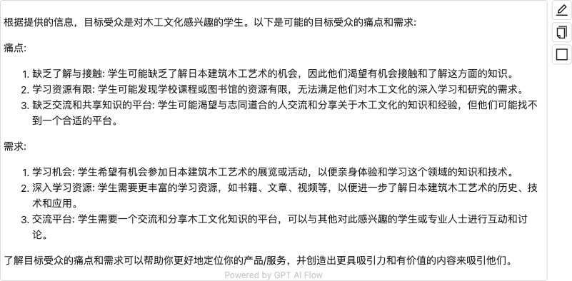

<!-- ```text
根据提供的信息，目标受众是对木工文化感兴趣的学生。以下是可能的目标受众的痛点和需求:

痛点:
1. 缺乏了解与接触: 学生可能缺乏了解日本建筑木工艺术的机会，因此他们渴望有机会接触和了解这方面的知识。
2. 学习资源有限: 学生可能发现学校课程或图书馆的资源有限，无法满足他们对木工文化的深入学习和研究的需求。
3. 缺乏交流和共享知识的平台: 学生可能渴望与志同道合的人交流和分享关于木工文化的知识和经验，但他们可能找不到一个合适的平台。

需求:
1. 学习机会: 学生希望有机会参加日本建筑木工艺术的展览或活动，以便亲身体验和学习这个领域的知识和技术。
2. 深入学习资源: 学生需要更丰富的学习资源，如书籍、文章、视频等，以便进一步了解日本建筑木工艺术的历史、技术和应用。
3. 交流平台: 学生需要一个交流和分享木工文化知识的平台，可以与其他对此感兴趣的学生或专业人士进行互动和讨论。

了解目标受众的痛点和需求可以帮助你更好地定位你的产品/服务，并创造出更具吸引力和有价值的内容来吸引他们。
``` -->

### 主题研究与构思

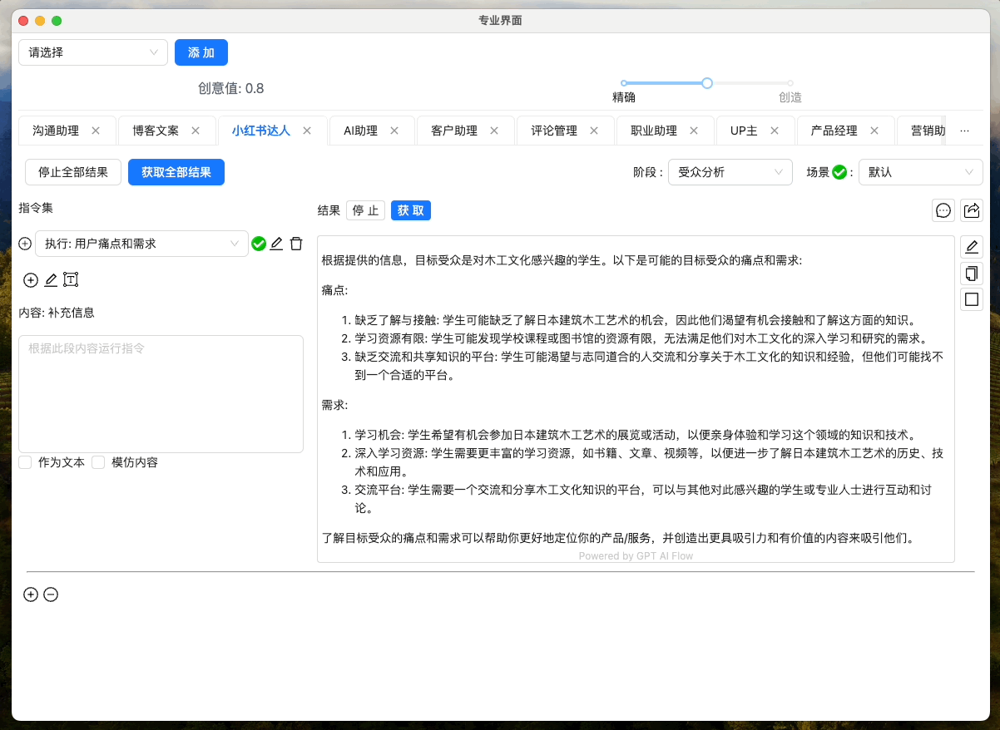

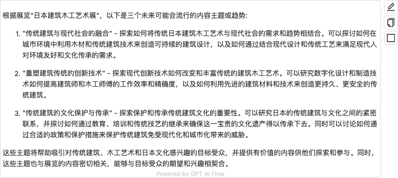

<!-- ```text
根据展览"日本建筑木工艺术展"，以下是三个未来可能会流行的内容主题或趋势:

1. "传统建筑与现代社会的融合" - 探索如何将传统日本建筑木工艺术与现代社会的需求和趋势相结合。可以探讨如何在城市环境中利用木材和传统建筑技术来创造可持续的建筑设计，以及如何通过结合现代设计和传统工艺来满足现代人对环境友好和文化传承的需求。

2. "重塑建筑传统的创新技术" - 探索现代创新技术如何改变和丰富传统的建筑木工艺术。可以研究数字化设计和制造技术如何提高建筑师和木工师傅的工作效率和精确度，以及如何利用先进的建筑材料和技术来创造更持久、更安全的传统建筑。

3. "传统建筑的文化保护与传承" - 探索保护和传承传统建筑文化的重要性。可以研究日本的传统建筑与文化之间的紧密联系，并探讨如何通过教育、培训和传统技艺的继承来确保这一宝贵的文化遗产得以传承下去。同时可以讨论如何通过合适的政策和保护措施来保护传统建筑免受现代化和城市化带来的威胁。

这些主题将帮助吸引对传统建筑、木工艺术和日本文化感兴趣的目标受众，并提供有价值的内容供他们探索和参与。同时，这些主题也与展览的内容密切相关，能够与目标受众的期望和兴趣相契合。
``` -->

### 内容规划


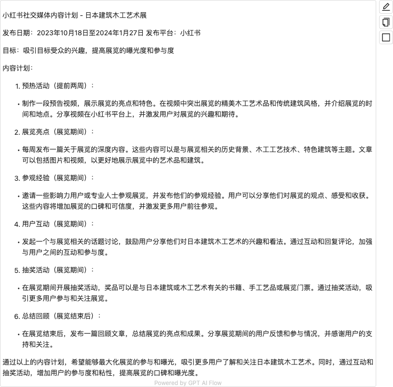

<!-- ```text
小红书社交媒体内容计划 - 日本建筑木工艺术展

发布日期：2023年10月18日至2024年1月27日
发布平台：小红书

目标：吸引目标受众的兴趣，提高展览的曝光度和参与度

内容计划：

1. 预热活动（提前两周）：
- 制作一段预告视频，展示展览的亮点和特色。在视频中突出展览的精美木工艺术品和传统建筑风格，并介绍展览的时间和地点。分享视频在小红书平台上，并激发用户对展览的兴趣和期待。

2. 展览亮点（展览期间）：
- 每周发布一篇关于展览的深度内容。这些内容可以是与展览相关的历史背景、木工工艺技术、特色建筑等主题。文章可以包括图片和视频，以更好地展示展览中的艺术品和建筑。

3. 参观经验（展览期间）：
- 邀请一些影响力用户或专业人士参观展览，并发布他们的参观经验。用户可以分享他们对展览的观点、感受和收获。这些内容将增加展览的口碑和可信度，并激发更多用户前往参观。

4. 用户互动（展览期间）：
- 发起一个与展览相关的话题讨论，鼓励用户分享他们对日本建筑木工艺术的兴趣和看法。通过互动和回复评论，加强与用户之间的互动和参与度。

5. 抽奖活动（展览期间）：
- 在展览期间开展抽奖活动，奖品可以是与日本建筑或木工艺术有关的书籍、手工艺品或展览门票。通过抽奖活动，吸引更多用户参与和关注展览。

6. 总结回顾（展览结束后）：
- 在展览结束后，发布一篇回顾文章，总结展览的亮点和成果。分享展览期间的用户反馈和参与情况，并感谢用户的支持和关注。

通过以上的内容计划，希望能够最大化展览的参与和曝光，吸引更多用户了解和关注日本建筑木工艺术。同时，通过互动和抽奖活动，增加用户的参与度和粘性，提高展览的口碑和曝光度。
``` -->

### 内容框架设计


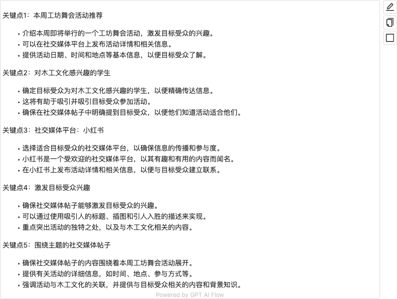

<!-- ```text
关键点1：本周工坊舞会活动推荐
- 介绍本周即将举行的一个工坊舞会活动，激发目标受众的兴趣。
- 可以在社交媒体平台上发布活动详情和相关信息。
- 提供活动日期、时间和地点等基本信息，以便目标受众了解。

关键点2：对木工文化感兴趣的学生
- 确定目标受众为对木工文化感兴趣的学生，以便精确传达信息。
- 这将有助于吸引并吸引目标受众参加活动。
- 确保在社交媒体帖子中明确提到目标受众，以便他们知道活动适合他们。

关键点3：社交媒体平台：小红书
- 选择适合目标受众的社交媒体平台，以确保信息的传播和参与度。
- 小红书是一个受欢迎的社交媒体平台，以其有趣和有用的内容而闻名。
- 在小红书上发布活动详情和相关信息，以便与目标受众建立联系。

关键点4：激发目标受众兴趣
- 确保社交媒体帖子能够激发目标受众的兴趣。
- 可以通过使用吸引人的标题、插图和引人入胜的描述来实现。
- 重点突出活动的独特之处，以及与木工文化相关的内容。

关键点5：围绕主题的社交媒体帖子
- 确保社交媒体帖子的内容围绕着本周工坊舞会活动展开。
- 提供有关活动的详细信息，如时间、地点、参与方式等。
- 强调活动与木工文化的关联，并提供与目标受众相关的内容和背景知识。
``` -->

### 内容创作

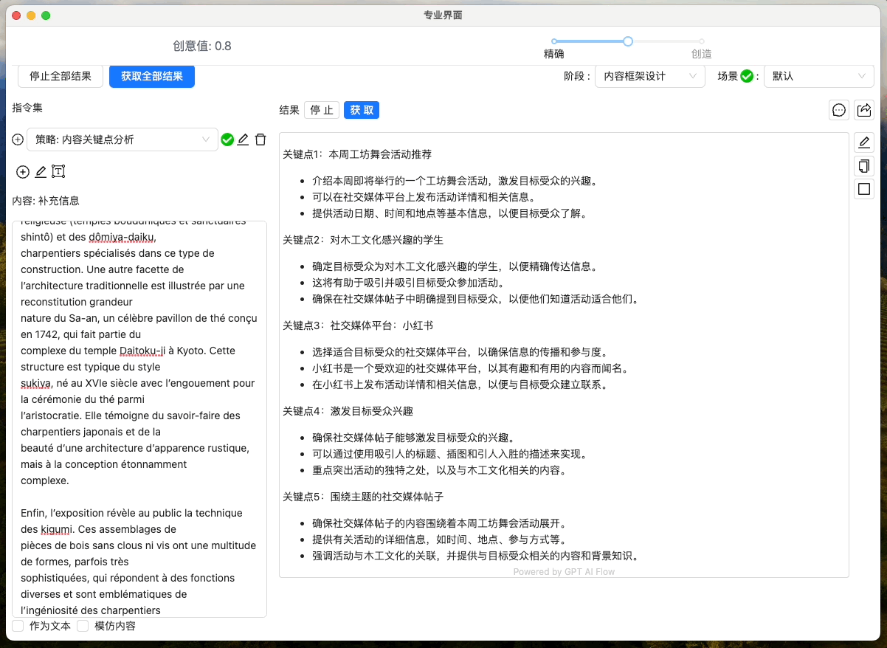

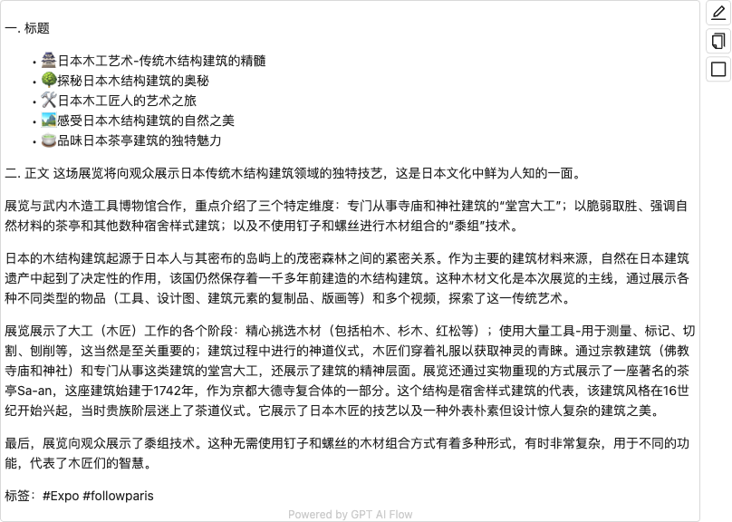

:::tip
使用更高级的模型效果将会更加好。
:::

<!-- ```text
一. 标题
- 🏯日本木工艺术-传统木结构建筑的精髓
- 🌳探秘日本木结构建筑的奥秘
- 🛠️日本木工匠人的艺术之旅
- 🏞️感受日本木结构建筑的自然之美
- 🍵品味日本茶亭建筑的独特魅力

二. 正文
这场展览将向观众展示日本传统木结构建筑领域的独特技艺，这是日本文化中鲜为人知的一面。

展览与武内木造工具博物馆合作，重点介绍了三个特定维度：专门从事寺庙和神社建筑的“堂宫大工”；以脆弱取胜、强调自然材料的茶亭和其他数种宿舍样式建筑；以及不使用钉子和螺丝进行木材组合的“黍组”技术。

日本的木结构建筑起源于日本人与其密布的岛屿上的茂密森林之间的紧密关系。作为主要的建筑材料来源，自然在日本建筑遗产中起到了决定性的作用，该国仍然保存着一千多年前建造的木结构建筑。这种木材文化是本次展览的主线，通过展示各种不同类型的物品（工具、设计图、建筑元素的复制品、版画等）和多个视频，探索了这一传统艺术。

展览展示了大工（木匠）工作的各个阶段：精心挑选木材（包括柏木、杉木、红松等）；使用大量工具-用于测量、标记、切割、刨削等，这当然是至关重要的；建筑过程中进行的神道仪式，木匠们穿着礼服以获取神灵的青睐。通过宗教建筑（佛教寺庙和神社）和专门从事这类建筑的堂宫大工，还展示了建筑的精神层面。展览还通过实物重现的方式展示了一座著名的茶亭Sa-an，这座建筑始建于1742年，作为京都大德寺复合体的一部分。这个结构是宿舍样式建筑的代表，该建筑风格在16世纪开始兴起，当时贵族阶层迷上了茶道仪式。它展示了日本木匠的技艺以及一种外表朴素但设计惊人复杂的建筑之美。

最后，展览向观众展示了黍组技术。这种无需使用钉子和螺丝的木材组合方式有着多种形式，有时非常复杂，用于不同的功能，代表了木匠们的智慧。

标签：#Expo #followparis
``` -->

## 视频案例

<iframe src="//player.bilibili.com/player.html?aid=915921783&bvid=BV13u4y1C7jF&cid=1265469812&p=1" scrolling="no" border="0" frameBorder="no" framespacing="0" allowFullScreen> </iframe>

## 用户案例

[小红书: 巴黎去哪玩](/docs/application-scenarios/user-testimonial#小红书达人)

## 联系我们

<ContactUs/>
