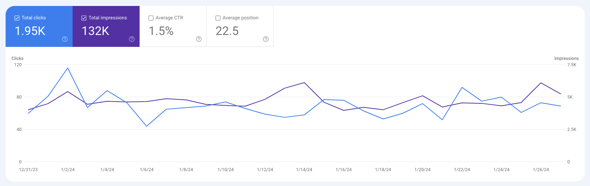

import Image from "@theme/IdealImage";
import ContactUs from "../9-contact-us.md"

# 用户案例

## 巴黎去哪玩

### [小红书达人模块](/docs/application-scenarios/xiaoHongShu)

[巴黎去哪玩 「Follow Paris」(2023.12.07)](https://www.xiaohongshu.com/user/profile/56cf33c550c4b408633787cf) 在小红书平台的关注数，仅在一个月内便观观看量增长 70%，互动量飙升超过 200%，笔记涨粉转化达 171%。您也有机会创造如此佳绩！

    <Image img={require("./img/17-user-testimonial/followparis/2024-01-29-img-20-xiaoHongShu-followparis-backoffice.png")} style={{ width: 300, marginLeft: "1rem", marginTop: "1rem" }} />
    <Image img={require("./img/17-user-testimonial/followparis/2023-12-07-img-17-xiaoHongShu-followparis-backoffice-2.png")} style={{ width: 300, marginLeft: "1rem", marginTop: "1rem" }} />
    <Image img={require("./img/17-user-testimonial/followparis/2023-12-07-img-18-xiaoHongShu-followparis-backoffice-3.png")} style={{ width: 300, marginLeft: "1rem", marginTop: "1rem" }} />
    <Image img={require("./img/17-user-testimonial/followparis/2023-12-07-img-19-xiaoHongShu-followparis-backoffice-4.png")} style={{ width: 300, marginLeft: "1rem", marginTop: "1rem" }} />

### [SEO 助理模块](/docs/application-scenarios/seo-assistant)

[Follow Paris 巴黎去哪玩(2024.01.29)](https://www.followparis.com/zh/que-faire-a-paris-cette-semaine) 网站 SEO 排行 Goolge 搜索首页。

数据：过去 28 天谷歌搜索流量 13.2 万，自然点击 1950 人。

Google 搜索关键词：

- que faire à paris cette semaine
- que faire a paris cette semaine
- follow paris
- paris cette semaine
- quoi faire à paris cette semaine
- que faire cette semaine à paris
- que faire cette semaine à paris

:::info 用户反馈

> "使用这套工具后，我的工作效率提高了 50%！" ——满意的用户张先生

:::

## 联系我们

<ContactUs/>
