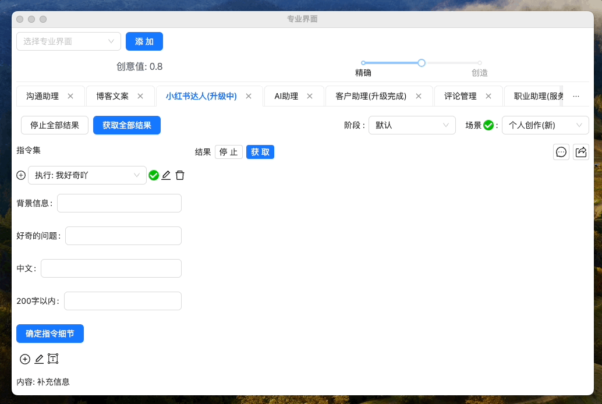
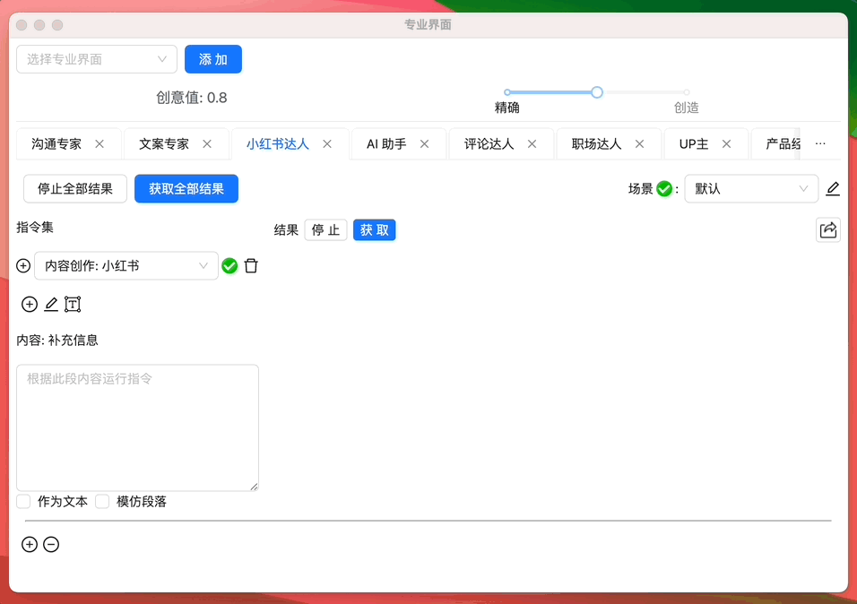
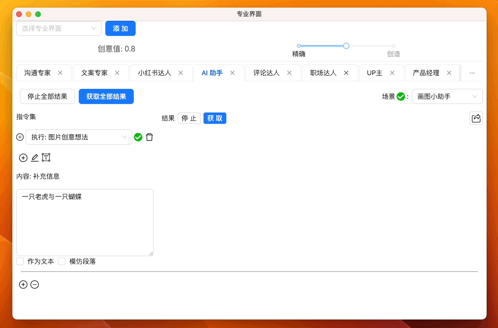
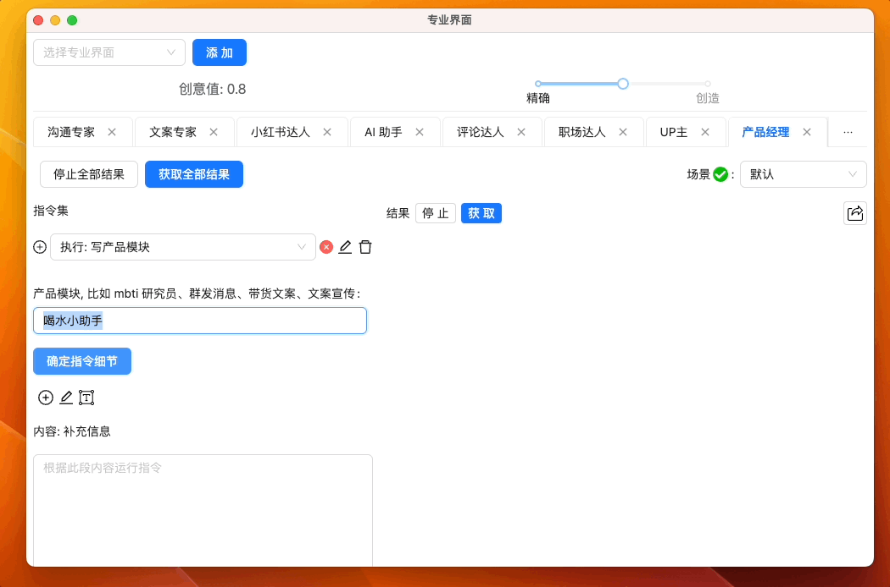
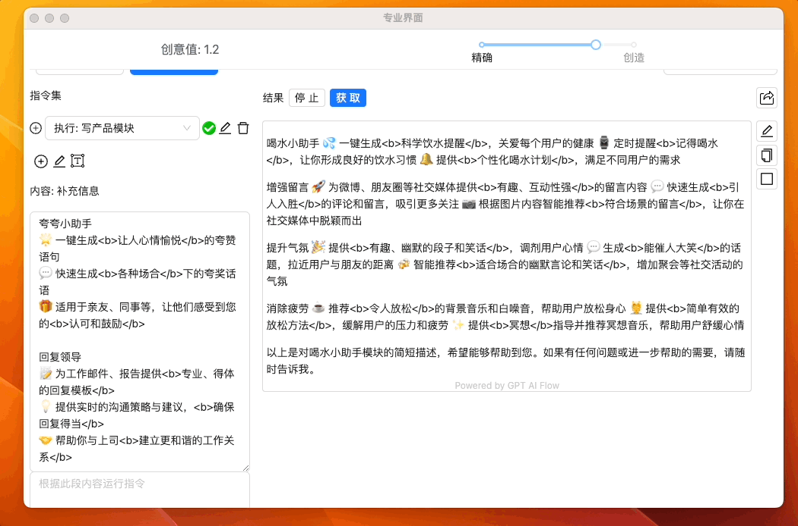

# 产品更新

## 2024-04-09-v0.1.44-GPT AI Flow 免费国际版

产品介绍：

欢迎体验 GPT AI Flow 的最新版本 v0.1.44，现已全面开放免费国际版！我们不断地聆听用户的声音，致力于提供更多样化和包容性的服务。本次更新不仅是向全球用户的承诺，也展现了我们对提供高性价比解决方案的坚定决心。立即下载并开始享受我们的免费服务，体验无界限的便捷与可靠！

版本说明

- **全球通用**: 无论您身在何处，都能轻松获取并使用我们的免费软件。
- **零成本体验**: 免费获取我们软件的基础功能集，而无需担心任何隐藏费用。
- **信赖的品质**: 即便是免费版本，我们也保证软件的品质不打折扣，致力于提供稳定可靠的用户体验。
- **持续的支持和改善**: 我们会定期发布版本更新，以确保软件功能的完善和用户体验的提升。

我们期待您的宝贵反馈，因为您的每一份评价和建议都将直接影响我们产品的未来。请通过邮箱 hello@gptaiflow.com 或使用我们的[在线反馈系统](https://github.com/GPT-AI-Flow/gpt-ai-flow-doc-docusaurus/issues)与我们联系，分享您的使用感受和需求。

感谢您的持续支持，希望 GPT AI Flow 能够在您的数字生活旅程中发挥重要作用。立即下载，加入我们的免费使用者行列，一同享受科技带来的便利性！[如果在使用中遇到任何问题或有任何建议，欢迎随时向我们反馈](https://wj.qq.com/s2/13154598/1770/)。

## 2024-02-04-v0.1.42-官方客服助手与 ProMode 专业模式指令链/小红书达人官方测试数据库 大更新

产品介绍:

欢迎体验我们的最新版本 v0.1.42，我们带来了一系列功能优化和新增特性，以提升您的用户体验！加入了全新的 GPT AI Flow 客服助手，可以更智能地解答用户咨询，大幅提升客户服务效率。此外，专为专业用户设计的 ProMode 专业模式进行了升级，优化了指令链处理流程，让操作更加流畅高效。我们还在测试阶段引入了专为小红书达人打造的官方数据库，为内容创作者提供更精准的数据支持。为了便捷操作，新增了 Alt+0 快捷键功能，让您能快速清除历史记录，保障工作区的整洁。

版本说明

1. **客服助手**: 新增 GPT AI Flow 客服助手，采用先进的人工智能技术，让客服响应更迅速、更个性化。
2. **ProMode 专业模式指令链优化**: 优化了 ProMode 专业模式的指令链处理流程，提高了命令执行的准确性和处理速度。
3. **小红书达人官方数据库(测试阶段)**: 引入小红书达人官方数据库，旨在帮助专业用户精准定位市场和观众数据。
4. **快捷清除历史**: 新增快捷键 `Alt+0`，用户可以通过这个简单的按键组合，迅速清除历史记录，保持工作环境的高效与整洁。

我们不断倾听用户的反馈，并致力于通过不断的更新和改进，为用户带来更好的产品体验。立即下载 v0.1.42，享受更加专业和智能的服务！

## 2024-01-22-v0.1.40-试用可选版本与专业模式升级

欢迎体验小红书达人 v2 的最新版本！在 v0.1.40 版本中，我们深入优化了用户的交互体验，并显著提升了软件性能。本次更新包括信息对话窗口新增的功能，以及复制部分的用户反馈改进，同时为您提供了更加灵活的试用选项。现在，用户可以根据自身的需求选择工具版或模型版，以获得更加个性化的使用体验。此外，通过升级软件依赖包，我们确保了软件运行更加稳定，提供了更好的性能。立即更新，体验更加流畅与高效的小红书达人 v2！

更新说明:

- **新增 G3, G4 模型类型标签**: 信息对话窗口中新增的模型类型标签让用户能快速辨识并选择适合他们需求的数据模型。
- **复制部分改进**: 响应用户反馈，调整了复制机制，以便用户能够选择性地复制所需的文字信息。
- **试用版本优化**: 提供了更灵活的试用版本选择，用户可以根据自己的需要选择工具版或模型版。
- **代码与软件依赖包大升级**: 通过升级软件依赖包和优化代码，我们实现了软件性能的大幅提升，保证了更流畅的用户操作体验。
- **专业模式升级**: 小红书达人的专业模式现已升级至 v2 版本，提供了更多专业工具和功能，帮助用户更有效地进行内容创作和管理。

立即更新到 v0.1.40，提升您的 GPT AI Flow 使用体验！

## 2023-12-29-v0.1.39-专业模式增强与用户体验优化

产品介绍：

本次更新侧重于为专业模式用户带来更灵活的操作体验，并对整个应用的用户界面进行了细致的优化。通过引入更多的模型选择和新增的临时模型选项，我们确保您能够在专业模式中体验更高的自定义性和效率。同时，我们不断努力提升平台的整体用户体验，让使用 GPT AI Flow 成为每一位用户愉快且高效的日常活动。

更新说明：

- **部分 proMode 指令升级**：我们升级了专业模式下的部分指令，现在您可以在其中选择更适合您需求的模型，以便在执行专业任务时获得更好的结果。
- **专业模式中增加临时模型选项**：为了给您提供更多的灵活性，我们在专业模式中新增了临时模型选项。这意味着您现在可以根据当前任务的具体需求，临时切换到不同的模型，无需更改默认设置。
- **优化用户体验**：我们致力于不断提升用户体验。在这个版本中，您会发现应用的各个方面，包括界面的流畅性、交互的直观性以及访问速度都有所改进，从而确保您的使用体验更加顺畅和愉快。

立即更新到 v0.1.39，享受 GPT AI Flow 带来的全新体验！我们期待您的宝贵反馈，并将其作为持续改进的动力。[如果在使用中遇到任何问题或有任何建议，欢迎随时向我们反馈](https://wj.qq.com/s2/13154598/1770/)。

## 2023-12-15-v0.1.38-全新个人创作模式，桌面端体验提升

产品介绍：

在这个更新中，我们专注于为桌面端用户提供更流畅、更直观的使用体验。引入的全新个人创作模式将赋予内容创作者更多自由与灵活性，不仅优化了编写和编辑工作的流程，还提供了更多个性化的工具和功能，让每位创作者都能在小红书平台上以自己独特的方式闪耀。

更新说明：

- **新增个人创作模式**：小红书专业模块中新增加了个人创作模式，让创作者可以更加灵活地编辑和发布原创作品，同时提供了更多样化的排版和编辑工具，以支持各种创作需求。
- **用户体验优化**：对桌面端界面和交互设计进行了全面优化，提升了操作的流畅性和便捷性，确保您能够更加高效地浏览和创作内容。
- **稳定性和性能改进**：对程序的整体稳定性和性能进行了进一步的优化，确保在长时间使用过程中提供一致的用户体验。

我们始终致力于通过不断的技术创新和功能完善，为用户提供更优质的产品体验。感谢您的持续支持，我们期待您在新版本中的创作成果！[如果在使用中遇到任何问题或有任何建议，欢迎随时向我们反馈](https://wj.qq.com/s2/13154598/1770/)。

## 2023-12-06-v0.1.37-OTA-1-智能助理平台 全面升级，专业模式更精准！

产品介绍：

欢迎体验全新更新的智能助理平台 v0.1.37-OTA-1，这次更新带来了对专业模式的全面增强，涉及多个功能模块。无论您是沟通助理、博客作者、小红书达人、AI 技术专家、客户服务专员、内容管理者、UP 主、产品经理还是营销人员，我们的平台都能为您提供更准确、高效的服务，满足您日益增长的专业需求。让我们一起探索这次更新的精彩内容！[如果在使用中遇到任何问题或有任何建议，欢迎随时向我们反馈](https://wj.qq.com/s2/13154598/1770/)。

更新说明：

- **智能沟通助理**: 提高语言模型的反应速度和对话准确性，更好地理解并回应客户需求。
- **博客文案制作**: 升级文案生成工具，提升写作辅助的准确性和创造性，以吸引更多读者。
- **小红书达人助手**: 优化内容推荐算法，增强个性化设置，提高内容与受众匹配度。
- **AI 助理模块**: 增强 AI 理解能力和任务执行效率，让技术支持更加智能化。
- **客户助理功能**: 提升客户服务响应的准确率，优化用户体验和满意度。
- **评论管理工具**: 引入更智能的评论过滤和反馈机制，提高内容管理的效率。
- **UP 主内容创造助手**: 增强视频和社交媒体内容创作的辅助能力，提高受众互动。
- **产品经理助理**: 加强市场分析和产品规划的工具，助力产品快速迭代和市场适应。
- **营销助理**: 提升市场趋势分析和营销策略推荐的准确度，为营销决策提供强有力的数据支撑。

所有模块的精度和准确度得到显著提升，确保您在专业领域的表现更加出色。立即更新，享受全面提升的智能助理服务吧！[如果在使用中遇到任何问题或有任何建议，欢迎随时向我们反馈](https://wj.qq.com/s2/13154598/1770/)。

## 2023-11-29-v0.1.37-模仿案例与仿写功能加强版!

产品介绍：

欢迎体验创意内容助手的最新版本 v0.1.37，我们的产品专为内容创作者、营销人员和写作爱好者设计，用以提升其内容创作的效率和质量。在这个版本中，我们引入了内置的模仿内容案例，为用户提供了丰富的参考素材。此外，我们还对内容仿写功能进行了显著加强，以支持更加多样化和高质量的内容创作。同时，我们优化了指令输入体验，使得用户操作更加流畅，体验更为顺滑。

产品说明：

- **内置模仿内容案例**：我们精心准备了一系列高质量的模仿案例，这些案例涵盖了不同风格和主题，用户可以直接使用这些案例来启发自己的创作，或者将其作为模板进行调整和改写，以迅速生成具有个性化特点的内容。
- **加强的内容仿写功能**：基于用户反馈和最新的技术进步，我们对内容仿写功能进行了全面的提升。无论是语言风格的模仿，还是结构和主题的复制，我们的工具都能提供更加智能和精准的仿写能力，帮助用户轻松创作出既符合需求又具有创新性的文案。
- **优化的指令输入体验**：为了让用户在使用时更加得心应手，我们对指令输入进行了全方位的优化。新的指令输入逻辑更加符合用户习惯，界面交互设计也更加直观，从而让用户的操作更加高效，减少了学习曲线。

无论您是在寻找灵感，还是需要快速产出高质量的文案，创意内容助手 v0.1.37 都将成为您不可或缺的助手。立刻更新，解锁您的创作潜能！[如果在使用中遇到任何问题或有任何建议，欢迎随时向我们反馈](https://wj.qq.com/s2/13154598/1770/)。

## 2023-11-25-v0.1.36-专业模式升级与美容护肤创作支持

产品介绍：

我们的最新更新，v0.1.36，旨在提升用户体验和拓展内容创作的范畴。本次更新专注于对专业模式的优化，并针对小红书达人专业模块中新增了美容护肤场景，为美容达人们提供更丰富的内容创作和护肤建议工具。

更新说明：

1. **专业模式优化**：我们对专业模式的操作流程进行了细致的优化，改进了对模式阶段的处理，使用户能够更流畅地进行创作和管理内容，从而提高工作效率和创作质量。
2. **美容护肤场景增设**：响应广大美容内容创作者的需求，v0.1.36 版本在小红书达人专业模块中新增了美容护肤场景。这允许创作者将专业知识和个性化建议直接融入他们的内容，同时也帮助用户获取实用的护肤信息。
3. **内容创作与护肤建议阶段配置**：为了进一步支持美容创作者，我们新增了两个定制阶段：内容创作和护肤建议。内容创作阶段致力于提供灵活的编辑工具和丰富的素材库，以激发创意和提高内容质量。护肤建议阶段则旨在帮助创作者提供更专业、更有针对性的护肤指导，满足用户在追求美丽的同时对专业建议的渴望。

我们坚信，通过这次更新，v0.1.36 将进一步巩固我们产品在内容创作市场的领导地位，同时也为我们的用户带来更深层次的价值和更优质的体验。立即体验 v0.1.36，开启您的专业内容创作之旅。[如果在使用中遇到任何问题或有任何建议，欢迎随时向我们反馈](https://wj.qq.com/s2/13154598/1770/)。

## 2023-11-16-v0.1.35-小红书达人专业模式升级 - AI 指令更智能，模型选择更丰富！

产品介绍：

随着社交媒体营销的不断演进，小红书作为领先的生活方式分享平台，始终致力于为达人们提供更高效、更个性化的内容创作体验。我们荣幸地宣布，小红书专业模式在 v0.1.35 版本中得到了全面优化，特别针对达人使用的 AI 指令设置进行了升级，使其变得更加智能且更加易于使用。此外，我们听取了众多达人的反馈，增加了更多模型选择，以满足不同领域达人的多样化需求。

版本说明：

在小红书 v0.1.35 中，达人们将体验到以下新增和改进功能：

1. 优化的 AI 指令设置：我们对专业模式下的 AI 指令进行了精细化的优化，使达人在创作内容时能够更加精准地控制所需效果。新的 AI 指令不仅反应更快，还更加符合直觉，让操作更加流畅。

2. 更多模型选择：为了支持达人们在小红书上创作出更多元化的内容，我们新增了一系列高效的模型选项。不论是美食、时尚还是旅行领域的达人，都能在更广泛的模型库中找到更适合自己内容风格的工具。

这次更新旨在通过更智能的工具和更广泛的选择，进一步提升达人们在小红书平台上的创作体验和内容质量。我们始终相信，不断的技术创新将会为小红书社区带来更多的可能性。立刻更新至 v0.1.35，开启您的专业创作新旅程！

[如果在使用中遇到任何问题或有任何建议，欢迎随时向我们反馈](https://wj.qq.com/s2/13154598/1770/)。

## 2023-11-08-v0.1.34-付款流程优化与 AI 模型更新

产品介绍：

在此次 v0.1.34 版本的更新中，我们主要对付款流程进行了整合与优化，增加了新一代的大模型-4-preview AI 模型选择，以及性能代码的优化，提供更流畅的用户体验。另外，必要的文本更新和订阅逻辑的处理也在本次版本中进行了调整。

产品说明：

1. **付款流程整合**：我们的技术团队对现有的付款流程进行了全面的整合，使之更符合用户使用习惯，提供更顺畅的付款体验。
2. **大模型-4-preview 模型选择**：我们增加了最新的大模型-4-preview 模型选择，使用户能够享受到最前沿的 AI 技术带来的优势。
3. **性能代码优化**：我们对性能代码进行了优化，将提升整体的系统性能，提供更流畅、更快速的用户体验。
4. **订阅逻辑更新**：此版本优化了订阅数据库 v2，并增加了过期订阅的处理机制，使用户的订阅管理更为便捷，同时更新了相应文本，使操作更为直观。

通过这些更新，我们希望进一步提升用户的使用体验，感谢您对我们产品的支持，我们将不断努力，为您提供更优质的服务。[如果在使用中遇到任何问题或有任何建议，欢迎随时向我们反馈](https://wj.qq.com/s2/13154598/1770/)。

## 2023-11-06-v0.1.33: ProMode 专业模式更新——更先进的数据结构和用户友好的交互体验

产品介绍：

我们很高兴地宣布，ProMode 专业模式的最新版本 v0.1.33 已经上线。我们在这个版本中进行了一些重要的升级和改进，以帮助用户更好地使用我们的产品。在这个版本中，我们从专业模块 v2.0 升级到了专业模块 v3.0，并且我们的专业模式设置现在可以应用在对话框中，让用户在已有专业答案的基础上通过对话方式直接个性化的使用 AI。此外，我们在专业模式中增加了阶段设置，未来每个模块都会有机会进行 OTA 升级。

产品说明：

1. **IProMode 数据结构升级**：从专业模块 v2.0 升级到了专业模块 v3.0，使得产品的性能和稳定性得到了进一步的提升。
2. **专业模式设置对话框**：用户可以在对话框中直接进行专业模式设置，这不仅方便了用户使用，也提升了产品的交互体验。
3. **增加阶段设置**：在专业模式中，我们新增了阶段设置功能，用户可以根据自身需求进行调整，未来每个模块都会有机会进行 OTA 升级，使产品更好地满足用户需求。

我们将继续收集用户反馈，不断优化我们的产品，满足用户的专业需求。[如果在使用中遇到任何问题或有任何建议，欢迎随时向我们反馈](https://wj.qq.com/s2/13154598/1770/)。

## 2023-10-29-v0.1.32: 全新奖励机制与性能优化

产品介绍：

欢迎体验 v0.1.32 版本，此次更新主要带来全新的推荐奖励机制，更进一步提高了用户体验。并根据广大用户的反馈，我们修复了账户登出及订阅套餐检查的问题，强化了产品的稳定性和可靠性。此外，我们引入了大模型-3.5 和大模型-4 的能力限制切换，以满足不同用户的需求。为提升后端稳定性，我们还进行了大规模的数据重构和性能优化。

产品说明：

1. **推荐奖励机制**：我们引入了全新的推荐奖励机制，用户通过推荐新用户使用我们的产品，将获得一定的奖励。
2. **账户登出问题修复**：感谢广大用户的反馈，我们已经解决了账户登出问题，提高了用户体验。
3. **订阅套餐检查问题修复**：此次更新修复了订阅套餐检查的问题，使得用户更加简易地查看和管理自己的订阅套餐。
4. **大模型-3.5/大模型-4 能力限制切换**：我们为用户提供了新的能力限制切换选项，根据你的需求，自由选择大模型-3.5 或大模型-4 模型的能力。
5. **数据与性能后端稳定性重构**：为了提高后端稳定性，我们对数据进行了重构，并对性能进行了优化，确保了产品的稳定运行。

感谢全球用户的支持和信任，我们将持续优化产品，提供最优质的服务。产品的不断升级和创新离不开用户的反馈和建议，让我们共同打造更好的数字世界，期待您的持续关注和支持，敬请体验并享受 v0.1.32 带来的全新体验。

[如果在使用中遇到任何问题或有任何建议，欢迎随时向我们反馈](https://wj.qq.com/s2/13154598/1770/)。

## 2023-10-23-v0.1.30-OTA-2: 升级您的博客内容创作体验

产品介绍：

我们非常高兴地发布 v0.1.30-OTA-2，这个版本对我们的博客文案内容创作专业模块进行了重大的升级。这个版本强化了受众分析，主题研究，关键词与 SEO，内容规划，内容创作，视觉元素，编辑校对，以及 SEO 优化等功能。我们的目标是为您提供一个全方位、高效的工具，帮助您制作出高质量的博客内容，并提升您的 SEO 优化能力。

产品说明：

在这个版本中，我们增强了以下几点功能,

- **受众分析**：我们的系统现在更加理解您的读者，可以为您提供更详细的受众分析，帮助您更好地满足他们的需求。
- **主题研究**：我们提供了一套强大的主题研究工具，能够帮助您深入了解热门主题，从而创作出更吸引人的内容。
- **关键词与 SEO**：我们的关键词研究工具和 SEO 优化功能得到了大幅提升，可以帮助您的博客在搜索引擎排名中更占优势。
- **内容规划**：我们增强了内容规划工具，您可以更轻松地规划和管理您的博客内容。
- **内容创作**：我们的内容创作工具更加强大，可以帮助您迅速创作出高质量的博客文章。
- **视觉元素**：我们提供了更丰富的视觉元素资源，让您的博客更加生动有趣。
- **编辑校对**：我们的编辑校对工具现在更加精准，可以帮助您提升博客内容的质量。
- **SEO 优化**：我们的 SEO 优化工具得到了升级，可以帮助您更好地提升博客的搜索引擎排名。

我们相信 v0.1.30-OTA-2 版本的升级将为您的博客创作与 SEO 优化体验带来全面的提升。[如果在使用中遇到任何问题或有任何建议，欢迎随时向我们反馈](https://wj.qq.com/s2/13154598/1770/)。

## 2023-10-20-v0.1.30-OTA-1: 小红书内容创作模块升级，让自媒体内容创作更具效率

产品介绍：

我们在这个版本中对专业模式的小红书模块进行了全面升级，旨在提供一种更优秀的自媒体创作体验。我们根据内容创作的流程，制定了全新的内容创作指令，从`目标设定`、`受众分析`到主`题研究与构思`，再到`内容规划`、`框架设计`和`内容创作`，我们为您提供一站式服务，让您的创作过程更加高效。

产品说明：

- **目标设定**：帮助您明确内容创作的目标，提供更具针对性的创作指导。
- **受众分析**：了解您的受众群体，为您的内容创作提供更精准的受众定位。
- **主题研究与构思**：基于大数据和行业洞察，为您提供热门和有前景的主题构思。
- **内容规划**：为您提供完整的内容规划建议，帮助您形成高效的创作流程。
- **内容框架设计**：为您的内容提供合理的框架设计，使其结构更清晰，易读性更强。
- **内容创作**：基于以上分析和规划，最终生成具有吸引力和影响力的内容。

相信这次升级会让您的自媒体创作更加高效和有成效，期待您使用的反馈和建议，我们一直在努力，只为提供给您更好的产品和服务。[如果在使用中遇到任何问题或有任何建议，欢迎随时向我们反馈](https://wj.qq.com/s2/13154598/1770/)。

## 2023-10-16-v0.1.30: ProMode 专业模式升级 & 个性化本地个人文档助手

产品介绍：

我们很高兴发布我们的 v0.1.30 版本，它包含了 **ProMode 专业模式**的重要更新以及全新的**本地个人文档助手**功能。我们相信，这些新特性将更进一步提升你的产品体验。

产品说明:

### ProMode 专业模式：

- 我们在不断听取用户反馈的基础上，进行了专业模式模型的更新与**仿写案例功能优化**，力求为用户提供更加专业、顺畅的使用体验。
- 美妆部分也进行了全面的重写，**文案推荐语气与角度也得到了改善**，使得用户在使用该功能时能够得到更加精准的建议。

### 本地个人文档助手：

我们引入了一个全新的功能 - 本地个人文档助手。这是一个强大的工具，允许用户使用自己本地的文字知识库构建出一个完全个性化的文档助手。无论你是在做研究、写报告，还是管理项目，此功能都将使你的工作更加高效。

- **个人化构建**: 本地个人文档助手让用户可以利用自己的本地文字知识库作为基础，构建个性化的文档助手。这意味着你可以将所有重要的信息和知识都整合在一个地方，方便随时查阅和使用。
- **快速获取答案**: 通过直接向本地文档助手提问，用户可以快速精准地获取知识库中的答案。这大大减少了查找信息的时间，提高了工作效率。

在我们发布这个新版本的同时，我们承诺会持续改进和优化这项功能，以满足用户的需求。我们期待你使用这个新功能，并享受它带来的便利。[如果在使用中遇到任何问题或有任何建议，欢迎随时向我们反馈](https://wj.qq.com/s2/13154598/1770/)。

## 2023-09-28-v0.1.29: 更便捷的用户体验与强大的创新工具

产品介绍:

我们非常高兴地向您介绍 v0.1.29 版本的更新！我们在这个版本中进行了多项优化和增强，以提供给您更顺畅和个性化的使用体验。我们优化了国内地区的试用流程，设置了更加便利的快捷键，推出了全新的 **`模仿段落`** 功能，让您的文字更具个性化风格。我们还新增了专业模式中的 **`创意值`** 设置，让您的创新无限可能。同时，我们增设了 **`分享按钮`** 和 **`画图小助手(AI助理)`** 模块，让您的成果可以更方便地分享出去。我们也为免费版用户添加了产品水印，让每一位用户都可以感受到我们对产品质量的坚守与追求。

产品说明:

1. **优化国内地区试用流程**: 我们对国内地区的试用流程进行了优化，用户可以更加轻松便捷地试用我们的产品。
2. **快捷键设置**: 我们新增了一个快捷键 Alt + `，选中即可进行搜索，大大提升了使用效率。
3. **模仿段落**: 此功能可以引导有特定文字风格需求的用户进行输入，让您的文字更具特色。
4. **创意值设置**: 在专业模式中，您可以自由调整创意值，实现您的创新构想。
5. **分享按钮**: 您可以将您的成果通过我们的分享按钮方便快捷地分享出去。
6. **画图小助手(AI 助理)模块**: 这是我们全新推出的功能，可以帮助您更好地完成画图任务。
7. **产品水印**: 我们在免费版用户的产品中增加了水印，保证了产品的专业性和权威性。

<iframe src="//player.bilibili.com/player.html?aid=491554698&bvid=BV15N411E7uU&cid=1284474746&p=1" scrolling="no" border="0" frameBorder="no" framespacing="0" allowFullScreen> </iframe>

这个版本的发布旨在提升用户体验，确保我们的产品能够更好地满足用户的需求。我们将持续倾听用户的反馈，不断优化和改进产品，为用户提供更好的使用体验。[如有任何问题或建议，请随时与我们联系](https://wj.qq.com/s2/13154598/1770/)。

### 快速搜索快捷键

### 创意值设置, 画图小助手(AI 助理)模块

### 模仿段落

### 分享按钮

将输出结果存储为图片，分享给朋友或工作伙伴。

## 2023-09-23-v0.1.28-OTA-4: 全面升级的专业模式-工作和社交的最佳助手

产品介绍:

我们很高兴地为你介绍 v0.1.28-OTA-4 版本的更新。这次更新中，我们进行了专业模式模块的大升级，为你提供了一系列全方位的助手服务，包括知识分享视频脚本、邮件助手、夸夸小助手、朋友圈文案、总结小助手，以及 mbti 研究员。同时，我们还提高了群发通知的功能，并增加了知乎问答模块，帮助你轻松互动、发现更多内容。

产品说明:

- **知识分享视频脚本**: 此功能可以帮你高效地构建分享内容，从而更有效地进行知识分享。
- **邮件助手**: 自动生成专业的邮件正文，提高工作效率，繁重的邮件工作再也不是问题。
- **夸夸小助手**: 无论遭遇什么压力，夸夸小助手都会随时送上赞美的暖心话语，让你立刻恢复信心。
- **朋友圈文案**: 自动生成朋友圈文案，让你的朋友圈总是充满新鲜元素。
- **总结小助手**: 帮助你总结每天的学习、工作和生活，让每一天都有所收获。
- **mbti 研究员**: 通过对 MBTI 性格测试结果的深入研究，让你更好地了解自己和他人。
- **群发通知**: 一键式群发通知，快速、简单又方便，让沟通更轻松。
- **知乎问答**: 通过对知乎社区的问答分析，让你不错过任何精彩讨论和发现。

这是我们为你精心打造的 v0.1.28-OTA-4 版本，一切都为了让你的工作和社交更加便捷、高效。现在就升级体验吧！[如有任何问题或建议，请随时与我们联系](https://wj.qq.com/s2/13154598/1770/)。

## 2023-09-18-v0.1.28-OTA-2: 提升趋势洞察力并提升传播效率的专业场景模块工具套

产品介绍:

v0.1.28-ota-2 是一款面向专业场景的升级版本，新加入的专业场景模块将会帮助你更方便地进行各类专业活动。其中包括了企业内部的 SWOT 分析，商业宣传的文案撰写，卖货的文案创作，短视频制作的脚本编写，以及提升团队管理效率的 OKR 方法等。无论你是企业内部成员还是自由职业者，你都可以依靠 v0.1.28-ota-2 来提升工作效率和工作质量。

产品说明:

1. **文案宣传模块**: 帮助用户创建出吸引眼球的社会媒体内容，提升品牌影响力。
2. **带货文案模块**: 专门为销售策略制定的嵌入式工具，让你的商品或服务能够更好地展示其价值并促进销售。
3. **短视频脚本模块**: 利用传统的剧本制作工具，以及最新的短片编辑技术，轻松制作出富有吸引力的视频内容。
4. **提供 SWOT 分析模块**: 快速完成对企业实力的四种要素（优势，劣势，机会，威胁）的分析，辅助企业进行市场定位和策略规划。
5. **OKR 方法模块**: 帮助你设定和完成目标，提供可追踪的进度反馈，往而提升你和你的团队的工作效率。

敬请期待我们为你带来更多的优化和改进。若有任何问题或建议，欢迎随时联系我们。[如有任何问题或建议，请随时与我们联系](https://wj.qq.com/s2/13154598/1770/)。

## 2023-09-17-v0.1.28-OTA-1: 全面增强您的职场与社交沟通能力

产品介绍:

我们激动地推出了 v0.1.28-OTA-1 的更新版本，这次的更新我们创新性地运用了 over-the-air (OTA) 技术，增加了众多沟通与职场的新场景。此次更新我们特别增设了“回复领导”、“总结小助手”、“夸人小助手”等定制化沟通功能，帮助用户高效、专业地处理各种工作情境。

产品说明:

1. **回复领导**: 这个功能将根据领导的邮件或消息，为您生成合适、得体的回复内容，帮您在工作中表现得更富思考、更专业。
2. **总结小助手**: 一键生成会议总结、项目总结等，让总结报告在众多文件中一眼脱颖而出。
3. **夸人小助手**: 用恰到好处的语言及时给予他人正面反馈，营造积极的工作氛围。
4. **联络员**: 协助您管理并连续各种工作联系，让您的人脉网络始终保持活跃。
5. **朋友圈文案**: 为您的朋友圈点赞或评论生成独特而深思熟虑的文案，让你在朋友圈中光彩照人。
6. **群通知**: 自动生成清晰、明确的群通知，确保团队的通信无障碍。
7. **文本校对员**: 在线检查并修改您的文本，票据您的输出内容无拼写、语法错误。
8. **邮件助手**: 根据您的需要，自动生成格式规范、文本清晰的邮件，让您的邮件总能准确、有效地传达信息。

让我们的 v0.1.28-OTA-1 版本，协助您快速、有效地处理各类场景，无论在工作还是在生活中，都能受益于这个全方位。[如有任何问题或建议，请随时与我们联系](https://wj.qq.com/s2/13154598/1770/)。

## 2023-09-16-v0.1.28: 订阅支付功能优化，增加新的模态命令

产品介绍:

在这次升级的 v0.1.28 版本中，我们做了一些重要的改进。我们重新设计并优化了订阅支付功能，使它能够更好地适应不同用户需求。此外，我们在设置的"专业模式"部分改善了用户体验。

产品说明:

- **订阅支付功能**: 我们创建了新的付费流程，使您更方便地管理您的订阅信息。同时，我们的改进支持两种类型的订阅，以适应不同用户的需求。
- **专业模式**
  - **专业模式优化**: 在"设置"中的"专业模式"部分，我们致力于优化您的用户体验，使得您可以更流畅地使用我们的产品。
  - **模态命令创建**: 我们新增加了三个专业模块 —— MBTI 研究员、总结助手 以及 邮件助手，这将帮助您在更多场景中高效地使用我们的产品。
- **代码优化**: 我们对原有的代码进行了优化，使其运行更加稳定和高效。
- **密码修改出错修复**: 我们修复了一个关于改变密码的错误，从此您在改变密码时不再会遇到任何问题。

我们非常期待你在新版本中的体验，并随时欢迎你提供反馈，让我们可以更好地满足你的需求。[如有任何问题或建议，请随时与我们联系](https://wj.qq.com/s2/13154598/1770/)。

## 2023-09-11-v0.1.27: 协同 AI 流和专业模式标签，新增自动更新功能

产品介绍:

v0.1.27 版本提供了全新的同步功能和自动更新工具。我们重构了 AI 流，专业模式标签以及应用版本的同步功能，使其可以更好地与后端配合，从而提供更流畅的用户体验。另外，我们还新增了自制的自动更新工具，能够迅速并安全地进行软件升级。同时，我们对快捷键做了一些更新，并优化了代码和通知功能，让产品更快更好。

产品说明:

- **后端同步**: aiFlows 和 proMode aiFlows 现在都可以同步来自后台的最新数据，快速迭代项目模型的设置与效率。
- **自动更新**: 新增新自动更新工具可以帮助用户在更新发布后即刻获取最新的软件版本，这一功能可减少人工介入，降低版本漏更新的可能。
- **代码优化和通知改进**: 我们对代码和通知进行了优化，提升了软件的性能和用户的体验。
- **错误修复**: 我们修复了上个版本中的一些问题，提供更加稳定的服务。

敬请期待我们为你带来更多的优化和改进。若有任何问题或建议，欢迎随时联系我们。[如有任何问题或建议，请随时与我们联系](https://wj.qq.com/s2/13154598/1770/)。

## 2023-09-03-v0.1.26: 优化用户体验和增加官方模型支持

产品介绍:  
v0.1.26 版本是一个旨在提升用户体验和增强功能的更新。我们专注于解决用户在使用过程中遇到的流程问题，并提供了更方便的快捷键操作。同时，我们还增加了官方模型支持和并升级专业模块版本，以提供更好的后端支持。

更新说明:

1. **快捷键功能**: 现在，按下 `Alt + Space` 键可以方便地显示/隐藏对话窗口，并且光标会自动聚焦到主窗口并可编辑。另外，我们还加入了 `Shift + Alt + Space` 键，专门用于控制主窗口的显示和隐藏。
2. **用户体验优化**: 我们解决了登录流程中的问题，现在登录后的 token 会实时更新，并提供了提示重启的功能。同时，我们更新了登录注册设置界面的标题，使其更加符合用户期望。
3. **后端增强**: 我们引入了自由的大模型的套餐订阅服务，使用户可以更加便捷地使用产品。同时，我们也升级了专业模块 v0.1.26 版本，以提供更稳定和高效的后端支持。

我们不断努力提升产品质量和用户体验，希望本次更新能够为您带来更好的使用体验和功能支持。感谢您的支持和反馈！[如有任何问题或建议，请随时与我们联系](https://wj.qq.com/s2/13154598/1770/)。

## 2023-09-02-v0.1.25: 快捷键提效, 优化指令集管理

**产品介绍**: 欢迎使用最新版本的 v0.1.25，本次更新我们全面增强了用户体验并添加了一些新特性，确保您可以更有效地使用我们的产品。我们的目标是简化您的操作过程和创建一个更友好的用户体验。

**产品说明**:

- **更优化的快捷键输入**: 直接将您的快捷键输入，无需复制。同时，我们增加了一个新的快捷键 Alt+空格，用于显示或隐藏 对话回答窗口。
- **优化了管理指令集的用户体验**: 新增了 '标签' 栏，为您提供了创建、删除、导入和导出自定义指令的功能。您的自定义指令将只在您本地的电脑上保存，保护您的数据安全。

感谢您的持续使用和支持，我们将持续为您提供更优质的服务与体验。[如有任何问题或建议，请随时与我们联系](https://wj.qq.com/s2/13154598/1770/)。

## 2023-08-29-v0.1.23: 专业界面优化与修复更新

v0.1.23 版本是我们专业界面的一次重要更新和优化。该更新重点关注用户界面体验和功能增强，以提供更专业和高效的使用体验。我们还修复了一些小细节，以提升产品整体稳定性和可靠性。

更新说明:

1. **专业界面的修改回答功能**: 我们听取了用户的反馈意见，在专业界面中增加了修改回答的功能。现在用户可以更方便地进行修改和编辑答案，以及及时地做出修改。
2. **增加文本输入模式**: 为了满足用户不同的输入需求，我们在专业界面中增加了输入文本作为模式的选项。用户可以使用文本输入模式更便捷地输入自己的内容，提高工作效率。
3. **Stripe 产品内容优化**: 我们对 Stripe 产品内容进行了优化，以提供更流畅和便捷的体验。我们对支付流程进行了改进和修复，确保用户在使用 Stripe 时能够享受到更好的支付服务。
4. **修复小细节**: 在此版本中，我们还修复了一些小细节，以提升产品的整体稳定性和可靠性。这些修复包括界面布局、按钮响应和文本显示等方面的问题。

我们相信，通过 v0.1.23 版本的更新，专业界面将会提供更加出色的使用体验，并帮助用户更高效地完成任务。我们将持续致力于产品的改进和优化，以满足用户的需求，并为用户带来更好的产品体验。[如有任何问题或建议，请随时与我们联系](https://wj.qq.com/s2/13154598/1770/)。

## 2023-08-26-v0.1.22: 强化专业能力，提升产品性能

v0.1.22 版本是一次专注于满足专业用户需求和提升产品性能的重要更新。我们新增了 **up 主、产品经理和营销助理**专业模块，让用户能够更好地发展自己的专业能力。同时，我们也针对产品性能进行了优化，提升了用户的使用体验。

1. **强化专业能力**: 我们新增了 up 主、产品经理和营销助理专业模块，为用户提供深入学习和实践的机会，帮助用户在自己的领域取得更大的成就。不论你是想成为一名优秀的视频创作者、高效的产品经理还是卓越的营销助理，我们都提供了专业指导和实操经验，助你成为行业顶尖的专家。

2. **提升产品性能**: 为了提供更好的使用体验，我们对产品性能进行了优化。通过对底层技术的调整和升级，我们改善了产品的稳定性和响应速度。从容应对高负载和复杂操作场景，让用户在使用产品时更加流畅和高效。

v0.1.22 版本的发布是我们持续关注用户需求和产品质量的承诺的一部分。我们将继续倾听用户的反馈意见，并不断优化产品，为用户创造更加卓越的使用体验。立即更新，提升专业能力，享受更快速的产品性能！[如有任何问题或建议，请随时与我们联系](https://wj.qq.com/s2/13154598/1770/)。

## 2023-08-24-v0.1.21: 优化专业界面输入方式

## 2023-08-21-v0.1.20: 全面升级，为您带来更专业、更稳定、更友好的用户体验！

亲爱的用户，

我们很高兴地向您介绍 v1.0.20 版本的全新更新！在这个版本中，我们依据您的反馈和建议，进行了多项优化和调整，以提供更优质的用户体验。以下是这个版本的主要更新内容:

### 官方网站更新

- 全新的首页设计，现在您可以在 [gptaiflow.com](https://www.gptaiflow.com/) 浏览更新后的界面

### 专业界面 v2

- 对所有专业界面模型进行了升级，提供更丰富的功能和更好的用户体验

### 用户注册流程优化

- 优化购买订阅后的数据更新流程，现在您可以在登录后即时看到专业界面的最新模型数据

### 软件性能优化

- 增加 Alt + Enter 快捷键，暂停 ⏸️ 搜索
- 为了提高软件运行速度和稳定性，增加本地输入缓存区

### 付费流程优化

- 对普通用户权限升级优化，将沟通模块作为免费模块提供给普通用户
- 对付费系统进行重整，并对产品价格和数量进行了调整，为您提供更为合理的购买选择

### 系统优化

- 为了确保在不同平台上的稳定运行，我们已完成 Apple 的应用签名，并优化了在 Windows 上的运行问题，修复了会自动安装其他应用程序的问题

我们真诚地感谢您对我们产品的支持和信任，期待您在新版本中获得更为愉快的体验！[如有任何问题或建议，请随时与我们联系](https://wj.qq.com/s2/13154598/1770/)。

## 2023-08-16-v0.1.19: 增加 ProMode 用户体验，重构 Refactor IProMode 数据结构，更新与 求职 相关的专业模型信息

亲爱的用户们，我们非常激动地宣布 GPT AI Flow 的 v0.1.19 版本正式推出！此次更新，我们对 ProMode 进行了一系列的增强，同时针对数据结构进行了重构，以提高整体性能和可靠性。此外，我们还更新了与求职相关的专业模型信息，为您提供更加准确的求职建议和策略。以下是本次更新的具体内容:

- **增强 ProMode 用户体验**: ProMode 是为专业用户设计的功能，本次更新我们对其进行了一系列优化，使其更加直观、易用，满足专业用户的高标准要求。
- **重构 IProMode 数据结构**: 为了提高系统的性能和稳定性，我们对 IProMode 数据结构进行了全面重构。这将确保数据的快速访问、准确处理，从而提高整体应用效率。
- **更新求职专业模型信息**: 求职市场和策略是时刻变化的，为了让您始终保持竞争力，我们更新了与求职相关的专业模型信息，为您提供最新的求职策略和建议。

我们始终致力于为您提供最优质的服务和最好的使用体验。您的 [反馈和建议](https://wj.qq.com/s2/13154598/1770/) 对我们至关重要，我们期待您的使用感受，并将根据反馈不断完善和优化我们的产品。感谢您对 GPT AI Flow 的支持和信任

## 2023-08-13-v0.1.18: 3 个新的自定义快捷键，职场与沟通专业板块

亲爱的用户们，我们非常荣幸地发布 GPT AI Flow 的 v0.1.18 版本！在这次更新中，我们进一步优化了用户体验，增加了自定义快捷键的功能，提升了应用的安全性，并新增了职场与沟通的专业板块。以下是本次更新的具体内容:

- **优化用户 UX**: 我们对界面进行了细致的调整，提高了流畅性和响应速度，以便您能够更舒适、更高效地使用我们的产品。
- **增加 3 个自定义快捷键**: 为了让您的操作更加便捷，我们新增了 3 个自定义快捷键功能。您现在可以自定义常用操作的快捷键，从而更快地访问和执行任务。
- **增强应用安全性**: 应用安全始终是我们优先关注的问题。这次更新中，我们进一步加强了安全措施，确保您的数据和隐私得到充分保护。
- **新增职场与沟通专业板块**: 职场沟通是许多专业人士的核心需求。为此，我们增加了职场与沟通的专业板块，提供了一系列强大的工具，助您提升沟通效率和职场表现。

## 2023-08-09-v0.1.17: 增加更改密码和忘记密码功能，汉化用户界面

亲爱的用户们，我们非常激动地宣布 GPT AI Flow 的 v0.1.17 版本现已正式推出！在这一全新版本中，我们侧重于增强安全性、改进本地化体验，并升级了专业界面的体验和 UI 设计。以下是本次更新的详细内容:

- **增加更改密码功能**: 为了提供更多的安全保障，我们增加了更改密码的功能。您现在可以随时在个人设置中更新您的密码，确保账户的安全。
- **忘记密码功能**: 忘记密码不再是问题。我们新增了忘记密码功能，通过几个简单的步骤，您就能轻松重置密码并重新访问您的账户。
- **汉化用户界面**: 为了更好地服务我们的中文用户，我们全面汉化了用户界面。现在，您可以更流畅地使用我们的产品，所有的功能和指令都用中文呈现，让您的使用体验更加舒适和便捷。
- **继续优化和提高稳定性**: 除了上述重点功能之外，我们也对整个系统进行了一系列的优化和调整，以确保提供更快速、更稳定的服务体验。
- **升级了专业界面的体验和 UI 设计**: 我们重点升级了专业界面的体验和 UI 设计，通过更现代、更直观的设计，使您的工作流程更为流畅，提高工作效率。

## 2023-08-06-v0.1.16: 优化 Stripe 支付流程

亲爱的用户们，我们非常荣幸地发布 GPT AI Flow 的 v0.1.16 版本！在这次更新中，我们重点对 Stripe 支付流程进行了全面优化，旨在为您提供更顺畅、更安全的付款体验。以下是本次更新的具体内容:

- **优化 Stripe 支付界面**: 我们重新设计了 Stripe 支付界面，使其更加用户友好。现在，您可以更轻松地完成支付操作，无论是选择支付方式还是查看交易详情，都更加直观和便捷。
- **增强支付安全性**: 安全始终是我们的首要考虑。本次更新中，我们强化了与 Stripe 的安全协议，提供了更高级别的加密保护，确保您的付款信息在传输过程中得到充分保障。
- **修复已知问题及性能提升**: 除了上述主要更新外，我们还修复了一些已知问题并对整个系统进行了性能优化，使得产品运行更加稳定和高效。

我们深知支付体验对用户来说的重要性，这次的更新正是为了让您的每一笔交易都更加轻松、快捷。我们会继续努力，以更高的标准和更严格的要求，不断完善产品，为您提供更优质的服务。

## 2023-08-05-v0.1.15: 动态更新专业模式的 AI 模型与指令

亲爱的用户们，我们高兴地宣布 GPT AI Flow 的 v0.1.15 版本正式发布！本次更新主要集中在动态更新专业模式的 AI 模型和指令，以进一步增强产品的灵活性和适用性。以下是本次更新的详细内容:

- **动态更新 AI 模型**: 为了使我们的产品始终保持在前沿技术水平，我们引入了动态更新专业模式的 AI 模型功能。您现在可以随时获得最新的 AI 模型，提高分析和响应的准确性。
- **专业模式指令增强**: 我们增加了一系列新的指令选项，以适应专业用户的不同需求。这些指令更具针对性，可以帮助您更精确地控制 AI 模型的行为。
- **指令管理界面优化**: 我们改进了指令管理界面，使其更加直观和易用。您现在可以更方便地查找、编辑和使用各种指令。
- **性能优化**: 除了上述主要功能外，我们还对整个系统进行了性能优化，提高了运行速度和稳定性。

我们的团队始终关注用户需求，并致力于不断改进产品功能和性能。我们期待您的使用和反馈，我们将继续努力为您提供更优质的服务体验。感谢您对我们产品的支持和信任！

## 2023-08-03-v0.1.14: 集成 Stripe 支付系统，全面优化用户体验，推出专业模式

我们非常激动地宣布 GPT AI Flow 的 v0.1.14 版本现已正式推出。在此次更新中，我们聚焦于进一步增强功能和提升整体用户体验。以下是具体的更新内容:

- **整合 Stripe 支付系统**: 为了让您的付款过程更加便捷和安全，我们已与 Stripe 支付系统进行了完美整合。现在，您可以使用 Stripe 在我们的平台上完成快速、安全的支付操作。
- **优化整体 UX 用户体验**: 用户体验始终是我们关注的核心。在这个版本中，我们通过重新设计了一些用户界面元素，优化了交互逻辑，从而让您的使用过程更加直观、流畅和愉悦。
- **正式推出专业模式**: 我们的专业模式现已正式上线，包括**社交媒体管理、SEO 管理以及评论管理**三大模块。这个模式为您提供了一站式的解决方案，使您可以轻松地进行社交媒体管理，优化您的 SEO 策略，以及有效地管理用户评论。

我们的团队始终坚持以用户为中心，不断迭代和优化我们的产品。我们坚信，通过此次更新，您将能够享受到更加高效、方便的使用体验。如果您有任何问题或建议，欢迎随时联系我们的客服团队。

## 2023-07-26-v0.1.11: 优化性能 修复 bugs

我们很高兴地宣布 GPT AI Flow 的 v0.1.11 版本正式上线。这次更新我们对性能进行了优化，并解决了用户反馈的问题。以下是具体的更新内容:

- **优化专业界面性能**: 为了让您的操作更加流畅，我们对专业界面性能进行了优化，提高了界面响应速度，从而可以更快地完成任务和操作。
- **修复用户反馈的问题**: 我们非常重视用户的反馈，也感谢您一直以来的支持和建议。这次更新中，我们修复了一些用户反馈的问题，提高了产品的稳定性和可靠性。

我们的团队始终在努力提升产品的功能和性能，以满足用户的需求，为您提供更好的体验。我们期待您的使用和反馈，并将根据反馈继续优化我们的产品。感谢您对我们产品的支持和关注！

## 2023-07-26-v0.1.10: 用户管理与专业模式

- **用户管理与权限管理系统**: 我们实现了的用户管理与权限管理系统。
- **增加大模型的类型选择**: 我们新增了一个功能，用户现在可以在大模型中选择不同的类型。这意味着用户可以根据自己的需求，选择最适合自己的模型类型。这个新功能提供了更高的灵活性，让用户可以更方便地使用我们的大模型。
- **简化代码**: 为了提高产品的运行效率和易用性，我们进行了大规模的代码优化。现在产品的运行更快，更稳定，并且对用户来说更加容易理解和使用。我们相信这个改进会提高用户的满意度和使用体验。

以上就是 v0.1.10 版本的主要更新内容。我们希望这些新功能和改进能帮助您更好地使用我们的产品。如果您有任何问题或建议，欢迎随时联系我们的客服团队。

## 2023-05-12-v0.1.0: 增加指令类型至 3 种, 新增'指令提示'类型，优化用户对话体验

在这次更新中，我们专注于提供更丰富的指令类型以满足更多的使用场景，同时优化了用户对话体验。以下是具体的更新内容:

- **提供更多指令类型**: 在这个版本中，我们增加了新的指令类型，使得指令类型增至 3 种。这些新的指令类型将帮助我们的产品适应更多的使用场景，提供更多的操作选择。
- **新增'指令提示'类型**: 我们引入了新的'指令提示'类型，可以在用户输入指令时提供更详细的操作提示，帮助用户更好地理解和使用各种指令。
- **优化用户对话体验**: 我们对用户对话过程进行了优化，旨在提供更流畅、更直观的对话体验。我们改进了对话界面的设计，使其更加友好和易用。同时，我们优化了对话逻辑，使得对话更加自然和连贯。

我们的团队一直在努力提高产品的功能和性能，以满足用户的需求并提供更好的体验。我们期待您的使用和反馈，并会根据您的反馈持续优化我们的产品。感谢您对我们产品的支持和关注！

## 2023-05-10-v0.0.15: 优化用户体验与新后端设置

我们很高兴地宣布 GPT AI Flow 的 v0.0.15 版本正式上线。本次版本更新主要聚焦在优化用户体验和增强后端稳定性方面，并且增加了以下主要改进:

- **优化用户体验**: 重新设计设置页面，使其更加直观易用，为用户提供更方便的设置选项；并提供逐字输出结果功能，以便更好地查看和理解回答内容，增强产品的准确性和易用性。
- **支持导入导出功能**: 新增对话历史记录导入导出功能，方便用户进行数据备份、恢复或分享，避免数据丢失或不便查看记录等问题。
- **本地存储功能优化**: 进一步提高对话历史记录本地存储功能的稳定性和可靠性，使用户随时随地获取历史记录，提高使用效率。
- **后端稳定性增强**: 引入新的更稳定的后端设置，提高系统的稳定性和性能，为用户提供更可靠的服务体验。

我们的团队一直在不断努力改进产品功能和性能，以便满足用户需求和提供更好的用户体验。期待您的使用和反馈。

## 2023-05-03-v0.0.2: 内测版本 1

在内测 2 版本中，我们增加了以下功能来进一步提升用户体验和便捷性:

- **优化设置页面用户体验**: 我们重新设计了设置页面，使其更加直观、易用和符合用户需求。通过重新组织和布局，您可以更快速、轻松地找到需要的设置项，并且我们还加入了更多的定制选项，以满足您的不同需求。
- **支持导入/导出功能**: 您可以方便地导入和导出对话历史记录，以便于备份、恢复或与他人共享。无需再担心数据丢失或不方便查看记录了。
- **本地存储对话历史记录**: 我们进一步优化了对话历史记录的本地存储功能，提高了稳定性和可靠性，让您随时随地获取历史记录。
- **逐字输出结果**: 您现在可以选择逐字输出结果，以便更好地查看和理解回答内容。这将有助于您更加深入思考和分析问题，并得到更准确和有用的答案。

我们仍在不断地优化产品功能和性能，以便满足您的需求和提供更好的用户体验。期待您的使用和反馈。

## 2023-04-15-v0.0.1: 原型

亲爱的用户，我们很高兴地宣布推出了一款功能强大、操作简便的 GPT AI Flow 的原型！

在这个版本中，我们提供基本的功能，以便为您提供更加流畅和高效的用户体验。下面是这个版本的主要亮点:

- **强化搜索框体验**: 为了增强搜索框的视觉效果，我们引入了动画效果。当您在搜索框中输入内容时，将看到平滑的过渡动画，使您的使用体验更为愉悦。
- **优化全局变量管理**: 我们引入了 electron-store 来更好地管理全局变量，使您在使用过程中更加稳定和可靠。
- **创建浮动窗口及内容展示**: 通过多窗口管理，您可以轻松创建浮动窗口并在其下方显示窗口内容。这将帮助您更好地在多任务环境下进行操作。
- **完善软件设置面板**: 在这个版本中，我们提供了软件设置面板，使您能够更轻松地调整和管理各种设置。
- **本地存储与消息管理**: 我们增强了消息历史的本地存储功能，并提供了消息清除选项。此外，我们还为每条消息提供了问题和回答的配对展示，方便您快速查阅和理解。
- **一键复制功能**: 我们设计了一键复制功能，让您可以方便地复制最新的回答，提高工作效率。
- **更智能的输入处理**: 针对长篇输入，我们对用户界面进行了优化，以提供更好的视觉体验。此外，当 GPT 在处理问题时，我们还为您提供了实时提示，让您时刻了解处理进度。
- **内置指令与自定义指令**: 在这个版本中，我们提供了内置指令功能，并允许您自行添加指令，使得操作更加灵活。
- **中断访问功能**: 为了让您在使用过程中有更多的控制权，我们新增了停止按钮和快捷键功能，让您可以随时中断访问。
- **Markdown 输出支持**: 我们优化了输出功能，让您可以通过简单的指令以 Markdown 方式输出内容，方便您查看和编辑。
