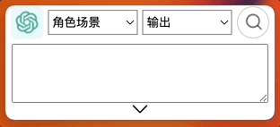
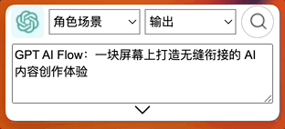
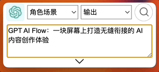

# 快捷键

选择文本，按 `Ctrl + C` 复制，按 `Alt + /`，将已经复制文本粘贴到 GPT AI Flow 的输入框;

`Shift + up` 上方向键 和 `Shift + down` 下方向键,更换左侧选框 🫲 的角色场景选项;

`Alt + up` 上方向键 和 `Alt + down` 下方向键，更换 🫱 右侧选框的输出选项；

按 `Alt + 回车`，开启搜索提问
